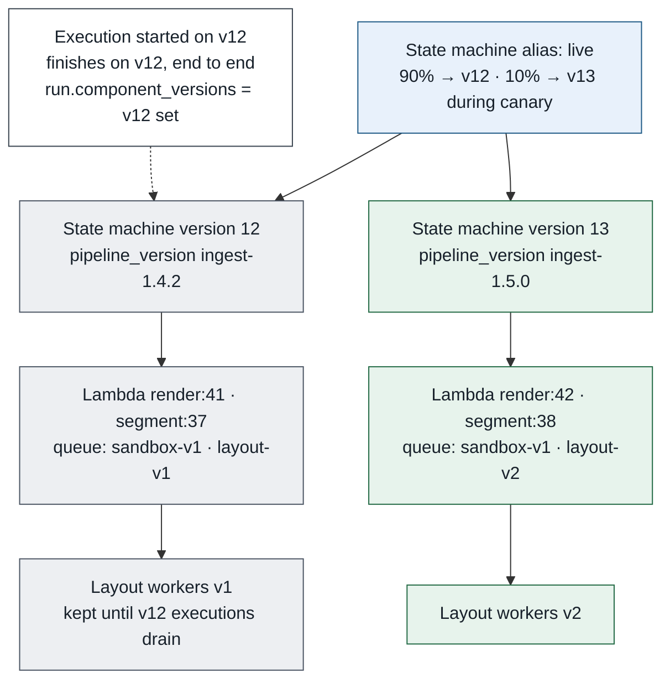
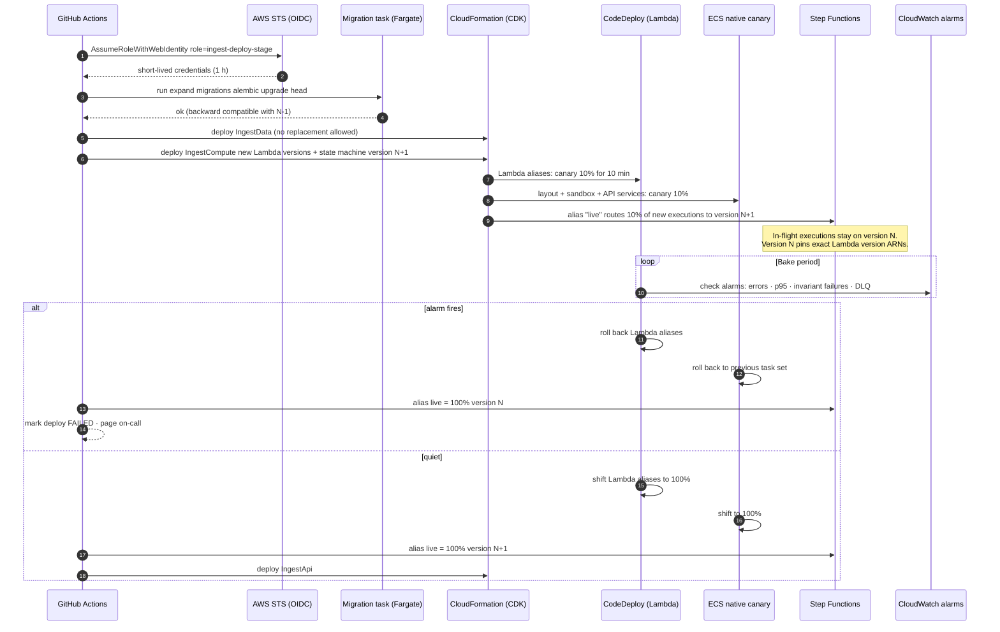

# Chunk 01 · Ingest — CI/CD Design

> **The one-line claim:**
> *Ingest ships on its own pipeline: build once, promote the same signed artefact through dev, stage and prod, and let alarms, not people, decide whether a canary lives. The special rule for this chunk is that a deploy must never change the code under a document that's already being processed, because every approved citation depends on knowing exactly which code produced it.*

| | |
|---|---|
| **Document** | CI/CD v1.0 · chunk 01 of 07 |
| **Builds on** | [LLD](lld.md) · [Infrastructure](infrastructure.md) |
| **Tooling** | GitHub Actions · AWS CDK · ECR · CodeDeploy (Lambda) · ECS native canary · Step Functions versions/aliases · AppConfig |
| **Related** | [Test and evaluation](test-and-evaluation.md) |

---

## 1. What this pipeline has to protect

Four things set this pipeline apart from a generic web service. Every design choice below traces back to one of them.

| # | What must be protected | Why it's specific to ingest | Pipeline mechanism |
|---|---|---|---|
| **P1** | **Approved citations** | A consultant's approval points at `run_id` + `segment_id`. If a deploy changes segment ids for the same input, or swaps code halfway through a run, provenance breaks. | Golden snapshots on every PR (§4.3); **version pinning** so in-flight runs finish on the code they started on (§6) |
| **P2** | **The sandbox boundary** | The sandbox parses hostile files. A dependency bump in LibreOffice or a PDF library is a security change. | Security fixture suite + image scanning + signing (§4.4, §5) |
| **P3** | **Stored data** | Originals are write-once; the DB holds approved lineage. Nothing can be "rolled back" by deleting data. | Stateful stack never auto-replaced; **expand/contract** migrations only (§7) |
| **P4** | **Other chunks** | Chunk 02 consumes `document.ready/v1` and the read API. | Contract tests fail the producer's build on a breaking change (§4.5) |

---

## 2. The pipeline at a glance

```mermaid
flowchart LR
  classDef dev fill:#E8F1FB,stroke:#1E5A86,color:#17202A
  classDef gate fill:#FBEDEA,stroke:#9B2C2C,color:#17202A
  classDef env fill:#E7F3EC,stroke:#236A45,color:#17202A
  classDef art fill:#F7EEDC,stroke:#8A5A12,color:#17202A

  PR["Pull request<br/>paths: services/ingest/**"] --> CI{"PR checks<br/>lint · types · unit · property<br/>golden snapshots · security fixtures<br/>SAST · deps · secrets<br/>cdk synth + cdk-nag · contract diff<br/>migration lint · ASL test"}
  CI -->|"all green + review"| MERGE["Merge to main"]
  MERGE --> BUILD["Build once<br/>4 images + Lambda images<br/>SBOM · scan · sign"]
  BUILD --> ECR[("ECR in tooling account<br/>tag = git sha<br/>promote by digest")]
  ECR --> DEV["Deploy dev<br/>migrate · data · compute · api"]
  DEV --> IT{"Integration gate<br/>fixture corpus end to end<br/>invariants I1 to I7<br/>contract consumers"}
  IT --> STG["Deploy stage<br/>canary 10% · 10 min"]
  STG --> LOAD{"Stage gates<br/>load test · FIS chaos<br/>ingest eval gate<br/>alarms quiet"}
  LOAD --> APPROVE{"Manual approval<br/>change window"}
  APPROVE --> PROD["Deploy prod-ca<br/>canary 10% · 30 min<br/>auto-rollback on alarms"]
  PROD --> SMOKE{"Post-deploy<br/>synthetic upload canary<br/>SLO watch 24h"}
  SMOKE --> PUB["Publish contracts<br/>event schemas · OpenAPI"]

  class PR,MERGE,BUILD dev
  class CI,IT,LOAD,APPROVE,SMOKE gate
  class DEV,STG,PROD env
  class ECR,PUB art
```



| Stage | Trigger | Where | Blocking? | Target time |
|---|---|---|---|---|
| **PR checks** | Pull request touching `services/ingest/**` or `platform/contracts/**` | GitHub-hosted runners | Yes, required status | ≤ 15 min |
| **Build** | Merge to `main` | GitHub runners → ECR (tooling account) | Yes | ≤ 12 min |
| **Dev** | After build | `coo-dev` | Yes | ≤ 15 min incl. integration |
| **Stage** | Dev green | `coo-stage` | Yes | ≤ 60 min incl. bake, load, chaos, eval |
| **Prod-CA** | Manual approval in a change window | `coo-prod-ca` | Yes | ≤ 45 min incl. 30-min canary |
| **Post-deploy** | After prod shift to 100% | `coo-prod-ca` | Alarms only | 24 h watch |

**Lead time target** (merge → prod): same day. **Deploy frequency target:** several per week. **Change failure rate target:** < 10%. **Time to restore:** < 30 min via automated rollback. These are the four DORA metrics; the pipeline emits them (§12).

---

## 3. Repository and triggers

Chunk 01 lives at `services/ingest/` (see Infra §15.2). The pipeline is **path-filtered**, so a change to chunk 02 never runs or deploys chunk 01.

```
.github/workflows/
  ingest-ci.yml          ← PR checks (paths: services/ingest/**, platform/contracts/**)
  ingest-release.yml     ← build + dev + stage + prod (on push to main, same paths)
  platform-release.yml   ← shared platform stack, separate owners, separate cadence
  web-release.yml        ← React shell
```

| Rule | Why |
|---|---|
| **Trunk-based.** Short-lived branches, merge to `main` within 2 days | Small changes are easy to canary and easy to roll back |
| **Protected `main`.** 1 review minimum; required checks; linear history; signed commits | Every prod change is attributable |
| **CODEOWNERS** on `services/ingest/contracts/`, `migrations/`, `src/sandbox/`, `tests/golden/` | Contract, schema, security and provenance changes need the owner's review |
| **Conventional commits** (`feat:`, `fix:`, `feat!:` …) | Drives the `pipeline_version` bump and release notes automatically |

---

## 4. PR checks (continuous integration)

> Test suites and evaluation metrics are defined in [Test and evaluation](test-and-evaluation.md). This section covers how the pipeline runs them.

All jobs run in parallel after a shared dependency-install job. Everything is required unless marked advisory.

### 4.1 Code quality

| Check | Tool | Fails the build when |
|---|---|---|
| Lint + format | `ruff` | Any violation |
| Types | `mypy --strict` on `src/` | Any error |
| **No document text in logs** | Custom `ruff` rule + Semgrep rule | A log call includes a field named `text`, `content`, `verbatim`, or a segment/page object |
| **Stage contract** | Custom check | A class in `stages/` doesn't subclass `Stage` (patterns G7) |
| Import boundaries | `import-linter` | Core code imports a vendor SDK directly, instead of through an adapter (patterns A9) |

### 4.2 Tests

| Suite | What it covers | Notes |
|---|---|---|
| **Unit** | Stage logic, state machine transitions, specifications, value objects | In-memory repos and fixture adapters; no AWS |
| **Property-based** | Canonicalisation + offset map: monotonic, total, round-trip (LLD §4.6) | Hypothesis; 500 examples on PR, 20,000 nightly |
| **Invariant** | Corrupted fixtures trigger I1a, I1b, I2, I3 with the right error codes | |
| **Golden snapshot** | §4.3 | The provenance guard |
| **Security fixtures** | §4.4 | Runs inside the **real sandbox image** |
| **Workflow** | Step Functions definition: ASL validation + state-level tests with the Step Functions **TestState** API against a dev account | Catches wrong `Retry`/`Catch` config before deploy |
| **Coverage** | ≥ 85% lines on `src/stages` and `src/domain` | Advisory elsewhere |

### 4.3 Golden snapshots: the provenance guard (P1)

The fixture corpus (`tests/fixtures/`) holds one synthetic document per LLD scenario R1–R20, plus edge cases: two-column layout, rotated scan, table across pages, broken font encoding, 0-byte file.

For each fixture, `tests/golden/{fixture}.json` stores the expected **segments, anchors, warnings and ids**. The PR job re-runs ingest locally against the fixture adapters and diffs.

| Diff result | What happens |
|---|---|
| No diff | Pass |
| Diff, no label | **Fail.** The PR changed provenance output, possibly by accident |
| Diff, with label `golden:rebaseline` | Passes only if (a) a CODEOWNER of `tests/golden/` approves, (b) the commit is `feat:` or `feat!:`, which bumps `pipeline_version` minor or major, and (c) the PR description lists the fixtures that changed and why |

**Why this matters:** a "harmless refactor" that renumbers segments would silently orphan approved citations in every project that re-processes. This check makes that change deliberate, reviewed, and versioned.

### 4.4 Security (P2)

| Check | Tool | Gate |
|---|---|---|
| Secrets in code | `gitleaks` | Any finding |
| SAST | CodeQL (Python) + Semgrep rules | High/critical |
| Dependency vulnerabilities | `pip-audit` + GitHub Dependabot alerts | High/critical with a fix available |
| Container image vulnerabilities | Amazon Inspector (on push to ECR) + `trivy` on the PR build | Critical in any image; high in the **sandbox** image |
| IaC | `cdk-nag` (AwsSolutions pack) + `checkov` on synthesised templates | Any unsuppressed error; suppressions need a reason in code |
| **Hostile-file fixtures** | EICAR test file, zip bomb, 6-level nested zip, macro DOCX, JavaScript PDF, XXE DOCX, encrypted PDF, `.pdf` that is really a ZIP | Each must end in its **exact expected state and code** (e.g. `QUARANTINED/ACTIVE_CONTENT`). Run inside the sandbox image with `--network none` |

### 4.5 Contracts (P4)

| Contract | Check | Breaking change means |
|---|---|---|
| Event schemas (`contracts/events/*.json`) | Schema compatibility check against the last published version (backward-compatible only) | Removing or renaming a field, changing a type, making an optional field required |
| Read API (`contracts/openapi.yaml`) | `oasdiff` breaking-change detection | Removing an endpoint or field, tightening a type |
| **Consumer contract tests** | Chunk 02's published expectations (`platform/contracts/consumers/relevance/*.json`) are run against ingest's producer | Chunk 02 would break |

A breaking change is not banned; it has to be **versioned**: publish `document.ready/v2` alongside `/v1`, keep both until consumers move (patterns G3).

### 4.6 Infrastructure and database

| Check | Tool |
|---|---|
| `cdk synth` for all three ingest stacks | CDK |
| **`cdk diff` posted as a PR comment** per environment | CDK + GitHub script |
| **Replacement guard** | Fails if the diff would **replace or delete** any resource in `IngestData` (buckets, queues, schema) |
| Migration lint | `squawk` on generated SQL: blocks locking operations on large tables, non-concurrent index builds, `NOT NULL` without default |
| Migration is expand-only | Custom check: no `DROP`, `RENAME`, or type narrowing in a release that also changes code (§7) |

### 4.7 Docs

| Check | Why |
|---|---|
| All fenced `mermaid` blocks render | The docs are part of the product; a broken diagram is a broken doc |
| Markdown link check | |

---

## 5. Build once, promote by digest

On merge to `main`:

1. **Version.** Compute `pipeline_version` from conventional commits (e.g. `ingest-1.5.0`). This string is baked into every image and recorded on every processing run (invariant I6).
2. **Build images**, tagged with the git SHA:

   | Image | Base | Used by |
   |---|---|---|
   | `ingest-api` | Python 3.12 slim | Fargate API |
   | `ingest-sandbox` | Minimal distro + LibreOffice + oletools, non-root, no shell | Fargate sandbox |
   | `ingest-layout` | Python 3.12 + Docling model weights baked in | Fargate layout workers |
   | `ingest-lambda` | AWS Lambda Python base | All ingest Lambdas (one image, handler per function) |

3. **Reproducibility.** Dependencies are locked with hashes (`uv lock`). Model weights are downloaded by digest, not "latest". The same commit always produces the same behaviour.
4. **SBOM** generated per image (`syft`) and attached to the release.
5. **Scan:** Inspector on push; the release fails on critical findings.
6. **Sign** each image digest with **AWS Signer** (Notation). Signature verification is enforced at deploy time for Lambda (code signing config) and checked by the pipeline for ECS task definitions [VERIFY enforcement options for ECS in your account].
7. **Push to ECR** in the tooling account. Workload accounts pull by **digest** via cross-account repository policy.

**Promotion never rebuilds.** Stage and prod deploy the exact digests that passed dev. A rebuild would be a different artefact and would need to pass every gate again.

---

## 6. Deploying without disturbing in-flight documents (P1)

This is the ingest-specific heart of the pipeline.

**The problem.** A 420-page scan can take ~8 minutes to process. If a deploy lands at minute 4, and the state machine calls Lambdas through a `live` alias, pages 1–200 are processed by v1.4.2 and pages 201–420 by v1.5.0. That run's `component_versions` would be a lie, and a table split differently halfway through a document is exactly the kind of bug nobody can reproduce.

**The rule.** *A run executes entirely on the code it started on.*



**How it's enforced:**

| Mechanism | Detail |
|---|---|
| **Lambda: published versions** | Each deploy publishes new, immutable Lambda versions. The **state machine definition references exact version ARNs** (`…:function:ingest-render:42`), not an alias. |
| **Step Functions: versions + alias** | Each deploy publishes a new state machine **version**. New executions start through the `live` **alias**, which does weighted routing during the canary. An execution runs on the version it started on until it ends [VERIFY: alias routing and version isolation semantics]. |
| **Fargate workers (sandbox, layout)** | Task messages carry `pipeline_version`. Workers accept messages for **their own major version**. A **major** bump creates new queues (`layout-v2`); old workers keep running until the old queue drains, then CDK removes them in the next release. Minor versions must be backward-compatible on the task message. |
| **Drain check** | Before removing old workers or old Lambda versions, the pipeline confirms no running executions exist on the old state machine version (`ListExecutions` filtered by version). |
| **Run record** | `processing_run.pipeline_version` and `component_versions` come from the state machine version's own static input, not from the environment, so they're always truthful. |

### 6.1 Canary and automatic rollback



| Component | Strategy | Stage | Prod |
|---|---|---|---|
| Lambdas (API-adjacent, e.g. SSE relay) | CodeDeploy canary | 10% for 10 min | 10% for 30 min |
| State machine | Step Functions alias weighted routing | 10% of new executions, 10 min | 10%, 30 min |
| Fargate API | **ECS built-in canary** | 10%, 10 min | 10%, 30 min |
| Fargate sandbox + layout (queue workers) | ECS rolling update behind version-specific queues (above) | min healthy 100% | min healthy 100% |

**Rollback alarms** (any one triggers automatic rollback during the bake):

| Alarm | Threshold |
|---|---|
| Execution failure rate on the **new** state machine version | > 2% or > 3 executions |
| **Any invariant failure** (`ingest_invariant_failures_total`) on new version | > 0 |
| Lambda errors / throttles on new versions | > 1% |
| API 5xx on canary target group | > 1% |
| API p95 latency | > 1.5× baseline |
| DLQ depth | > 0 new messages |

Rollback is **code-only**. It never touches `IngestData`, and migrations are expand-only (§7), so the previous code still works against the current schema.

### 6.2 Deploy order per environment

1. **Migrations** (expand) as a one-off Fargate task in the VPC.
2. **`IngestData`** stack: additive only; replacement guard enforced.
3. **`IngestCompute`**: new Lambda versions, new state machine version, worker services; canary begins.
4. **Bake** with alarms.
5. **`IngestApi`**: API service canary.
6. **Contracts published** (only after prod).

---

## 7. Database migrations: expand, then contract

The API and workflow of version N-1 must keep working against the schema of version N, because canaries and in-flight runs overlap.

| Release | Schema change | Code change |
|---|---|---|
| **R1: expand** | Add new column/table (nullable or with default); create indexes `CONCURRENTLY` | Write both old and new; read old |
| **R2: migrate** | Backfill in batches (a Step Functions job, throttled) | Read new, fall back to old |
| **R3: contract** | Drop the old column | Remove fallback |

**Rules the pipeline enforces:** migrations run before compute; destructive statements are blocked unless the PR is labelled `migration:contract` and the previous release was an expand; migrations are tested against a **copy of stage data** restored from a snapshot in the stage job.

**Never migrated:** approved lineage rows (`processing_run`, `segment`, `segment_anchor` for runs referenced by approvals). Schema changes to these tables are additive only, forever. That's invariant I7 expressed as a pipeline rule.

---

## 8. Environment gates

### 8.1 Dev: integration

| Test | Passes when |
|---|---|
| **End-to-end fixture run** | The whole fixture corpus is uploaded through the real API (presigned multipart), and every document reaches its expected terminal state and code within 15 min |
| Invariants | Zero I1–I7 failures across the run |
| Events | `document.ready/v1` for each ready fixture arrives on the bus with a valid schema; a test subscriber dedupes on `(doc_id, run_id)` |
| SSE | A test client disconnects mid-run, reconnects with `Last-Event-ID`, and receives every missed event exactly once |
| Idempotency | The same fixture uploaded twice returns `duplicate_of`; one execution is started twice with the same name and the second call is rejected |
| Read API | Anchors returned for a fixture round-trip against its canonical page text |

### 8.2 Stage: production rehearsal

| Gate | Passes when |
|---|---|
| **Canary bake** | No rollback alarm for 10 min |
| **Load** | 20 projects × 600 pages concurrently (synthetic); 95% of documents ≤ 200 pages ready in ≤ 10 min (the SLO); no DLQ messages |
| **Chaos** (AWS Fault Injection Service) | (a) stop 50% of layout tasks mid-run; (b) inject Textract throttling via an FIS fault on the adapter's endpoint path, or a fixture fault flag; (c) fail over Aurora during Commit. **Pass:** no duplicates, no lost pages, correct final states, breaker opens and recovers |
| **Ingest eval gate** | Blocking metrics, thresholds and regression rule as defined in [Test and evaluation §3 and §5](test-and-evaluation.md#5-thresholds-gates-and-regression): clause integrity, highlight hit rate, TEDS-Struct, numeric token accuracy, OCR CER, section-path accuracy |
| **Security** | Re-run hostile-file fixtures against the deployed sandbox |

### 8.3 Prod-CA

| Gate | Detail |
|---|---|
| **Manual approval** | GitHub Environment protection: a named approver outside the author; allowed only in the change window (Tue–Thu, 10:00–15:00 ET) unless labelled `hotfix` |
| **Freeze calendar** | Blocked during declared freezes (e.g., customer go-live weeks) |
| **Canary** | 10% for 30 min with the rollback alarms |
| **Synthetic canary** | CloudWatch Synthetics uploads a small synthetic policy every 15 min and asserts it reaches `READY` with the expected segments, in prod, forever |
| **24 h SLO watch** | Error-budget burn-rate alarms on the ingest SLO |

---

## 9. Identity and secrets in the pipeline

| Principle | Implementation |
|---|---|
| **No long-lived AWS keys anywhere** | GitHub Actions uses **OIDC** to assume a role per account: `ingest-deploy-dev`, `-stage`, `-prod-ca` |
| **Role trust is narrow** | Trust policy conditions on repo, branch (`refs/heads/main`) and GitHub Environment (`prod-ca`) claims. A fork or feature branch can't assume the prod role |
| **Least privilege** | Deploy roles can only use the CDK bootstrap roles for the ingest stacks, bounded by a **permissions boundary** that forbids IAM changes outside `ingest-*` names |
| **PR jobs** | Assume a **read-only** role in dev for `cdk diff` and TestState only |
| **Runtime secrets** | Never in the pipeline. Services read Secrets Manager at runtime; DB access via RDS Proxy IAM auth |
| **Audit** | Every deploy writes a record (git SHA, digests, `pipeline_version`, approver, alarms state) to CloudTrail and to a `deployments` table surfaced on the ops dashboard |

---

## 10. Configuration and feature flags

Code deploys and behaviour changes are separated.

| What changes | Mechanism | Rollout |
|---|---|---|
| Thresholds (OCR confidence, boilerplate band, segment length) | Versioned YAML in the repo (LLD §14); hash recorded per run | Through the full pipeline, like code, because they affect provenance |
| **Per-tenant OCR engine** (cloud vs self-hosted) | AWS AppConfig feature flag | AppConfig deployment strategy: 10% of tenants for 30 min, auto-rollback on alarms |
| **New layout model** | AppConfig flag `layout.model = docling-2.x` with the old model still deployed | Shadow first: run both on 5% of pages, compare outputs offline, then switch |
| Kill switches | `ingest.accept_uploads`, `ingest.ocr.enabled` | Instant; for incidents |

**Rule:** any flag that changes **segment output** must also be recorded in `processing_run.component_versions`, so a run's provenance includes the flags it ran with.

---

## 11. Release, rollback and hotfix playbook

| Situation | Action |
|---|---|
| **Canary alarm fires** | Automatic: aliases and ECS roll back, state machine alias to 100% previous version. On-call is paged with the failing alarm and the deploy record |
| **Bug found after 100%** | `git revert` → normal pipeline (fast path: dev and stage gates, skip load and chaos, approval still required). Target: < 30 min to restore |
| **Bad migration** | No schema rollback. Expand-only means old code still works: roll code back; fix forward with a new expand migration |
| **Bad segmentation shipped** (golden snapshots missed it) | Roll back code. Runs produced by the bad version stay (immutable), but are flagged `pipeline_version_recalled`; the UI prompts consultants on affected projects to re-process; approved fields from those runs are marked for re-confirmation. Then add the case to the fixture corpus |
| **Critical CVE in sandbox dependency** | `hotfix` label: dependency bump, full security fixtures, stage canary 10 min, prod approval allowed outside the window |
| **Contract break reached chunk 02** | Should be impossible (§4.5). If it happens: roll back producer, re-publish `/v1`, add the missed case to consumer contract tests |

---

## 12. Pipeline observability

| Metric | Source | Target |
|---|---|---|
| Lead time for change (merge → prod) | GitHub + deploy records | < 1 day |
| Deploy frequency (prod) | Deploy records | ≥ 3 / week |
| Change failure rate | Rollbacks + hotfixes ÷ deploys | < 10% |
| Time to restore | Alarm → rollback complete | < 30 min |
| PR check duration p90 | GitHub | ≤ 15 min |
| Flaky test rate | Test reports | < 1%; flaky tests quarantined within a day |
| Golden rebaselines per month | Label count | Watched. A spike means segmentation is unstable |

---

## 13. How this generalises to the other chunks

Every chunk gets the same skeleton: path-filtered CI, build once, sign, promote by digest, canary with alarms, expand/contract migrations, contract tests. Each adds its own specific guard, the way ingest adds golden snapshots and version pinning:

| Chunk | Its specific guard |
|---|---|
| 02 Relevance screen | Relevance-recall eval gate (≥ 98%) on every prompt or model change |
| 03 Extraction | Unsupported-value rate and gap-recall gates from the PRD (§13) |
| 04 Harness | Harness self-tests: known-answer runs must score exactly as expected |
| 05 Review workspace | Accessibility (axe) + visual regression on the review screen |
| 06 Rule packs | Rule-pack changes trigger a scoped eval on the affected entitlement types before merge |
| 07 Infra | Platform stack changes need all chunks' integration suites green |

---

## 14. Open questions

| # | Question | Decide by |
|---|---|---|
| Q1 | GitHub-hosted runners, or self-hosted in AWS (CodeBuild-hosted GitHub runners) for the sandbox security tests? | Before first build |
| Q2 | Signature enforcement for ECS task images: pipeline check only, or admission-style enforcement? | Before prod |
| Q3 | Per-PR ephemeral ingest stacks in dev: worth the cost for large changes? | After alpha |
| Q4 | Change window and freeze calendar: agreed with Services leadership? | Before prod |

---

## 15. The 90-second version

> "Ingest has its own path-filtered pipeline, so a change to another chunk never deploys it.
>
> Pull requests run the usual lint, types, tests and security scans, plus three checks specific to ingest. Golden snapshots: if a change moves a single segment id on the fixture corpus, the build fails unless it's deliberately re-baselined and the pipeline version is bumped, because approved citations point at those ids. Hostile-file fixtures run inside the real sandbox image with no network. And contract tests fail my build if I'd break chunk 02.
>
> On merge I build once, generate an SBOM, scan, sign, and promote the same digests through dev, stage and prod. Credentials come from OIDC; there are no stored keys.
>
> The key rule is that a document finishes on the code it started on. The state machine pins exact Lambda versions, new executions go through a weighted alias for the canary, and queue workers are versioned so old runs drain on old workers. Alarms decide rollback: any invariant failure on the new version rolls it back automatically. Migrations are expand-only, so rolling back code is always safe."

---

## Sources

- [Amazon ECS enables built-in blue/green deployments (Jul 2025)](https://aws.amazon.com/about-aws/whats-new/2025/07/amazon-ecs-built-in-blue-green-deployments/)
- [Amazon ECS built-in linear and canary deployments (Oct 2025)](https://aws.amazon.com/about-aws/whats-new/2025/10/amazon-ecs-built-in-linear-canary-deployments)
- [InfoQ: AWS blue/green for ECS](https://infoq.com/news/2025/07/aws-blue-green-ecs)
- [AWS Step Functions launches versions and aliases](https://aws.amazon.com/about-aws/whats-new/2023/06/aws-step-functions-versions-aliases)
- [Step Functions: gradual deployment of state machine versions](https://docs.aws.amazon.com/step-functions/latest/dg/version-rolling-deployment.html)
- [Step Functions: continuous deployments with versions and aliases](https://docs.aws.amazon.com/step-functions/latest/dg/concepts-cd-aliasing-versioning.html)
- [Step Functions: alias and version deployment example](https://docs.aws.amazon.com/step-functions/latest/dg/example-alias-version-deployment.html)
- [Explicit version isolation in Step Functions pipelines](https://medium.com/@brylov/explicit-version-isolation-solving-deployment-challenges-in-complex-aws-step-functions-pipelines-a70d083eadf0)