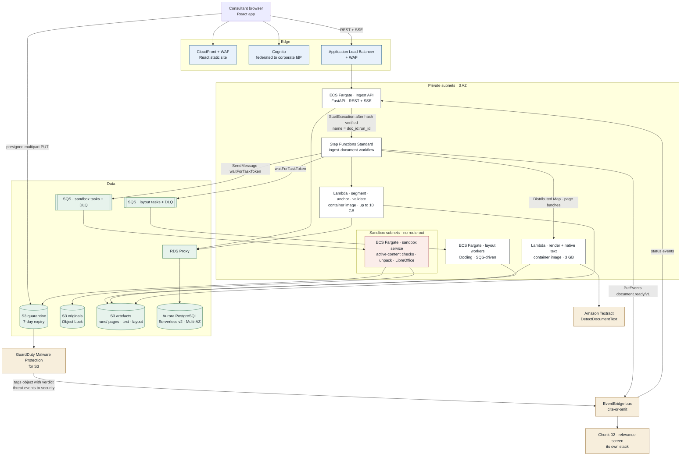
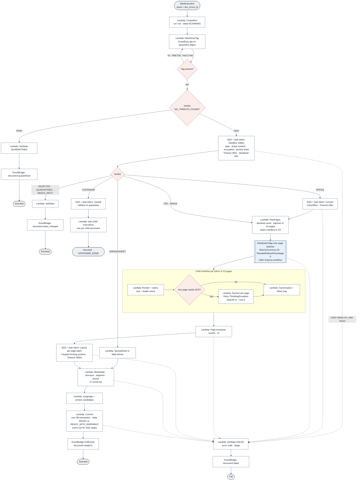
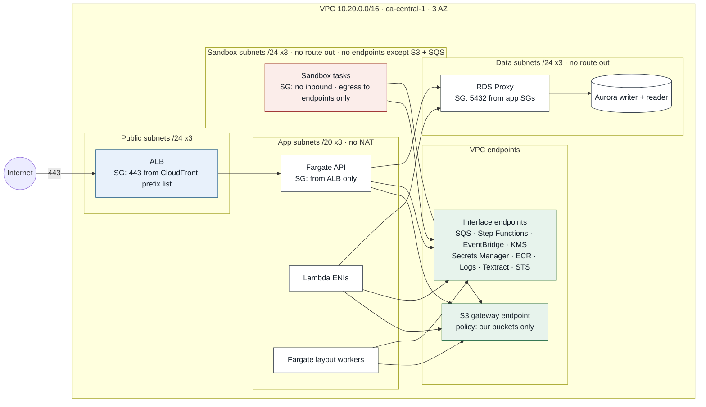
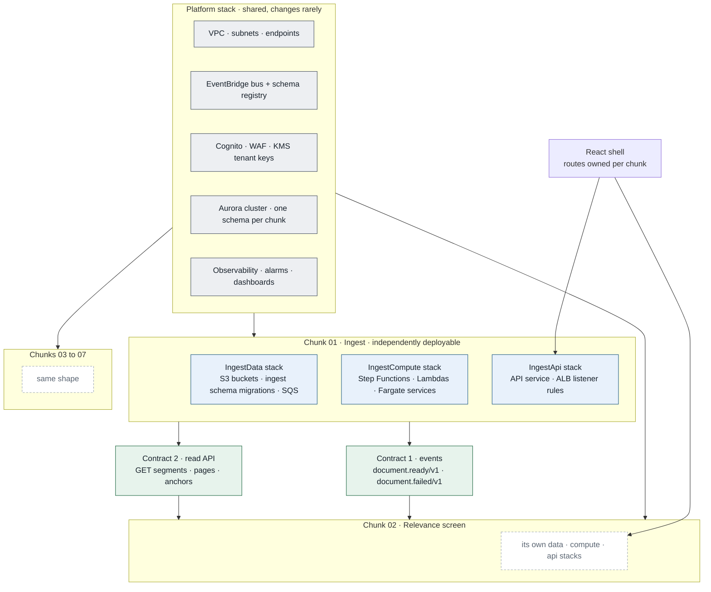

# Chunk 01 · Ingest — AWS Infrastructure Design


> **The one-line claim:**> *Ingest on AWS is a Step Functions workflow per document. Stateless Lambdas handle the page-parallel work. A sealed Fargate sandbox handles untrusted files. Textract reads the scans. S3 and Aurora hold everything. It ships as its own deployable unit, and talks to the other six chunks only through versioned events and a read API.*

| | |
|---|---|
| **Document** | Infra v1.0 · chunk 01 of 07 |
| **Builds on** | [HLD](hld.md) · [Patterns](patterns.md) · [LLD](lld.md) |
| **Region** | `ca-central-1` primary · `ca-west-1` for disaster recovery |
| **IaC** | AWS CDK (Python) |
| **Related** | [Test and evaluation](test-and-evaluation.md) · [CI/CD](ci-cd.md) |

Items tagged **[EST]** are estimates. Items tagged **[VERIFY]** are AWS facts I confirmed from public sources at the time of writing; re-check them in the AWS console, because quotas and prices change.

---

## 1. The picture


```
 [CONSULTANT · React app]
        │  (CloudFront + WAF serves the app · Cognito signs in via corporate IdP)
        │
        ├──────────── presigned multipart PUT (8 MB parts) ───────────┐
        │                                                             ▼
        │                                              [S3 · quarantine bucket]
        │                                                             │
        ▼                                                             ▼
 [ALB + WAF] ──► ┌───────────────────────────────┐        [GuardDuty Malware Protection]
                 │  Ingest API                    │           tags object with verdict
                 │  ECS Fargate · FastAPI         │
                 │  REST + Server-Sent Events     │
                 └───────────────────────────────┘
                        │  hash verified → StartExecution (name = doc_id:run_id)
                        ▼
                 ┌─────────────────────────────────────────────┐
                 │  Step Functions · ingest-document workflow   │ ─── [Stop / Exit]
                 │  (process manager · retries · catch · timers)│   quarantined · rejected
                 └─────────────────────────────────────────────┘   needs-input · container
                        │
        ┌───────────────┼────────────────────────────────────────────────┐
        ▼               ▼                                                ▼
 ┌──────────────┐ ┌───────────────────────────────┐          ┌──────────────────────┐
 │ SANDBOX      │ │ Distributed Map · page batches │          │ Layout workers       │
 │ ECS Fargate  │ │ Lambda (Python, container)     │          │ ECS Fargate · Docling│
 │ no network   │ │ render · native text · health  │ ──OCR──► │ SQS + task token     │
 │ safety check │ │ canonicalise · offset map      │  [Amazon │                      │
 │ unpack · Word│ │ 50 batches in parallel         │ Textract]│                      │
 │ → PDF convert│ └───────────────────────────────┘          └──────────────────────┘
 └──────────────┘               │                                        │
        │                       ▼                                        ▼
        │               ┌──────────────────────────────────────────────────────┐
        │               │ Lambda · structure · segment · anchor · validate      │
        │               │ invariants I1–I7 · one DB transaction                 │
        │               └──────────────────────────────────────────────────────┘
        ▼                       │                                  │
 [S3 originals · Object Lock]   ▼                                  ▼
 [S3 artefacts · runs/…]  [Aurora PostgreSQL via RDS Proxy]  [EventBridge · document.ready/v1]
                                    ▲                                  │
                                    │                                  ├──► [Chunk 02 · own stack]
       [React · document list] ◄── SSE ── [Ingest API] ◄───────────────┘   status events
```

---

## 2. Architecture



### 2.1 How the LLD maps to AWS

| LLD component | AWS service | Key configuration |
|---|---|---|
| React workspace | **S3 + CloudFront** | Private bucket, Origin Access Control, WAF managed rules, HSTS |
| Sign-in | **Amazon Cognito** | Federated to the corporate IdP (SAML/OIDC); groups → project roles |
| Ingest API + SSE | **ECS Fargate** behind **ALB** | 2–6 tasks, 1 vCPU / 2 GB, ALB idle timeout 3,600 s for SSE |
| Orchestrator (process manager) | **Step Functions Standard** | One execution per document run; execution name = `{doc_id}:{run_id}` (idempotent start) |
| Upload | **S3 presigned multipart** | 15-min URL expiry, PUT to one key under `quarantine/` |
| Malware scan | **GuardDuty Malware Protection for S3** on the quarantine bucket | Tags each object with the verdict; threat events to security |
| Safety checks, unpack, Word→PDF | **ECS Fargate sandbox service** | No outbound route; S3 and SQS endpoints only; 2 vCPU / 4 GB; read-only root FS |
| Render, native text, canonicalise | **Lambda** (container image) | 3,008 MB, 60 s timeout, 10 pages per invocation |
| OCR | **Amazon Textract** `DetectDocumentText` | Sync API per page, via VPC interface endpoint |
| Layout + tables | **ECS Fargate** Docling workers, SQS-driven | 4 vCPU / 8 GB; scale on queue depth; option: SageMaker async GPU (§4) |
| Segment, anchor, validate, commit | **Lambda** (container image) | Up to 10,240 MB, 900 s timeout |
| Queues | **SQS** with **DLQs** | Visibility timeout = stage timeout + 30 s; maxReceiveCount 3 |
| Database | **Aurora PostgreSQL Serverless v2** + **RDS Proxy** | Multi-AZ, 1–16 ACU [EST], `ingest` schema owned by this chunk |
| Object storage | **S3** × 3 buckets | quarantine, originals (Object Lock), artefacts |
| Events between chunks | **EventBridge** custom bus | Schema registry; versioned detail-types |
| Secrets | **Secrets Manager** | DB credentials via RDS Proxy IAM auth; no static keys |
| Keys | **KMS** | One customer-managed key per tenant; S3 Bucket Keys on |
| Observability | **CloudWatch** + **X-Ray / ADOT** | Structured logs (EMF), traces per execution |

---

## 3. Re-evaluation: what changes when the LLD meets AWS

Mapping to AWS removed code we'd otherwise have to write, and exposed one place where the LLD would have hit an AWS limit. Six decisions, each recorded as an ADR.

| # | Decision | What it replaces in the LLD | Why |
|---|---|---|---|
| **ADR-01** | **Step Functions Standard is the process manager.** | The custom stateless orchestrator (LLD G1) | Retries, catch, timeouts, backoff, heartbeats, fan-out and waiting are declarative and durable. It closes LLD gaps **G1, G5, G6** natively. Postgres stays the **system of record** for document state, because the UI queries it; Step Functions owns **progress**. |
| **ADR-02** | **Distributed Map for pages**, not inline Map. | The scatter-gather design (A5) | A Standard execution has a **25,000-event history limit** [VERIFY]. An inline Map over 420 pages × ~6 events per page would exceed it. Distributed Map runs each batch as a **child execution** with its own history, and supports up to 10,000 parallel children [VERIFY]. |
| **ADR-03** | **Commit, then publish, as two Step Functions states.** | The outbox relay for inter-chunk events (A2) | Step Functions persists state between steps, so if the publish fails or the worker dies after commit, the execution **resumes at Publish** and retries. That durability is what the outbox relay provided. The outbox table stays, as the **event log for SSE replay**. |
| **ADR-04** | **GuardDuty Malware Protection for S3** replaces self-managed ClamAV. | ClamAV in the sandbox | Managed signatures and scaling; tags objects so bucket policies can block unscanned files. Its limits suit us: objects up to 5 GB, archives up to 1,000 files and 5 levels deep [VERIFY]. **The sandbox keeps** the checks GuardDuty doesn't do: true-type detection, macros, PDF JavaScript, encryption, our stricter archive ratio. |
| **ADR-05** | **Long-running stages use SQS + task token**, not `ecs:runTask.sync`. | — | Starting a Fargate task per document adds ~30–60 s of startup [EST]. A warm service pulling from SQS answers in seconds, and `waitForTaskToken` + heartbeat lets Step Functions detect a dead worker. |
| **ADR-06** | **Aurora PostgreSQL, not DynamoDB.** | — | The reference design used DynamoDB, which suits key-value report lookups. Ingest needs **transactions** (pages, segments, anchors and state in one commit), **joins** (segments by page, anchors by segment), **row-level security** by project, and ad-hoc audit queries. Those are relational workloads. |

**One place the LLD would have broken on AWS:** Lambda's 15-minute cap. Every stage is sized to finish well inside it (page work is batched at 10 pages ≈ 5–20 s; whole-document segmentation for 600 pages ≈ 1–3 min [EST]). Anything that can't fit, like Word conversion, layout on huge pages, or unpacking large archives, runs on Fargate.

---

## 4. Compute: which service runs which stage, and why

| Stage | Runs on | Why this and not the alternative |
|---|---|---|
| S0 Upload handshake, reads, SSE | **Fargate** (API) | SSE needs long-lived connections. API Gateway now supports response streaming [VERIFY], but browser support for SSE through it has reported issues; an ALB + Fargate service is simpler and proven for streaming. |
| Malware scan | **GuardDuty** | Managed (ADR-04) |
| S1 Safety, S2 Unpack, S4 Convert | **Fargate sandbox** | Untrusted parsing and LibreOffice need isolation, more memory than is comfortable in Lambda, and no network. One document per task process; the process exits after each job. |
| S5 Render, S6 Native text + canonicalise | **Lambda** | Bursty, short, embarrassingly parallel; scales to zero; pay per ms |
| S6 OCR | **Textract** | Managed, in-region in `ca-central-1` [VERIFY], ~$1.50 per 1,000 pages [VERIFY]. Swappable via the `OcrPort` adapter. |
| S8 Layout | **Fargate** (CPU) at launch | Docling is CPU-viable at our volume (~1–2 s/page [EST]) and avoids GPU cost. **Upgrade path:** SageMaker **asynchronous inference** on a GPU instance with scale-to-zero, if layout becomes the throughput bottleneck. The `LayoutPort` adapter hides the switch. |
| S9–S14 Structure, segment, validate, commit | **Lambda** | Pure CPU on one document's outputs; minutes at most |
| S13 Version candidates | **Lambda** | Small MinHash computation per project |

**What we don't use, and why:**
- **EKS:** no workload here needs Kubernetes; Fargate + Lambda carry no cluster to operate.
- **AWS Batch:** Distributed Map already gives batch-style fan-out with better visibility.
- **SageMaker at launch:** we host no model we need to train or serve at scale yet.

---

## 5. The workflow



### 5.1 Workflow settings

| Setting | Value | Why |
|---|---|---|
| Type | Standard | Durable, exactly-once state transitions, up to 1 year; needed for task-token waits |
| Execution name | `{doc_id}:{run_id}` | Starting the same run twice is rejected, so a retried API call can't double-process |
| Distributed Map child type | **Express** | Page batches are short (< 5 min) and high volume; Express is cheaper per transition |
| Map `MaxConcurrency` | 50 [EST] | Caps Lambda + Textract pressure per document; tenant caps sit on top (§9) |
| `ToleratedFailurePercentage` | 0 | A lost page fails the document (invariant I1a), never silently continues |
| Textract retry | `ThrottlingException`, `ProvisionedThroughputExceededException`: interval 2 s, backoff 2.0, max 6, jitter FULL | Textract quotas are per account per region (§9) |
| Task-token stages | `TimeoutSeconds` = stage timeout; `HeartbeatSeconds` 60 | A crashed Fargate worker is detected in ≤ 60 s instead of waiting for the full timeout |
| Catch | `States.ALL` → SetState FAILED → publish `document.failed` | Every failure path ends with a known state and an event |
| Circuit breaker (LLD R2) | A Lambda checks a breaker flag in **Parameter Store** before calling Textract; if open → `Wait` 120 s and loop, **without** consuming a retry | Implements LLD G5 in Step Functions terms |

### 5.2 Sequence for one document

1. React completes the multipart upload; the API verifies the server-side SHA-256 and sets `RECEIVED`.
2. The API calls `StartExecution` with name `{doc_id}:{run_id}`.
3. `CreateRun` inserts the `processing_run` row.
4. `ReadScanTag` loops (10 s, max 5 min) until GuardDuty has tagged the quarantine object.
5. The sandbox service takes the safety task from SQS, runs the checks, copies the clean file to `originals/` and returns its verdict with `SendTaskSuccess`.
6. Office files go back through the sandbox for conversion; PDFs and images go straight to `PlanPages`.
7. `PlanPages` writes a page-batch manifest to S3. Distributed Map reads it and runs one Express child per 10 pages: render, native text, health check, Textract where needed, canonicalise.
8. Page invariants are checked. Layout runs on Fargate via task token.
9. The segment Lambda builds sections, segments and anchors and checks round-trip (I2).
10. `Commit` writes everything in one transaction and appends the SSE event row.
11. `Publish` sends `document.ready/v1` to EventBridge. Chunk 02's rule receives it; the API's rule pushes it to open SSE streams.

---

## 6. Storage

### 6.1 S3 buckets

| Bucket | Contents | Protection | Lifecycle |
|---|---|---|---|
| `coo-{env}-ingest-quarantine` | Raw uploads | SSE-KMS (tenant key); **bucket policy denies `GetObject` to every role except the sandbox role**, and denies it to the sandbox unless the object's GuardDuty tag is `NO_THREATS_FOUND` | Expire 7 days; abort incomplete multipart after 1 day |
| `coo-{env}-ingest-originals` | Scanned-clean originals, key = content hash | **Object Lock, compliance mode**, retention per contract; SSE-KMS; versioning | Transition to Glacier Instant Retrieval after 90 days |
| `coo-{env}-ingest-artefacts` | `runs/{run_id}/…` page images, canonical text, offset maps, layout JSON, manifests | SSE-KMS; versioning off (runs are immutable by key) | OCR images expire in 30 days; other artefacts follow project retention |

All three: Block Public Access on, TLS-only policy, access logs to a central log bucket, S3 gateway VPC endpoint with a policy that allows only these buckets.

**Key layout** (unchanged from LLD §5.2): `{tenant_id}/{project_id}/…`, so IAM conditions and KMS keys align with tenants.

### 6.2 Aurora PostgreSQL

| Setting | Value |
|---|---|
| Engine | Aurora PostgreSQL 16, Serverless v2 |
| Capacity | 1–16 ACU [EST]; writer + 1 reader in a second AZ |
| Access | **RDS Proxy** in front. Lambda bursts would otherwise exhaust connections. IAM authentication; no passwords in code |
| Schema ownership | Schema `ingest` belongs to chunk 01. **Other chunks never read it directly.** They use the read API (§11) |
| Row-level security | On, keyed by `project_id` via a session variable set per request |
| Backups | Automated, 35-day PITR; daily snapshot copied to `ca-west-1` |
| Migrations | Versioned (Alembic), run by the deploy pipeline before compute changes |
| Encryption | KMS; TLS enforced |

---

## 7. Events and the boundary between chunks

**One EventBridge bus for the platform:** `cite-or-omit-{env}`.

| Event (detail-type) | Published by | Consumed by | Contract |
|---|---|---|---|
| `document.received/v1` | Ingest API | Ingest (SSE) | `doc_id, project_id, batch_id` |
| `document.state_changed/v1` | Ingest workflow | Ingest (SSE) | `doc_id, state, progress{pages_done,pages_total}` |
| `document.ready/v1` | Ingest workflow | **Chunk 02**, Ingest (SSE) | `doc_id, run_id, project_id, page_count, segment_count, warnings[]` |
| `document.failed/v1` | Ingest workflow | Ingest (SSE), ops alerts | `doc_id, run_id, stage, error_code` |
| `document.quarantined/v1` | Ingest workflow | Ingest (SSE), **security** | `doc_id, reason` |
| `batch.completed/v1` | Ingest (aggregator Lambda) | Ingest (SSE) | `batch_id, counts by outcome` |

**Rules:** events carry ids and counts, **never document text**. Schemas are registered in the EventBridge schema registry. Consumers dedupe on `(doc_id, run_id, detail-type)` and ignore unknown fields. A breaking change publishes `/v2` alongside `/v1`.

**SSE path:** EventBridge rule → SQS → API tasks write each event into the `outbox` table (the replay log), then fan out to open SSE connections for that project. A reconnecting browser sends `Last-Event-ID` and receives the rows after it.

---

## 8. Network



| Decision | Detail |
|---|---|
| **No NAT gateway** | Nothing in the VPC needs the public internet. Every AWS call goes through **VPC endpoints**. It's cheaper, and it removes a whole exfiltration path. |
| **Four subnet tiers** | public (ALB only) · app (API, Lambda, layout) · data (Aurora, RDS Proxy) · **sandbox** |
| **Sandbox tier** | No route table entries beyond the local VPC; reaches only the S3 gateway endpoint and the SQS/KMS/Logs interface endpoints. Security group: **no inbound**. A compromised converter has nowhere to call. |
| **Endpoint policies** | S3 endpoint allows only our buckets; SQS endpoint only our queues. Stops data being copied to an attacker's bucket via a stolen role. |
| **ALB ingress** | Security group allows 443 only from the CloudFront managed prefix list. WAF on both CloudFront and ALB. |
| **Textract** | Called through its interface endpoint; document bytes never leave the AWS network. |

---

## 9. Security and IAM

### 9.1 One role per stage, least privilege

| Role | Can | Cannot |
|---|---|---|
| `ingest-api` | Create presigned PUTs to `quarantine/`; read artefacts for authorised projects; read/write `ingest` schema via proxy; `StartExecution` | Read quarantine objects; write originals |
| `ingest-sandbox` | Read `quarantine/` **only if tagged clean**; write `originals/` and `runs/*/converted.pdf`; SQS receive/delete on sandbox queue; `SendTaskSuccess/Failure` | Anything else on the network; DB access |
| `ingest-page-lambda` | Read `originals/`, write `runs/*/pages|text`; `textract:DetectDocumentText` | Read quarantine; DB writes |
| `ingest-layout` | Read `runs/*/pages`, write `runs/*/layout`; SQS on layout queue | Read originals or quarantine |
| `ingest-segment-lambda` | Read `runs/*`; write DB via proxy; `events:PutEvents` on the bus | Read quarantine |
| `ingest-workflow` | Invoke the above Lambdas; SQS send; `events:PutEvents` | Direct S3 or DB access |

Roles are further scoped with **ABAC**: session tag `tenant_id` must match the S3 prefix and KMS key tag.

### 9.2 Controls

| Control | Service |
|---|---|
| Malware on upload | GuardDuty Malware Protection for S3 |
| Threat detection for the account | GuardDuty |
| API audit | CloudTrail (org trail), S3 data events on originals |
| Configuration drift | AWS Config + conformance pack; Security Hub |
| PII discovery in artefacts (optional) | Macie scheduled jobs on `artefacts/` |
| Secrets | Secrets Manager, rotated |
| Web | WAF managed rule groups + rate-based rules |
| Encryption | KMS tenant keys; crypto-shred on tenant offboarding by scheduling key deletion after the audit hold |

---

## 10. Multi-tenancy and data residency

- **Pool model with hard edges:** shared compute, but tenant-scoped S3 prefixes, KMS keys, IAM session tags and Postgres row-level security.
- **Per-tenant concurrency caps:** a tenant semaphore row in Postgres limits each tenant to 4 concurrent document executions [EST]; `PlanPages` sets the Distributed Map `MaxConcurrency` per execution (default 50). A fifth document waits in a `Wait` loop rather than failing.
- **Residency by cell:** one full deployment per residency region, e.g. `ca-central-1` for Canadian customers and `us-east-1` for US customers. A tenant belongs to one cell; data never crosses. The Canadian cell uses Textract in `ca-central-1` [VERIFY].

---

## 11. Observability

| Signal | Implementation |
|---|---|
| Logs | Structured JSON; Lambda Powertools; **no document text** (a log-scrubber layer drops fields named `text`, `content`, `verbatim`) |
| Metrics | CloudWatch Embedded Metric Format; the LLD §11 metric set; Step Functions and Map Run metrics built in |
| Traces | X-Ray / ADOT: one trace per execution, spans per state and per Lambda |
| Dashboards | Per environment: executions by outcome, stage p95, OCR share, Textract throttles, DLQ depth, queue age, Aurora ACU |
| Alarms | Execution failure rate > 2% (1 h) · any DLQ message · Textract throttles sustained 10 min · Aurora ACU at max for 15 min · **any** invariant failure metric > 0 |
| SLO | 95% of documents ≤ 200 pages ready within 10 minutes (LLD §11) |

---

## 12. Scaling, quotas and limits

| Limit | Value | Our exposure | Mitigation |
|---|---|---|---|
| Lambda max duration | 15 min | Segment Lambda on 600+ pages | Batch design keeps it to minutes; > 2,000 pages is blocked at upload |
| Lambda regional concurrency | 1,000 default [VERIFY] | Map children × 10 pages | Request an increase to 3,000 before beta; reserve concurrency for API-adjacent functions |
| Step Functions execution history | 25,000 events [VERIFY] | Inline Map over pages would exceed | Distributed Map (ADR-02) |
| Distributed Map child concurrency | up to 10,000 [VERIFY] | We cap at 50 per doc | Tenant caps on top |
| Textract sync TPS | Account/region quota; low defaults [VERIFY] | ~2.5 OCR pages/s at burst [EST] | Request an increase; retry with backoff; circuit breaker |
| GuardDuty S3 object size | 5 GB [VERIFY] | Max upload is 500 MB | Within limits |
| SQS message size | 256 KB | Claim-check messages ≈ 1 KB | Keys, not content |
| Aurora Serverless v2 | Scales in ACU steps | Commit bursts | RDS Proxy pooling; max ACU alarm |

---

## 13. Resilience and disaster recovery

| Failure | What happens |
|---|---|
| One AZ lost | ALB, Fargate, Lambda and Aurora are Multi-AZ; Aurora fails over (~30 s); in-flight Step Functions executions continue; Lambda retries absorb the blip |
| Textract degraded | Throttle retries, then breaker opens; documents wait in `EXTRACTING_TEXT`; nothing marked failed for AWS's outage |
| Sandbox task crashes mid-conversion | Heartbeat missed → Step Functions retries on another task; after 3 → FAILED with code |
| Poison page | Lambda fails for that batch → Map child fails → document FAILED with page numbers; the page goes to the fixture corpus |
| Aurora writer failover during Commit | Commit Lambda retries (idempotent inserts); Step Functions resumes at Commit |
| Region lost | Pilot-light recovery in `ca-west-1`: S3 cross-region replication of originals and artefacts, Aurora snapshot copies, CDK redeploy |

**Targets [EST]:** in-region RPO 0 (Multi-AZ). Regional disaster: **RPO ≤ 15 min** for objects (replication) and ≤ 24 h for the database (daily snapshot copy; tighten with Aurora Global Database if a customer requires it). **RTO ≤ 4 h** via CDK redeploy.

---

## 14. Cost

At the PRD's peak volume: ~90,000 pages/day × 22 business days ≈ **2 million pages/month**. **All figures [EST]**: order-of-magnitude, list prices, before savings plans. Validate with the AWS Pricing Calculator before quoting anywhere.

| Component | Basis | Monthly |
|---|---|---|
| Textract | 25% of pages OCR'd = 500K pages × ~$1.50/1,000 | ~$750 |
| GuardDuty Malware Protection for S3 | ~600 GB scanned × ~$0.60/GB + objects [VERIFY price] | ~$370 |
| Aurora Serverless v2 | 2 instances, average ~3 ACU | ~$600 |
| VPC interface endpoints | ~10 endpoints × 3 AZ | ~$250 |
| Fargate (API, sandbox, layout) | API 2 tasks always on; sandbox 2–8; layout scales with load | ~$450 |
| Lambda | ~2M page-renders + segment runs | ~$120 |
| Step Functions | Standard parents + Express children | ~$60 |
| RDS Proxy, ALB, CloudFront, WAF | | ~$150 |
| S3 storage + requests | ~300 GB added per month, growing | ~$50 → grows |
| CloudWatch, X-Ray, KMS, Secrets | | ~$200 |
| **Total** | | **≈ $3,000/month** |

**Per implementation:** a 600-page entitlement set ≈ **$1** of infrastructure at this volume. The expensive parts of the product are the model calls in chunks 02–03; ingest is a rounding error, which is exactly why it must never call an LLM.

---

## 15. Deploying chunk 01 on its own

You asked whether each chunk can be developed separately. **Yes, and the design should enforce it.** Each chunk is a **bounded context** with its own code, data, infrastructure and pipeline, joined to the others only by explicit contracts.



### 15.1 The rules of independence

| Rule | How it's enforced |
|---|---|
| **Own your data** | Chunk 01 owns the `ingest` schema and its buckets. No other chunk has DB or S3 permissions on them. |
| **Talk through contracts only** | Two contracts: **events** (`document.ready/v1` …) and a **read API** (`GET /documents/{id}/segments`, `/pages/{n}`, `/segments/{id}`). Both versioned. |
| **Deploy alone** | Chunk 01 has its own CDK app and pipeline. Deploying ingest never redeploys chunk 02. |
| **Shared only what must be shared** | The **platform stack**: VPC, event bus, Cognito, WAF, KMS tenant keys, Aurora cluster (one schema per chunk), observability baseline. It changes rarely and is owned separately. |
| **Contract tests** | Chunk 01's pipeline publishes its event schemas and OpenAPI spec; chunk 02's pipeline runs **consumer contract tests** against them. A breaking change fails the producer's build. |
| **Frontend** | One React **shell** with routes owned per chunk (ingest owns Upload and Documents). Micro-frontends later only if teams split. |

### 15.2 Repository layout

```
cite-or-omit/
├── platform/                    ← shared CDK app: vpc, bus, cognito, kms, aurora cluster
├── services/
│   ├── ingest/                  ← chunk 01, independently deployable
│   │   ├── infra/               ← CDK app: IngestData, IngestCompute, IngestApi stacks
│   │   ├── migrations/          ← Alembic, schema "ingest"
│   │   ├── contracts/           ← event JSON schemas + openapi.yaml (published)
│   │   └── tests/               ← unit · fixtures · golden · contract
│   ├── relevance/               ← chunk 02 (same shape)
│   └── …
└── web/                         ← React shell; routes per chunk
```

### 15.3 CDK stacks for chunk 01

| Stack | Contains | Changes |
|---|---|---|
| `IngestData` | 3 buckets + policies, SQS queues + DLQs, `ingest` schema migration custom resource, GuardDuty protection plan | Rarely; `RemovalPolicy.RETAIN` on everything stateful |
| `IngestCompute` | Step Functions, Lambdas, Fargate services (sandbox, layout), alarms, dashboards | Every release |
| `IngestApi` | API Fargate service, ALB listener rules, EventBridge → SQS rule for SSE | Every API release |

Splitting stateful from stateless means a bad compute deploy can be rolled back without touching data.

---

## 16. Environments

| Account | Purpose | Notes |
|---|---|---|
| `coo-dev` | Engineers' shared dev | Synthetic documents only |
| `coo-stage` | Pre-prod, load and chaos tests | Same topology as prod, smaller caps |
| `coo-prod-ca` | Production, Canadian cell | |
| `coo-prod-us` | Production, US cell (when needed) | |
| `coo-security`, `coo-logs` | Org-level security tooling and log archive | Control Tower landing zone |

CI/CD, promotion rules and runbooks are defined in [CI/CD](ci-cd.md). Test gates and quality metrics are defined in [Test and evaluation](test-and-evaluation.md).

---

## 17. Open questions

| # | Question | Blocks |
|---|---|---|
| Q1 | Textract quotas in `ca-central-1` for our account: default vs needed at burst | Before beta |
| Q2 | Does any Canadian tenant forbid even in-region managed OCR (self-hosted required)? | Before alpha |
| Q3 | GuardDuty per-GB pricing at our volume vs a bucket-AV product; re-scan need when signatures update | Phase 0 |
| Q4 | Docling on Fargate CPU: measured pages/s on real collective agreements; GPU needed? | Phase 0 bake-off |
| Q5 | Aurora Global Database for tighter regional RPO, or is 24 h acceptable contractually? | Legal/contract |

---

## 18. The 90-second version

> "Every document gets its own Step Functions execution, named by document and run, so it can't be started twice. Step Functions is my process manager: retries, timeouts and heartbeats are declarative, and it's durable between steps. So I commit to Aurora and then publish to EventBridge as two steps, and if anything dies in between, it resumes at publish.
>
> Uploads go straight to a quarantine bucket with presigned multipart URLs. GuardDuty tags each object, and a bucket policy means nothing can read an untagged or infected file. The safety checks, unzipping and Word conversion run in a Fargate sandbox with no route out of the VPC. There's no NAT gateway at all; everything goes through VPC endpoints.
>
> Pages fan out through a Distributed Map. That matters because an inline map over 400 pages would blow the 25,000-event history limit. Each batch of ten is an Express child running Lambda for rendering and Textract for scans. Layout runs on Fargate, segmentation in Lambda, and everything commits in one transaction behind RDS Proxy.
>
> Ingest is its own deployable unit. It owns its schema and buckets, and the other chunks see it only through a versioned event and a read API. It costs about a dollar per implementation, which is why it never calls an LLM."

---

## Sources

- [Amazon Textract now available in Canada (Central)](https://aws.amazon.com/about-aws/whats-new/2020/10/amazon-textract-is-now-available-in-the-asia-pacific-seoul-and-canada-central-regions)
- [Amazon Textract FAQs](https://aws.amazon.com/textract/faqs/)
- [Introducing Amazon GuardDuty Malware Protection for Amazon S3](https://aws.amazon.com/blogs/aws/introducing-amazon-guardduty-malware-protection-for-amazon-s3)
- [How Malware Protection for S3 works](https://docs.aws.amazon.com/guardduty/latest/ug/how-malware-protection-for-s3-gdu-works.html)
- [Monitoring S3 object scans with EventBridge](https://docs.aws.amazon.com/guardduty/latest/ug/monitor-with-eventbridge-s3-malware-protection.html)
- [Review: GuardDuty Malware Protection for S3 (limits and pricing)](https://cloudonaut.io/review-amazon-guardduty-malware-protection-for-s3/)
- [GuardDuty Malware Protection for S3 price reduction](https://aws.amazon.com/about-aws/whats-new/2025/02/amazon-guardduty-malware-protection-s3-price-reduction)
- [Using Map state in Distributed mode](https://docs.aws.amazon.com/step-functions/latest/dg/state-map-distributed.html)
- [Step Functions Distributed Map announcement](https://aws.amazon.com/blogs/aws/step-functions-distributed-map-a-serverless-solution-for-large-scale-parallel-data-processing/)
- [API Gateway: stream the integration response](https://docs.aws.amazon.com/apigateway/latest/developerguide/response-transfer-mode.html)
- [Building responsive APIs with API Gateway response streaming](https://aws.amazon.com/blogs/compute/building-responsive-apis-with-amazon-api-gateway-response-streaming/)
- [Serverless issue: API Gateway response streaming in browsers](https://github.com/serverless/serverless/issues/13177)
