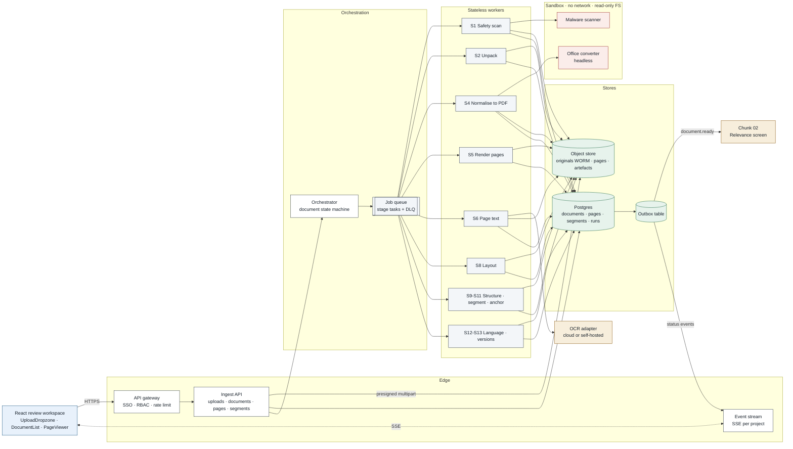
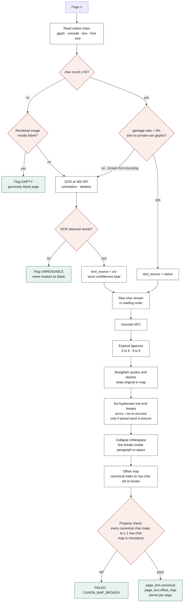
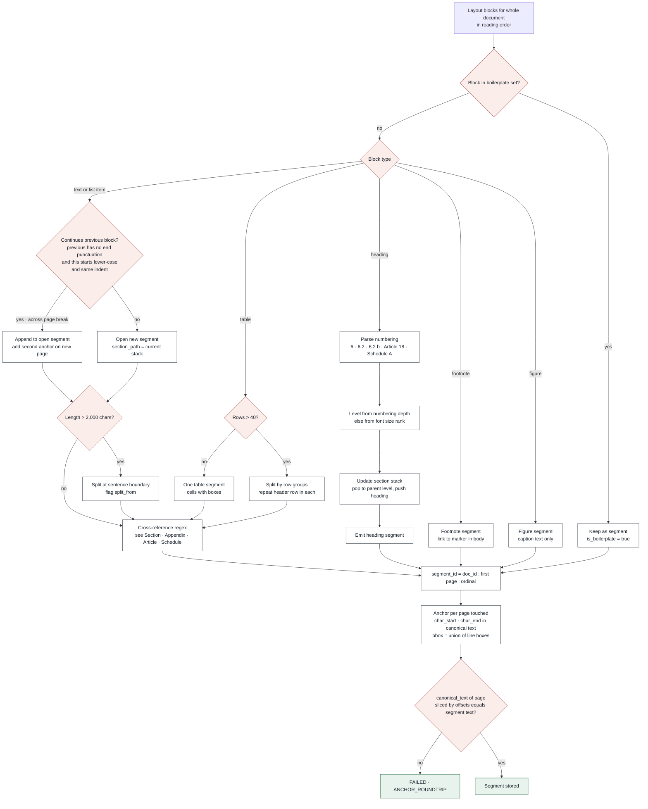
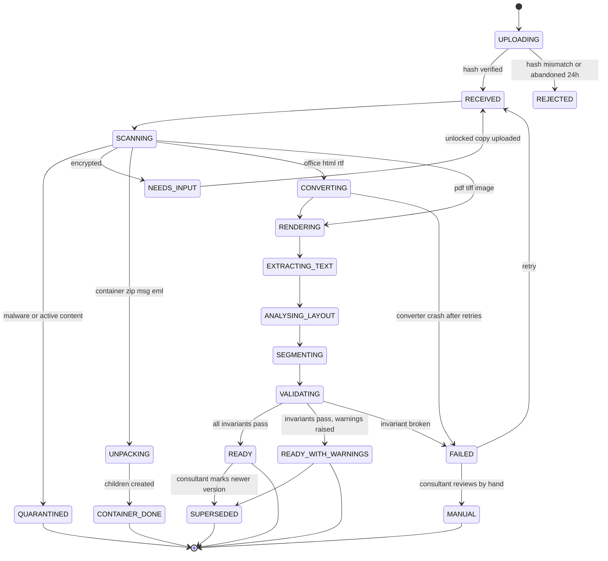
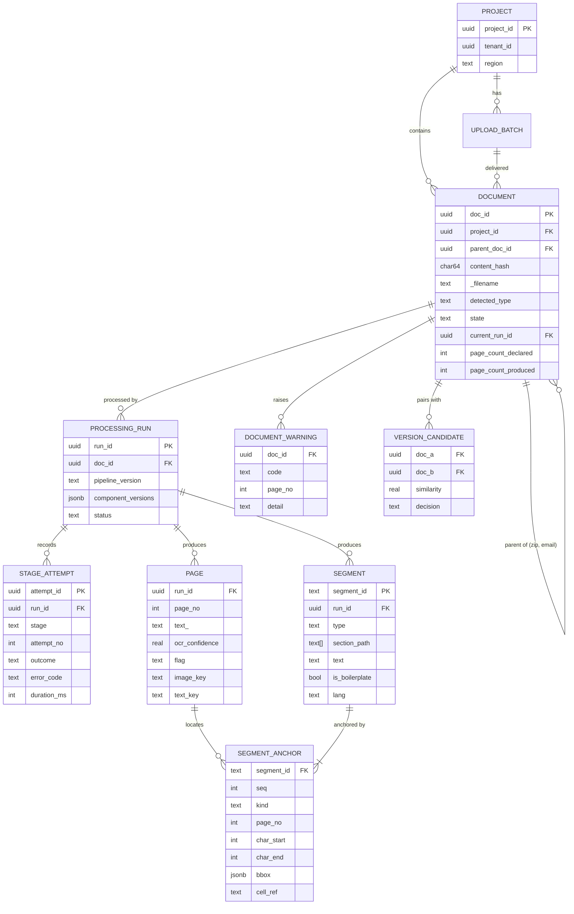
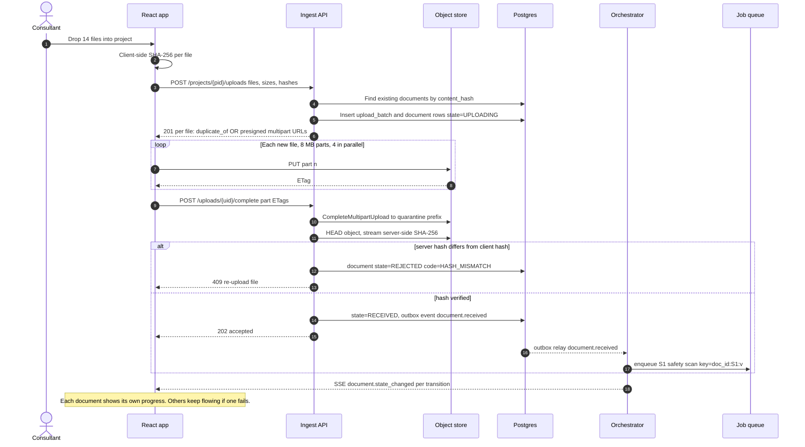

# Chunk 01 · Ingest, normalise & segment — Low-Level Design

> **The one-line claim:**
> *Ingest is the only stage that sees the customer's raw files, so it carries three jobs nobody downstream can do: keep hostile files out, lose nothing, and record coordinates precise enough that a highlight lands on the exact words, even after OCR, hyphenation and page breaks.*

| | |
|---|---|
| **Document** | LLD v1.0 · chunk 01 of 07 |
| **Supersedes** | Nothing. Amends HLD v1.0 (§1 below) |
| **PRD requirements** | FR-ING-01 → 05 · FR-AUD-01, 02 · NFR throughput, security, privacy |
| **Frontend** | React review workspace (upload, document list, page viewer) |
| **Related** | [Test and evaluation](test-and-evaluation.md) · [CI/CD](ci-cd.md) |
| **Status** | HLD ✅ · Patterns ✅ · LLD ✅ · Infrastructure ✅ · Test/evaluation ✅ · CI/CD ✅ · Code ⬜ |

**How to read this:** §1 is the re-evaluation of the HLD. §2 is the catalogue of real-world scenarios the design must survive. §3–§9 are the build spec. §10–§15 are what makes it production: security, observability, capacity, testing, config and runbook.

Numbers marked **[EST]** are engineering estimates to confirm with real documents in phase 0.

## Quick navigation

- [Repository home](../../../README.md)
- [PRD](../../prd/PRD.md)
- [Chunk 01 HLD](hld.md)
- [Chunk 01 LLD](#)

---
## 1. Re-evaluation of the HLD

I read HLD v1.0 as a hostile reviewer would. It was right about the core: clause-level segmentation, rendering DOCX to PDF, keeping page images, two invariants. But it was written as if every file is honest, every run succeeds once, and one pipeline version lives forever. Production breaks all three assumptions.

| # | Finding | Severity | Resolution in this LLD |
|---|---|---|---|
| **F1** | **No safety stage.** Customer files are untrusted input. DOCX macros, PDF JavaScript, zip bombs and XML entity attacks all arrive through this door. The office converter is a large attack surface. | 🔴 Critical | New **S1 Safety scan** + converter sandbox (§3.2, §10) |
| **F2** | **Invariant I1 is tautological for Word files.** "Declared pages" for DOCX comes from our own render, so it always equals itself and proves nothing. | 🔴 Critical | DOCX gets a **text-coverage invariant** instead: every character of body text in the DOCX XML must appear in the rendered PDF text (§6, I1b) |
| **F3** | **"Page text" was never defined.** Chunk 03 verifies citations against it, so ligatures (fi), line-end hyphenation ("accru-/es") and smart quotes will make correct citations fail verification. | 🔴 Critical | **Canonical page text** with an **offset map** back to raw characters and boxes (§4.6) |
| **F4** | **Reprocessing breaks approved citations.** If a pipeline upgrade re-segments a document, `segment_id`s change and approved fields point at nothing. | 🔴 Critical | **Processing runs are immutable and versioned.** Approved citations pin to `run_id`. A new run never rewrites an old one (§5.3) |
| **F5** | **Missing real formats:** ZIP (customers send one zip), `.msg`/`.eml` (policy forwarded by email), XLSX (accrual tables live in spreadsheets), HTML (intranet export). | 🟠 High | S2 Unpack for containers. **Polymorphic anchors** (`page_bbox` or `cell`) for spreadsheets (§4.3, §4.4) |
| **F6** | **No async/progress model for the UI.** A 112-page scan takes minutes; the consultant needs per-document progress, and one failure mustn't block thirteen successes. | 🟠 High | Per-document state machine + SSE event stream to React (§5, §8) |
| **F7** | **Tenancy and privacy not specified.** Collective agreements contain member names; handbooks contain signatures. | 🟠 High | Per-tenant encryption keys, region pinning, no document text in logs, deletion by key destruction (§10) |
| **F8** | **Upload path not designed.** 300 MB scanned PDFs over hotel Wi-Fi will fail on a single POST. | 🟡 Medium | Resumable multipart upload direct to object storage, client + server hash (§8.2) |
| **F9** | **Watermarks ignored.** A "DRAFT" or "SUPERSEDED" watermark is a signal about whether the document is policy at all. | 🟡 Medium | Watermark detection → document warning (§4.8) |
| **F10** | **No retry, idempotency or poison-message design.** | 🟡 Medium | Stage-level idempotency keys, retry budgets, DLQ (§7) |
| **F11** | **No test corpus defined.** "Works on my PDF" is how ingest pipelines fail in production. | 🟡 Medium | Named fixture corpus, one per scenario (§13) |
| **F12** | **OCR choice deferred with no interface.** Swapping engines later would ripple through the code. | 🟢 Low | `OcrAdapter` interface; engine is config (§4.5) |

**Net effect on the HLD:** the 12-step flow stands. It gains **S1 Safety**, **S2 Unpack** and a formal **canonicalisation** step, invariant **I1** splits into **I1a** (paged sources) and **I1b** (Word text coverage), and a new invariant **I7** protects approved citations across reprocessing.

---

## 2. Real-world scenarios the design must survive

Each scenario becomes a test fixture (§13). The **Handled by** column is where to look in this document.

| # | What actually happens | Expected behaviour | Handled by |
|---|---|---|---|
| **R1** | Customer sends one ZIP: 38 files in nested folders, including `__MACOSX` junk and `Thumbs.db` | Unpacked into 36 child documents; OS junk silently skipped and counted; folder path kept as metadata | S2 |
| **R2** | Same handbook sent twice, renamed `Handbook_FINAL_v2.pdf` | Recognised by content hash; linked, not reprocessed; UI shows "duplicate of…" | S0 |
| **R3** | 2022 and 2025 handbooks both sent | Both processed; flagged as a version pair (similarity 0.86); consultant marks 2022 as superseded | S13 |
| **R4** | 112-page collective agreement scanned sideways, some pages skewed, one upside down | Orientation corrected per page; deskewed OCR; low-confidence pages flagged individually | S5, S6 |
| **R5** | DOCX handbook with HR's tracked changes still in it | Accepted-state processed; `TRACKED_CHANGES` warning pinned at the top of the review | S4 |
| **R6** | PDF password-protected by the customer's HR system | State `NEEDS_INPUT`; consultant prompted to request an unlocked copy; never skipped silently | S1 |
| **R7** | PDF contains embedded JavaScript (a form from an old HR portal) | `QUARANTINED`; security notified; consultant told why in plain words | S1 |
| **R8** | Accrual tiers kept in `PTO_Accrual_Rates.xlsx`, two sheets | Each sheet becomes table segments with **cell anchors** (`Sheet1!B4`); no fake page rendering | S4, §4.4 |
| **R9** | Quebec addendum, English and French side by side in two columns | Two-column reading order; each segment tagged `en` or `fr`; pairs not merged | S8, S12 |
| **R10** | Policy was forwarded as an Outlook `.msg` with the PDF attached | The email body becomes one document, the PDF a child document; both processed | S2 |
| **R11** | 300 MB, 420-page scanned PDF uploaded over a weak connection | Resumable upload in 8 MB parts; survives a dropped connection; page-level parallel OCR | §8.2, §11 |
| **R12** | Phone photos of a printed policy (JPEGs, shadows, perspective) | Each image a page; OCR confidence drives `LOW_OCR` flags; consultant told to read those pages | S4, S6 |
| **R13** | A PDF with a broken font encoding: text copies out as `ÿþ#$%` | Native text rejected by the health check; page OCR'd instead | S6 |
| **R14** | A policy clause runs from the bottom of page 31 onto page 32 | One segment with two anchors; highlight spans both pages | S10 |
| **R15** | "DRAFT — NOT FOR DISTRIBUTION" watermark on every page | `WATERMARK_DRAFT` warning; consultant confirms with customer this is the live policy | S9 |
| **R16** | OCR provider has an outage mid-batch | Pages retried with backoff; circuit opens; documents wait in `EXTRACTING_TEXT`; nothing marked failed for an outage | §7 |
| **R17** | Worker crashes on page 60 of 112 | Stage restarts from its idempotency key; completed pages not redone | §7 |
| **R18** | Consultant deletes a document while it is processing | Run cancelled cooperatively; artefacts deleted; late worker writes rejected by run status | §7.4 |
| **R19** | Pipeline v1.3 ships a better table detector after 40 projects already approved | Old runs untouched; re-processing opt-in per project; approved citations stay on their `run_id` | §5.3, I7 |
| **R20** | A 2-page offer-letter template with merge fields `«FirstName»` | Processed normally; merge fields kept verbatim; no special handling needed | — |

---

## 3. Components



### 3.1 Services

| Component | Responsibility | Runs as | Scales on |
|---|---|---|---|
| **Ingest API** | Upload handshake, document/page/segment reads, retry and supersede commands. The only thing React talks to. | Stateless HTTP service | Requests |
| **Event stream** | Server-sent events per project: state changes, progress, warnings | Same service, separate route | Open connections |
| **Orchestrator** | Owns the document state machine. Consumes outbox events, enqueues the next stage, applies retry budgets, handles cancellation. | Single logical service (leader-elected) | Events |
| **Workers** | Execute one stage for one document (or one page). Pure functions of (input artefacts, config, versions) → output artefacts. | Stateless containers | Queue depth |
| **Sandbox** | Malware scanner and office converter, isolated | Separate container class, no network | Queue depth |
| **OCR adapter** | Normalises one or more OCR engines behind one interface | In-worker library + remote engine | Pages |
| **Object store** | Originals (write-once), renders, canonical text, layout JSON | Managed service | — |
| **Postgres** | Documents, runs, stage attempts, pages, segments, anchors, warnings, outbox | Managed, one primary + replica | — |
| **Job queue** | At-least-once delivery, visibility timeout, DLQ | Managed queue | — |

### 3.2 Technology choices

Chosen for the reference build. Every one is behind an interface so it can change.

| Concern | Reference choice | Alternatives considered | Why this one |
|---|---|---|---|
| Language (workers, API) | **Python 3.12** | Go | Best document tooling ecosystem; interview language |
| API framework | **FastAPI** | Flask, Django | Typed request/response models → OpenAPI → typed React client |
| PDF render + native text | **PDFium via pypdfium2**, **PyMuPDF** for char boxes | pdfplumber, Poppler | Fast, char-level boxes, handles broken PDFs gracefully |
| Office → PDF | **LibreOffice headless** in sandbox | Commercial converter, Gotenberg | Free, broad format coverage; sandboxing handles the risk |
| Type detection | **libmagic** | Extension, MIME header | Extensions and browser MIME types lie |
| Malware | **ClamAV** + **oletools** (macros) + PDF active-content check | Cloud AV API | Runs offline in the sandbox; macro detection is explicit |
| OCR | **Adapter**: cloud document OCR (e.g. Textract) **or** self-hosted (PaddleOCR / Tesseract) | Single hard-wired engine | Canadian data-residency may force self-hosted for some tenants |
| Layout + tables | **Docling** (local, open source; layout + table structure) | Cloud layout APIs, Unstructured | Runs in our boundary; strong table structure; no per-page fee |
| Language ID | **fastText lid.176** | langdetect | Fast, accurate on short text |
| Near-duplicate | **MinHash** (datasketch) on segment shingles | Embeddings | Deterministic, cheap, explainable |
| Queue | **SQS** + DLQ | Redis Streams, RabbitMQ | Managed, visibility timeout fits long stages |
| Object store | **S3** (Object Lock for originals) | Any S3-compatible | Write-once originals for audit |
| DB | **Postgres 16** | — | Transactions for outbox, JSONB for boxes |
| Frontend | **React + TypeScript**, TanStack Query, PDF page as image + SVG overlay | PDF.js rendering in browser | We already render server-side; overlay boxes are exact to our coordinates |

**AWS mapping** (the reference deployment): API and workers on ECS Fargate, sandbox as a separate task definition with no network, S3 with Object Lock, SQS, RDS Postgres, KMS per tenant, CloudWatch + OpenTelemetry.

---

## 4. Stage specifications

```mermaid
flowchart TB
  classDef gate fill:#FBEDEA,stroke:#9B2C2C,color:#17202A
  classDef step fill:#FFFFFF,stroke:#39434F,color:#17202A
  classDef store fill:#E7F3EC,stroke:#236A45,color:#17202A
  classDef warn fill:#F7EEDC,stroke:#8A5A12,color:#17202A
  classDef stop fill:#EDEFF2,stroke:#4B5563,color:#17202A

  IN["document.received<br/>doc_id · content_hash · quarantine key"]

  subgraph S1["S1 · Safety scan"]
    MAG["Detect true type<br/>magic bytes, ignore extension"]
    ALLOW{"Type on allow-list?"}
    AV["Malware scan<br/>sandboxed"]
    ACT{"Macros · PDF JavaScript<br/>launch actions?"}
    ENC{"Encrypted?"}
    BOMB{"Archive limits OK?<br/>ratio · count · depth · size"}
  end

  subgraph S2["S2 · Unpack containers"]
    UNZ["Extract zip · msg · eml<br/>create child documents<br/>parent_id set"]
  end

  subgraph S4["S4 · Normalise to PDF"]
    TC{"DOCX has tracked<br/>changes or comments?"}
    ACC["Accept all changes in XML copy<br/>warn TRACKED_CHANGES"]
    CONV["Office converter to PDF<br/>sandbox · timeout 120s"]
    PMAP["Keep DOCX paragraph id<br/>to PDF text mapping"]
    IMG["TIFF · PNG · JPEG to PDF<br/>unroll every TIFF frame"]
    XLS["XLSX: each sheet to table blocks<br/>cell anchors, no rendering"]
  end

  subgraph S5["S5 · Render"]
    CNT["Declared page count<br/>from PDF page tree or TIFF frames"]
    RND["Render every page<br/>150 DPI view · 300 DPI OCR"]
    ROT["Detect rotation 0/90/180/270<br/>normalise orientation"]
    I1{"I1 · pages rendered<br/>equal declared?"}
  end

  subgraph S6["S6 · Page text, per page"]
    NAT["Native text layer<br/>chars with boxes"]
    HEALTH{"Healthy?<br/>≥ 50 chars · garbage < 5%<br/>unicode mapped"}
    OCR["OCR adapter<br/>deskew · words · boxes · confidence"]
    CONF{"Mean confidence ≥ 0.85?"}
    CANON["Canonical page text<br/>NFC · ligatures · de-hyphenate<br/>offset map to raw chars"]
    I3{"I3 · text or explicit<br/>EMPTY / UNREADABLE flag?"}
  end

  subgraph S8["S8 · Layout"]
    LAY["Blocks: heading · text · list · table<br/>header · footer · footnote · figure"]
    ORD["Reading order<br/>columns top to bottom"]
    TAB["Table structure<br/>rows · columns · cell boxes"]
  end

  subgraph S9["S9 to S11 · Structure, segment, anchor"]
    BP["Boilerplate: text repeated in top/bottom band<br/>on ≥ 50% of pages"]
    WM{"Watermark DRAFT or SUPERSEDED?"}
    TREE["Section tree<br/>numbering patterns + font size"]
    SEG["Segments along structure<br/>merge across page breaks<br/>tables whole · split > 2,000 chars at sentences"]
    XREF["Detect cross-references<br/>see Appendix B · Article 18"]
    ANC["Anchors: page · char_start · char_end · bbox"]
    I2{"I2 · every anchor<br/>round-trips to its text?"}
  end

  subgraph S12["S12 to S13 · Enrich"]
    LANG["Language per segment<br/>en · fr · mixed"]
    VER["Near-duplicate vs other docs in project<br/>MinHash Jaccard ≥ 0.8"]
  end

  subgraph S14["S14 · Validate and publish"]
    I6{"I4 to I6 · ids deterministic<br/>originals untouched<br/>versions recorded?"}
    TX["One transaction:<br/>pages · segments · anchors · warnings<br/>status · outbox event"]
  end

  OBJ[("Object store")]
  PG[("Postgres")]
  READY["document.ready → chunk 02"]
  RW["READY_WITH_WARNINGS → chunk 02<br/>warnings shown in UI"]
  QUAR["QUARANTINED<br/>tell consultant, keep for security"]
  NEED["NEEDS_INPUT<br/>ask for unlocked copy"]
  REJ["REJECTED<br/>unsupported type, reason shown"]
  FAIL["FAILED<br/>code + reason, retry or manual"]

  IN --> MAG --> ALLOW
  ALLOW -->|"no"| REJ
  ALLOW -->|"yes"| AV --> ACT
  ACT -->|"yes"| QUAR
  ACT -->|"no"| ENC
  ENC -->|"yes"| NEED
  ENC -->|"no"| BOMB
  BOMB -->|"limit exceeded"| QUAR
  BOMB -->|"container"| UNZ
  UNZ -->|"each child re-enters S1"| IN
  BOMB -->|"office file"| TC
  BOMB -->|"pdf"| CNT
  BOMB -->|"image or tiff"| IMG
  BOMB -->|"spreadsheet"| XLS
  TC -->|"yes"| ACC --> CONV
  TC -->|"no"| CONV
  CONV --> PMAP --> CNT
  CONV -->|"crash or timeout x3"| FAIL
  IMG --> CNT
  XLS --> BP
  CNT --> RND --> ROT --> I1
  I1 -->|"no"| FAIL
  I1 -->|"yes"| NAT --> HEALTH
  HEALTH -->|"yes"| CANON
  HEALTH -->|"no"| OCR --> CONF
  CONF -->|"yes"| CANON
  CONF -->|"no · warn LOW_OCR page"| CANON
  CANON --> I3
  I3 -->|"no"| FAIL
  I3 -->|"yes"| LAY --> ORD --> TAB --> BP --> WM
  WM -->|"yes · warn"| TREE
  WM -->|"no"| TREE
  TREE --> SEG --> XREF --> ANC --> I2
  I2 -->|"no"| FAIL
  I2 -->|"yes"| LANG --> VER --> I6
  I6 -->|"no"| FAIL
  I6 -->|"yes"| TX
  TX --> PG
  RND --> OBJ
  CANON --> OBJ
  TX -->|"no warnings"| READY
  TX -->|"warnings"| RW

  class ALLOW,ACT,ENC,BOMB,TC,HEALTH,CONF,I1,I2,I3,I6,WM gate
  class MAG,AV,UNZ,ACC,CONV,PMAP,IMG,XLS,CNT,RND,ROT,NAT,OCR,CANON,LAY,ORD,TAB,BP,TREE,SEG,XREF,ANC,LANG,VER,TX step
  class OBJ,PG store
  class RW warn
  class QUAR,NEED,REJ,FAIL,READY stop
```


Every stage follows the same contract:

```
input:  doc_id, run_id, stage, input artefact keys
output: output artefact keys + DB rows, written idempotently
key:    idempotency key = {run_id}:{stage}[:{page_no}]
emits:  outbox event {doc_id, run_id, stage, outcome}
```

### S0 · Intake (Ingest API)

| | |
|---|---|
| **Input** | File metadata from React: name, size, client SHA-256 |
| **Steps** | 1. Look up `content_hash` in the project → if found, return `duplicate_of` and create no work. 2. Enforce quotas: ≤ 200 files and ≤ 2,000 pages per batch, ≤ 500 MB per file. 3. Create `document` rows `UPLOADING`, return presigned multipart URLs to the **quarantine** prefix. 4. On complete: server streams the object to recompute SHA-256. Mismatch → `REJECTED/HASH_MISMATCH`. |
| **Output** | `document` in `RECEIVED`; outbox `document.received` |
| **Why server hash too** | The client hash lets us skip duplicate uploads. The server hash is the one we trust for audit. |
| **Abandoned uploads** | Multipart uploads not completed in 24 h are aborted by a lifecycle rule; document → `REJECTED/ABANDONED` |

### S1 · Safety scan (sandbox)

| Check | Rule | On failure |
|---|---|---|
| True type | libmagic on first 8 KB. Allow-list: PDF, DOCX, DOC, RTF, ODT, HTML, TXT, XLSX, XLS, CSV, TIFF, PNG, JPEG, ZIP, MSG, EML | `REJECTED/UNSUPPORTED_TYPE`, shown with the detected type |
| Extension mismatch | `.pdf` that is actually a ZIP etc. | Proceed with the true type, warn `EXTENSION_MISMATCH` |
| Malware | ClamAV signature scan | `QUARANTINED/MALWARE` → security alert |
| Office macros | oletools `olevba` finds VBA | `QUARANTINED/ACTIVE_CONTENT` |
| PDF active content | `/JavaScript`, `/JS`, `/Launch`, `/EmbeddedFile` with executable, `/OpenAction` running JS | `QUARANTINED/ACTIVE_CONTENT` |
| XML attacks (DOCX/XLSX) | Parse with entity expansion disabled (defusedxml) | `QUARANTINED/MALFORMED_XML` |
| Encryption | PDF encrypted with user password; Office encrypted package | `NEEDS_INPUT/ENCRYPTED` |
| Archive limits | compression ratio ≤ 100:1, ≤ 500 entries, depth ≤ 3, total uncompressed ≤ 2 GB | `QUARANTINED/ARCHIVE_LIMIT` |

**Passing files are copied** from `quarantine/` to `originals/` (Object Lock, write-once). Nothing downstream ever reads from quarantine.

### S2 · Unpack containers

- **ZIP:** extract entries; skip OS junk (`__MACOSX/`, `.DS_Store`, `Thumbs.db`, `~$*` lock files) and count them; each remaining entry → child `document` with `parent_doc_id`, `container_path`. Each child re-enters **S1** (a zip inside a zip is scanned again, with depth +1).
- **MSG/EML:** body (HTML or text) → one child document of type `email_body`; each attachment → a child document.
- The container itself ends in `CONTAINER_DONE`. It has no pages or segments.

### S3 · Route

A pure function of detected type:

| Type | Route |
|---|---|
| PDF | → S5 |
| DOCX, DOC, RTF, ODT, HTML, TXT | → S4 office path |
| TIFF, PNG, JPEG | → S4 image path |
| XLSX, XLS, CSV | → S4 spreadsheet path |

### S4 · Normalise

**Office path**
1. **Tracked changes and comments.** Open the DOCX XML (defusedxml). If `w:ins`, `w:del` or `w:comment` elements exist: produce a copy with insertions kept, deletions removed and comments stripped. Warn `TRACKED_CHANGES` with counts.
2. **Paragraph inventory.** Record every body paragraph's id (`w14:paraId` if present, else ordinal) and its plain text. This is the input to invariant **I1b**.
3. **Convert** with LibreOffice headless in the sandbox. Timeout 120 s. Memory limit 2 GB. One conversion per process (LibreOffice is not safe to share).
4. **Paragraph → page map.** Match each inventory paragraph to its location in the rendered PDF text (normalised string match). Stored so a citation can also say "§6.2, paragraph 3".

**Image path**
- TIFF: iterate **every frame**. Each frame → one PDF page. `page_count_declared` = frame count.
- PNG/JPEG: one image → one page. EXIF orientation applied before anything else.

**Spreadsheet path** (no rendering)
- Each sheet → a sequence of table blocks. Detect the used range, header row (first row with ≥ 60% text cells) and merged cells.
- Anchors are **cell anchors**: `{kind: "cell", sheet: "Accrual", ref: "B4", row: 4, col: 2}`.
- Formulas: store the **cached value** and the formula text. The value is what the consultant sees in Excel.
- Hidden sheets and rows are processed and marked `hidden=true`. They are often exactly where HR keeps the real table.

### S5 · Render

1. **Declared page count** from the PDF page tree (or TIFF frames). For converted Office files, this count is recorded but **not** used for I1 (see F2).
2. **Render** each page twice with PDFium: 150 DPI WebP for display, 300 DPI grayscale PNG for OCR (created only if the page goes to OCR, so it's lazy).
3. **Orientation:** if the page has no usable text layer, run orientation detection (0/90/180/270). Rotate the image and record `rotation`. All boxes are in the **rotated, upright** coordinate space.
4. **I1a:** rendered page count must equal the declared count. Any gap fails the document with `PAGE_COUNT_MISMATCH` and the missing page numbers.
5. Pages are processed as a fan-out: one queue task per page for S6.

### S6 · Page text (per page)


**Native first.** Extract characters with their unicode value, box, font name and size.

**Health check** (all must pass to use native text):

| Signal | Threshold [EST] | What it catches |
|---|---|---|
| Character count | ≥ 50 | Scanned page with a few typed characters on a cover sheet |
| Garbage ratio | < 5% of chars outside letters, digits, common punctuation | Broken font encoding (R13) |
| Private-use glyphs | 0 | Fonts mapping glyphs to private Unicode codepoints |
| Invisible text | < 20% of chars rendered invisibly | PDF with an old, wrong OCR layer hidden under the image |

**Else OCR** through the adapter:

```python
class OcrAdapter(Protocol):
    def recognise(self, image: bytes, *, dpi: int, lang_hint: list[str]) -> OcrPage: ...

@dataclass(frozen=True)
class OcrWord:
    text: str
    bbox: tuple[float, float, float, float]   # page coords, upright
    confidence: float                          # 0..1
    line_id: int
    block_id: int
```

**Page flags**: `EMPTY` only when the rendered image is ≥ 99.5% background **and** OCR returns nothing. `UNREADABLE` when the image has content but OCR returns nothing. **An unreadable page is never treated as blank.** `LOW_OCR` when mean word confidence < 0.85 [EST].

### 4.6 Canonical page text and the offset map

This is the fix for F3, and it's the part chunk 03 depends on most.

**Problem:** the raw characters on a page are not the string anyone would quote. The model will write "accrues", but the page contains `accru` `-` `\n` `es`. It will write "fi", but the page contains the single glyph `fi`.

**Canonical text rules**, applied in order:

| # | Rule | Example |
|---|---|---|
| 1 | Unicode NFC | `é` (e + combining accent) → `é` |
| 2 | Expand ligatures | `fi` → `fi`, `fl` → `fl`, `ff` → `ff` |
| 3 | Straighten quotes, normalise dashes | `“ ” ’` → `" " '`; `–` stays but is mapped |
| 4 | De-hyphenate line ends **only if** the joined word is in the lexicon or appears elsewhere unhyphenated in the document | `accru-⏎es` → `accrues`; `full-⏎time` stays `full-time` |
| 5 | Soft line breaks inside a paragraph → one space; paragraph breaks → `\n\n` | |
| 6 | Collapse runs of whitespace | |

**Offset map:** for every canonical character, the list of raw character ids it came from; for every raw character, its box. So `canonical[1004:1144]` → raw char ids → union of boxes per line → the highlight.

**Properties enforced (property-based tests and runtime check):**
- Every canonical character maps to ≥ 1 raw character (no invented text).
- The map is monotonic (canonical order follows reading order).
- Slicing any canonical range yields a set of boxes all on this page.

Chunk 03 verifies citations against **canonical text**, with the same normalisation applied to the model's quote. That is why correct quotes don't fail verification.

### S7 · Page-level checks

- **I3:** every page has canonical text **or** an explicit flag (`EMPTY` / `UNREADABLE`).
- **I1b (office sources only):** text coverage. Take the paragraph inventory from S4, canonicalise it, and check that ≥ 99.5% [EST] of its characters appear, in order, in the concatenated canonical text of the rendered PDF. Failure → `FAILED/CONVERSION_TEXT_LOSS`, with the first missing paragraph quoted. This catches the converter silently dropping a text box, a table or a section.

### S8 · Layout

Run Docling (or equivalent) per page on the image + native text. Output blocks:

```json
{ "page": 31, "blocks": [
  { "id": "b12", "type": "section_header", "bbox": [72,140,260,158], "text_span": [812,829], "font_size": 13.5, "bold": true },
  { "id": "b13", "type": "text", "bbox": [72,162,540,210], "text_span": [830,1003], "indent": 72 },
  { "id": "b14", "type": "table", "bbox": [72,300,540,420],
    "cells": [{ "r":0,"c":0,"text":"Years of service","bbox":[...]}, "..."] }
]}
```

**Reading order:** detect columns by clustering block x-ranges; order column by column, top to bottom. Headers/footers are excluded from the column pass and placed first/last.

**Tables:** keep row/column indices, header rows, spanning cells, and cell boxes. A table that continues onto the next page with a repeated header is **stitched** into one logical table (same column count, header match ≥ 0.9 similarity).

### S9 · Boilerplate and watermarks

- **Boilerplate:** normalise digits to `#` in lines within the top and bottom 8% of each page. A normalised line appearing on ≥ 50% of pages (min 3) is boilerplate. "Confidential — ACME — Page 31" and "…Page 32" collapse to the same pattern.
- **Watermarks:** large, rotated or low-opacity text spanning the page centre, or text matching `DRAFT|SUPERSEDED|SAMPLE|NOT FOR DISTRIBUTION|OBSOLETE` in ≥ 30% of pages → document warning `WATERMARK_{WORD}`.

### S10 · Structure and segmentation


**Heading detection.** A block is a heading if the layout model says so **or** it matches a numbering pattern and is short (< 120 chars) with no terminal full stop.

| Pattern | Example | Level rule |
|---|---|---|
| `^\d+(\.\d+)*\.?\s` | `6`, `6.2`, `6.2.1` | depth = number of dot parts |
| `^(Article\|Section\|Part)\s+[\dIVX]+` | `Article 18` | level 1 in collective agreements |
| `^(Schedule\|Appendix\|Annex)\s+[A-Z\d]+` | `Appendix B` | level 1 |
| `^\([a-z]\)\s` | `(b)` | parent + 1 |
| `^\((i\|ii\|iii\|iv\|v\|vi\|vii\|viii\|ix\|x)\)\s` | `(ii)` | parent + 2 |
| No numbering | "Paid Time Off" in bold | rank by font size among headings in this document |

**Section stack.** On each heading, pop the stack to its parent level and push. Every non-heading segment gets `section_path = stack`.

**Continuation across page breaks** (R14). Merge the first text block of page *n+1* into the open segment from page *n* when: the open segment has no terminal punctuation, **and** the new block starts lower-case or with a continuation word, **and** indentation matches within 6 pt, **and** no heading intervenes. The segment keeps **two anchors**, one per page.

**Limits.** Segments longer than 2,000 chars [EST] are split at sentence boundaries; both halves carry `split_group`. Tables with more than 40 rows are split by row groups with the header row repeated.

**Cross-references.** Regex over segment text: `see\s+(section|article|appendix|schedule|table)\s+[\w.]+`. Store the raw reference; chunk 02 resolves it.

**Ids.** `segment_id = {run_id_short}:{first_page:03d}:{ordinal:04d}`. Deterministic for the same input bytes, config and pipeline version (I4).

### S11 · Anchors

```json
{ "segment_id": "r7f3:031:0006",
  "anchors": [
    { "seq": 0, "kind": "page_bbox", "page_no": 31,
      "char_start": 1004, "char_end": 1144,
      "line_boxes": [[72,214,540,229],[72,232,388,248]],
      "bbox": [72,214,540,248] } ] }
```

- `line_boxes` are kept, not just the union. The union of a two-line span covers words that aren't in the citation; per-line boxes highlight exactly the quoted words.
- **I2 round-trip:** `canonical_text[page][char_start:char_end] == segment_part_text` for every anchor. Exact string equality.

### S12 · Language

fastText on each segment ≥ 20 chars. Store top language and confidence. Segments with `fr` confidence ≥ 0.8 in an MVP (English-only) project raise `LANGUAGE_UNSUPPORTED` on the document, which is visible in the UI but doesn't block.

### S13 · Version candidates

Across all `READY` documents in the project: MinHash (128 permutations) over 5-word shingles of non-boilerplate segments. Pairs with estimated Jaccard ≥ 0.8 [EST] → `version_candidate` row. Hints for which is newer: year in title or filename, "effective date" regex in the first 3 pages, PDF metadata date. **The system suggests; the consultant decides.**

### S14 · Validate and publish

One database transaction:
1. Insert pages, segments, anchors, warnings for this `run_id`.
2. Run I4–I6 checks.
3. Set `document.current_run_id = run_id` and `state = READY | READY_WITH_WARNINGS`.
4. Insert outbox event `document.ready {doc_id, run_id, page_count, segment_count, warnings}`.

Chunk 02 consumes `document.ready`. Nothing downstream reads a run that isn't current and complete.

### Document state machine

Owned by the orchestrator. Every transition is written with the actor and time, and is pushed to the UI as an event.


---

## 5. Data model


### 5.1 DDL (core tables)

```sql
CREATE TABLE document (
  doc_id              uuid PRIMARY KEY,
  project_id          uuid NOT NULL REFERENCES project,
  batch_id            uuid REFERENCES upload_batch,
  parent_doc_id       uuid REFERENCES document,
  container_path      text,
  content_hash        char(64) NOT NULL,
  source_filename     text NOT NULL,
  detected_type       text,
  state               text NOT NULL,
  state_reason        text,
  current_run_id      uuid,
  superseded_by       uuid REFERENCES document,
  page_count_declared int,
  page_count_produced int,
  created_by          text NOT NULL,
  created_at          timestamptz NOT NULL DEFAULT now(),
  updated_at          timestamptz NOT NULL DEFAULT now(),
  UNIQUE (project_id, content_hash, parent_doc_id)
);

CREATE TABLE processing_run (
  run_id              uuid PRIMARY KEY,
  doc_id              uuid NOT NULL REFERENCES document,
  pipeline_version    text NOT NULL,          -- e.g. ingest-1.3.0
  component_versions  jsonb NOT NULL,         -- converter, ocr engine, layout model
  config_hash         char(64) NOT NULL,
  status              text NOT NULL,          -- running | complete | failed | cancelled
  started_at          timestamptz NOT NULL,
  finished_at         timestamptz
);

CREATE TABLE stage_attempt (
  attempt_id   uuid PRIMARY KEY,
  run_id       uuid NOT NULL REFERENCES processing_run,
  stage        text NOT NULL,
  page_no      int,
  attempt_no   int NOT NULL,
  outcome      text NOT NULL,                -- ok | retry | failed
  error_code   text,
  duration_ms  int,
  UNIQUE (run_id, stage, page_no, attempt_no)
);

CREATE TABLE page (
  run_id         uuid NOT NULL REFERENCES processing_run,
  page_no        int  NOT NULL,
  width_pt       real NOT NULL,
  height_pt      real NOT NULL,
  rotation       smallint NOT NULL DEFAULT 0,
  text_source    text,                      -- native | ocr | none
  ocr_confidence real,
  flag           text,                      -- EMPTY | UNREADABLE | LOW_OCR
  image_key      text NOT NULL,
  canonical_key  text,
  offset_map_key text,
  PRIMARY KEY (run_id, page_no)
);

CREATE TABLE segment (
  segment_id     text PRIMARY KEY,
  run_id         uuid NOT NULL REFERENCES processing_run,
  ordinal        int  NOT NULL,
  type           text NOT NULL,
  section_path   text[] NOT NULL,
  text           text NOT NULL,
  table_json     jsonb,
  refs           text[],
  is_boilerplate boolean NOT NULL DEFAULT false,
  lang           text,
  split_group    text
);

CREATE TABLE segment_anchor (
  segment_id   text NOT NULL REFERENCES segment,
  seq          smallint NOT NULL,
  kind         text NOT NULL,              -- page_bbox | cell
  page_no      int,
  char_start   int,
  char_end     int,
  line_boxes   jsonb,
  bbox         jsonb,
  sheet        text,
  cell_ref     text,
  PRIMARY KEY (segment_id, seq)
);

CREATE TABLE document_warning (
  doc_id   uuid NOT NULL REFERENCES document,
  run_id   uuid REFERENCES processing_run,
  code     text NOT NULL,
  page_no  int,
  detail   jsonb,
  PRIMARY KEY (doc_id, code, page_no)
);

CREATE TABLE outbox (
  id          bigserial PRIMARY KEY,
  topic       text NOT NULL,
  payload     jsonb NOT NULL,
  created_at  timestamptz NOT NULL DEFAULT now(),
  published_at timestamptz
);
```

**Tenant isolation:** every table carries `project_id` (directly or through `document`), and Postgres row-level security restricts rows to projects the caller is staffed on.

### 5.2 Object store layout

```
s3://{bucket}/{tenant_id}/{project_id}/
  quarantine/{doc_id}                          ← upload target, 7-day expiry
  originals/{content_hash}                     ← Object Lock, write-once
  runs/{run_id}/
    converted.pdf                              ← office path only
    pages/{page_no:04d}.webp                   ← 150 DPI view
    ocr/{page_no:04d}.png                      ← 300 DPI, only if OCR'd, 30-day expiry
    text/{page_no:04d}.canonical.txt
    text/{page_no:04d}.offsets.bin             ← packed offset map
    layout/{page_no:04d}.json
    manifest.json                              ← versions, counts, hashes of every artefact
```

Keys by `content_hash` mean the same original, uploaded to two projects of the same tenant, is stored once.

### 5.3 Runs are immutable (fix for F4)

- A **run** is one execution of the pipeline on one document. Its outputs are never modified after it completes.
- Re-processing creates a **new run**. `document.current_run_id` moves only when the new run completes successfully.
- **Approved citations store `run_id` + `segment_id` + anchor.** They keep resolving because the old run's artefacts remain.
- **I7:** a run referenced by any approved citation cannot be deleted, except by project deletion.
- Upgrading an in-flight project is **opt-in**. The UI shows "A newer pipeline is available — re-process?" and lists which approved fields would need re-confirmation.

---

## 6. Invariants — as code

| # | Invariant | Where | Implementation |
|---|---|---|---|
| **I1a** | Rendered pages = declared pages (PDF, TIFF, images) | S5 | `assert rendered == declared`, list missing page numbers |
| **I1b** | Office text coverage ≥ 99.5% | S7 | Ordered subsequence match of canonical DOCX paragraphs in canonical PDF text |
| **I2** | Anchors round-trip exactly | S11 | String equality per anchor |
| **I3** | Every page has text or an explicit flag | S7 | `text_source != none or flag in (EMPTY, UNREADABLE)` |
| **I4** | Same bytes + config + versions → same segment ids | CI | Golden-corpus snapshot test on every build |
| **I5** | Originals never modified | Storage | S3 Object Lock (compliance mode) on `originals/` |
| **I6** | Every run records pipeline, component and config versions | S14 | `NOT NULL` constraints + manifest hash |
| **I7** | Runs referenced by approved citations are never deleted | Storage + DB | FK from citations to `processing_run`; deletion guard |

---

## 7. Reliability

### 7.1 Retries and timeouts

| Stage | Timeout | Retries | Backoff | Non-retryable errors |
|---|---|---|---|---|
| S1 Safety | 60 s | 2 | 5 s, 30 s | Malware, active content, encrypted, unsupported |
| S2 Unpack | 120 s | 2 | 5 s, 30 s | Archive limit |
| S4 Convert | 120 s | 3 | 10 s, 60 s, 300 s | `CONVERSION_TEXT_LOSS` |
| S5 Render | 30 s / page | 3 | 2 s, 10 s, 60 s | Page count mismatch |
| S6 OCR | 45 s / page | 5 | exponential, jitter, cap 5 min | — (outages are retryable) |
| S8 Layout | 60 s / page | 3 | 5 s, 30 s, 120 s | — |
| S10–S14 | 300 s / doc | 2 | 10 s, 60 s | Invariant failures |

After the last retry a task goes to the **DLQ** and the document goes to `FAILED` with the stage's error code. The DLQ is alarmed; an engineer can replay from it after a fix.

### 7.2 Idempotency

- Every task carries `{run_id}:{stage}[:{page_no}]`. Before doing work, a worker checks `stage_attempt` for a successful attempt with the same key. If one exists → acknowledge and exit.
- Every artefact write goes to a **deterministic key** under `runs/{run_id}/`. A replay overwrites with identical bytes.
- DB writes use `INSERT … ON CONFLICT DO NOTHING` on natural keys.

### 7.3 OCR provider outage (R16)

A circuit breaker per OCR engine opens after 20 failures in 60 s. While open, OCR tasks are **delayed, not failed**: re-enqueued with 2-minute visibility. The document stays in `EXTRACTING_TEXT`, and the UI shows "Waiting on text recognition service". If a tenant allows a fallback engine **and** that engine has passed the same eval gate, the adapter switches. Otherwise it waits.

### 7.4 Cancellation (R18)

Deleting a document sets `processing_run.status = cancelled`. Workers check run status before writing, and the S14 transaction checks it again. Late writes from an in-flight worker hit a cancelled run and are discarded. A sweeper deletes the run's artefacts after 1 hour.

### 7.5 Concurrency

- Page-level fan-out for S5, S6 and S8. Document-level for everything else.
- One advisory lock per `doc_id` in the orchestrator, so two runs for the same document can't both be `running`.
- Per-tenant concurrency cap (default 200 page tasks) so one large customer can't starve others.

---

## 8. API for the React frontend

### 8.1 Endpoints

| Method | Path | Purpose |
|---|---|---|
| `POST` | `/projects/{pid}/uploads` | Start a batch: `[{name, size, sha256}]` → per file `duplicate_of` or `{doc_id, upload_id, part_urls[]}` |
| `POST` | `/uploads/{upload_id}/complete` | `{parts:[{n, etag}]}` → 202 or 409 hash mismatch |
| `GET` | `/projects/{pid}/documents` | List with state, counts, warnings summary, progress |
| `GET` | `/documents/{doc_id}` | Detail: runs, warnings, version candidates, children |
| `GET` | `/documents/{doc_id}/pages/{n}` | Page metadata + signed image URL + flags |
| `GET` | `/documents/{doc_id}/segments?page={n}` | Segments and anchors on a page (current run) |
| `GET` | `/segments/{segment_id}` | One segment with anchors, any run |
| `POST` | `/documents/{doc_id}/retry` | Start a new run for a `FAILED` document |
| `POST` | `/documents/{doc_id}/manual` | Mark as reviewed by hand (reason required) |
| `POST` | `/documents/{doc_id}/supersede` | `{superseded_by}` |
| `POST` | `/documents/{doc_id}/unlock` | Upload an unlocked replacement for `NEEDS_INPUT` |
| `DELETE` | `/documents/{doc_id}` | Cancel and delete (not allowed once cited in an approved record) |
| `GET` | `/projects/{pid}/events` | **SSE** stream |

### 8.2 Upload flow


- The browser computes SHA-256 in a Web Worker (streaming, so a 300 MB file doesn't block the UI).
- Parts of 8 MB, 4 in parallel, each retried up to 5 times. Completed part ETags are kept in memory, so a dropped connection resumes from the last good part.

### 8.3 Event stream

```
event: document.state_changed
data: {"doc_id":"…","state":"EXTRACTING_TEXT","progress":{"pages_done":61,"pages_total":112}}

event: document.warning
data: {"doc_id":"…","code":"LOW_OCR","page_no":44}

event: document.ready
data: {"doc_id":"…","run_id":"…","segments":418,"warnings":["TRACKED_CHANGES"]}
```

Events carry an `id`. On reconnect the browser sends `Last-Event-ID` and the server replays from the outbox, so no event is lost to a flaky connection.

### 8.4 React components (built in the code phase)

| Component | Shows | Data |
|---|---|---|
| `UploadDropzone` | Drag-and-drop, per-file hash + upload progress, duplicate notices | uploads API |
| `DocumentList` | One row per document: state chip, progress bar, page count, warning badges | documents list + SSE |
| `DocumentStatusChip` | State in words + colour + icon: Ready · Needs attention · Processing · Blocked | SSE |
| `WarningsPanel` | Plain-language warnings with the action to take ("Ask the customer for an unlocked copy") | document detail |
| `VersionPairCard` | "These look like two versions of the same handbook — which is current?" | version candidates |
| `PageViewer` | Page image with SVG overlay of `line_boxes`; zoom; LOW_OCR banner | page + segments |

**Plain-language states for consultants** (the UI never shows internal state names):

| Internal | Consultant sees |
|---|---|
| `SCANNING` … `VALIDATING` | Processing · page 61 of 112 |
| `READY` | Ready |
| `READY_WITH_WARNINGS` | Ready · 2 things to check |
| `NEEDS_INPUT` | Locked file — ask the customer for an unlocked copy |
| `QUARANTINED` | Blocked for security — IT has been notified |
| `REJECTED` | Can't read this type of file (detected: *type*) |
| `FAILED` | Couldn't process — Retry, or Review by hand |

---

## 9. Error and warning catalogue

| Code | Kind | Retryable | Consultant message |
|---|---|---|---|
| `HASH_MISMATCH` | Reject | Re-upload | "Upload was corrupted in transit. Please upload again." |
| `UNSUPPORTED_TYPE` | Reject | No | "We can't read this type of file (detected: {type})." |
| `MALWARE` | Quarantine | No | "This file was blocked for security. IT has been notified." |
| `ACTIVE_CONTENT` | Quarantine | No | "This file contains macros or scripts and was blocked. Ask the customer for a PDF export." |
| `ARCHIVE_LIMIT` | Quarantine | No | "This archive is too large or deeply nested to open safely." |
| `ENCRYPTED` | Needs input | After unlock | "This file is password-protected. Ask the customer for an unlocked copy." |
| `CONVERSION_TIMEOUT` | Fail | Yes | "Conversion took too long. Retry, or ask for a PDF version." |
| `CONVERSION_TEXT_LOSS` | Fail | No | "Some text was lost converting this Word file (from: '{first missing}'). Ask for a PDF version." |
| `PAGE_COUNT_MISMATCH` | Fail | Yes | "Pages {list} couldn't be read." |
| `CANON_MAP_BROKEN` / `ANCHOR_ROUNDTRIP` | Fail | Engineering | "An internal check failed. Our team has been alerted." |
| `TRACKED_CHANGES` | Warning | — | "This file had tracked changes. We used the accepted version. Confirm with the customer." |
| `LOW_OCR` | Warning (page) | — | "Page {n} is hard to read. Check it yourself." |
| `UNREADABLE` | Warning (page) | — | "Page {n} has content we couldn't read. Review it by hand." |
| `WATERMARK_DRAFT` / `_SUPERSEDED` | Warning | — | "This document is marked {word}. Confirm it's the current policy." |
| `EXTENSION_MISMATCH` | Warning | — | "File named .{ext} is actually {type}." |
| `LANGUAGE_UNSUPPORTED` | Warning | — | "Contains {lang} text, which isn't supported yet." |

---

## 10. Security and privacy

| Area | Design |
|---|---|
| **Untrusted input** | Quarantine prefix → S1 → originals. Parsers run with size, time and memory limits. XML parsed with entity expansion off. |
| **Sandbox** | Malware scan and office conversion run in a separate container class: no network egress, read-only root filesystem, non-root user, seccomp profile, 2 GB memory, 2 vCPU, killed after timeout. One document per process. |
| **Tenant isolation** | Per-tenant S3 prefix + KMS key; Postgres row-level security by project; per-tenant concurrency caps. |
| **Access** | SSO; only consultants staffed on the project (and their solution lead) can read its documents. Page images served via short-lived signed URLs (5 min). |
| **PII** | **No redaction at ingest, deliberately.** Redaction would change the text the citations must match. Instead: minimum access, encryption, no document text in logs or traces, and a PII flag on documents likely to contain personal data (signatures, member lists) to tighten retention. |
| **Logs** | Structured logs carry ids, counts, codes and durations. **Never document text.** A lint rule and a log scrubber enforce it. |
| **Residency** | Project `region` pins storage and OCR engine. A Canadian-resident tenant uses a Canadian region or the self-hosted OCR engine. |
| **Retention & deletion** | Follows the customer contract. Deletion of a project destroys its KMS data key (crypto-shred) after the audit hold. |
| **Audit** | Every state change, retry, manual override and supersede is an audit event with actor and time. |

---

## 11. Observability

**Metrics** (all tagged `tenant`, `project`, `stage`, `pipeline_version`):

| Metric | Type | Alert |
|---|---|---|
| `ingest_documents_total{outcome}` | counter | `FAILED` rate > 2% over 1 h |
| `ingest_stage_duration_seconds` | histogram | p95 S4 > 90 s |
| `ingest_pages_total{text_source}` | counter | OCR share jumps > 2× week-on-week |
| `ingest_page_ocr_confidence` | histogram | median < 0.9 for a tenant |
| `ingest_invariant_failures_total{invariant}` | counter | **any** I2 or I5 failure → page |
| `ingest_quarantined_total{reason}` | counter | any `MALWARE` → security channel |
| `ingest_queue_age_seconds` | gauge | oldest task > 10 min |
| `ingest_dlq_depth` | gauge | > 0 |
| `ingest_doc_end_to_end_seconds` | histogram | SLO below |

**Traces:** one trace per run; one span per stage; page tasks as child spans. Span attributes carry ids and counts only.

**SLOs:**
- 95% of documents ≤ 200 pages reach `READY*` within **10 minutes** of upload completion.
- 99.9% of `READY` documents have zero invariant failures on later audit.
- Ingest API availability 99.5% in business hours.

**Dashboards:** batch view (per project: states, pages, warnings), stage latency and error rates, OCR health per engine, quarantine log.

---

## 12. Capacity and cost

| Quantity | Value |
|---|---|
| Pages per implementation, entitlements | ~600 |
| Peak load (PRD) | ~90,000 pages/day **[EST]** |
| Peak rate | 90,000 / 8 business h ≈ **3.1 pages/s**; plan for 3× bursts ≈ 10 pages/s |
| OCR share | ~25% **[EST]** → ~2.5 OCR pages/s at burst |
| Worker sizing at burst | Render + native: ~0.2 s/page → 2 vCPU. Layout: ~1 s/page → 10 vCPU. OCR (self-hosted): ~1.5 s/page → ~4 vCPU; or cloud OCR with concurrency ~5 |
| Converter | ~5% of documents are Office files, ~20 s each → 1–2 sandbox tasks |
| Storage per implementation | ~600 × 120 KB WebP + text + layout ≈ **~90 MB** (the HLD's ~180 MB assumed PNG) |
| Cloud OCR cost [EST] | ~$1.50 per 1,000 pages → ~150 OCR pages ≈ **$0.23 per implementation** |

**Conclusion:** ingest costs cents per implementation and scales linearly with cheap CPU. It is not the bottleneck and should never call an LLM.

---

## 13. Testing

The detailed test and evaluation plan is maintained in [Test and evaluation](test-and-evaluation.md). This section remains the build-level test contract; the linked document defines the quality metrics, labelled data, thresholds and release gates.

| Layer | What | How |
|---|---|---|
| **Fixture corpus** | One synthetic document per scenario R1–R20, plus: two-column layout, rotated scan, table spanning pages, broken font encoding, 0-byte file, PDF with 0 pages | Planned documentation fixture set with expected-output JSON |
| **Golden snapshot** | Segments, anchors and warnings for every fixture | CI fails on any diff; intentional changes regenerate with review (enforces I4) |
| **Property tests** | Canonicalisation + offset map (monotonic, total, round-trip) over random text with ligatures, hyphens and Unicode | Hypothesis |
| **Invariant tests** | Deliberately corrupt fixtures to trigger each invariant | Unit |
| **Fuzzing** | Malformed PDFs, DOCX and ZIPs against the parsers **inside the sandbox image** | Nightly |
| **Security tests** | EICAR test file, zip bomb, macro DOCX, JavaScript PDF, XXE DOCX | CI; each must reach the expected quarantine code |
| **Chaos** | Kill a worker mid-page; OCR returns 500s for 5 min; drop the DB connection during S14 | Staging; assert no duplicates, no loss, correct final state |
| **Load** | 20 projects × 600 pages concurrently | Staging; SLO measured |
| **Real-document eval** | Table detection recall and heading accuracy on golden-set documents (chunk 04) | Per release |

---

## 14. Configuration

Versioned with the pipeline; the hash is recorded on every run.

```yaml
ingest:
  limits:
    max_files_per_batch: 200
    max_pages_per_batch: 2000
    max_file_mb: 500
    archive: { max_ratio: 100, max_entries: 500, max_depth: 3, max_total_gb: 2 }
  render:
    view_dpi: 150
    ocr_dpi: 300
    view_format: webp
  native_text_health:
    min_chars: 50
    max_garbage_ratio: 0.05
    max_invisible_ratio: 0.20
  ocr:
    engine: ${TENANT_OCR_ENGINE}       # cloud | self_hosted
    low_confidence_threshold: 0.85
    circuit: { failures: 20, window_s: 60, open_s: 120 }
  coverage:
    office_min_text_coverage: 0.995
  boilerplate:
    band_fraction: 0.08
    min_page_share: 0.5
    min_pages: 3
  segmentation:
    max_segment_chars: 2000
    max_table_rows: 40
    continuation_indent_tolerance_pt: 6
  versions:
    minhash_permutations: 128
    shingle_words: 5
    candidate_threshold: 0.8
  timeouts_s: { safety: 60, unpack: 120, convert: 120, render_page: 30, ocr_page: 45, layout_page: 60, finalize: 300 }
```

---

## 15. Runbook (the first five incidents to expect)

| Symptom | Likely cause | Action |
|---|---|---|
| Many `CONVERSION_TIMEOUT` for one tenant | Huge DOCX with embedded images | Raise converter timeout for that tenant; ask for PDF exports |
| OCR share jumps for a tenant | Customer switched to a scanner-based HR system | Expected; watch `LOW_OCR` rate; consider 300 → 400 DPI for that tenant |
| `ANCHOR_ROUNDTRIP` failure | Canonicalisation bug on a new Unicode case | Block release; add the text as a property-test seed; fix; re-run affected docs as new runs |
| DLQ growing on S8 | Layout model OOM on huge pages (A3 schedules) | Increase layout worker memory; downscale page before layout |
| Consultant says "highlight is on the wrong line" | Rotation or reading-order issue on that page | Pull the run's `layout/{page}.json` and overlay; add the page to the fixture corpus |

---

## 16. What changes downstream

| Consumer | Contract it can rely on |
|---|---|
| **Chunk 02** | `document.ready` event; segments in reading order with `section_path`, `type`, `is_boilerplate`, `refs`, `lang` |
| **Chunk 03** | Canonical page text + offset map; citations verified by exact match on canonical text |
| **Chunk 05 (React)** | Page images + `line_boxes` for exact highlights; cell anchors for spreadsheets; plain-language warnings |
| **Chunk 04** | Deterministic ids per run, so eval results are comparable across runs |
| **Chunk 07** | Stage metrics, queues and DLQ, per-tenant caps |

---

## 17. Open questions

| # | Question | Decide by |
|---|---|---|
| Q1 | Cloud vs self-hosted OCR per tenant: which tenants require Canadian residency? | Before alpha |
| Q2 | Docling vs a cloud layout API: bake-off on 20 real collective agreements for table recall | Phase 0 |
| Q3 | Do consultants need the original DOCX pagination? Measure how often our render differs by > 1 page | Alpha |
| Q4 | Keep 300 DPI OCR images for 30 days or delete after OCR? (re-OCR vs storage) | Phase 0 |
| Q5 | Should bilingual EN/FR column pairs be linked for chunk 03? | Before FR-CA (P1) |

---

*Next: Chunk 02 — Relevance screen & routing. HLD first, then LLD.*
