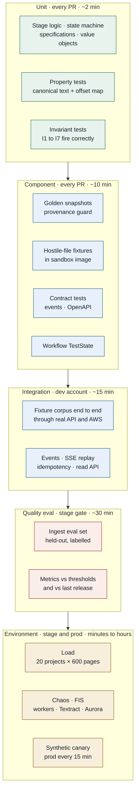
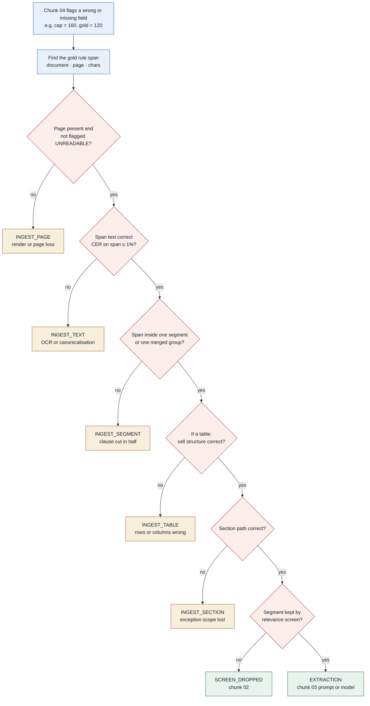
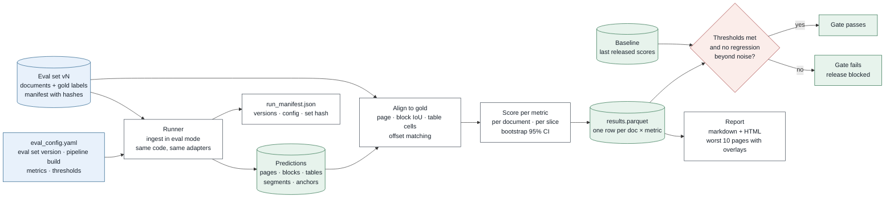

# Chunk 01 · Ingest — Test & Evaluation Plan

> **The one-line claim:**
> *Tests prove ingest does what we wrote. Evaluation proves what we wrote is good enough for real documents. Ingest needs both, because its mistakes don't show up as ingest failures: they show up two chunks later as a wrong extraction that someone blames on the prompt.*

| | |
|---|---|
| **Document** | Test & Eval v1.0 · chunk 01 of 07 |
| **Consolidates** | [LLD §13](lld.md#13-testing) · [CI/CD §4 and §8](ci-cd.md#4-pr-checks-continuous-integration). This document is the source of truth for ingest testing. |
| **Related** | Chunk 04 (evaluation harness for extraction) reuses the harness shape defined in §7 |

Numbers marked **[EST]** are starting targets, to be recalibrated after the first baseline run in phase 0 (§5.4).

---

## 1. Test vs eval: why both

| | **Tests** | **Evaluation** |
|---|---|---|
| Question | Does the code do what we specified? | Is the output good enough on real documents? |
| Answer | Pass / fail | A score, with a confidence interval |
| Input | Small, crafted fixtures with exact expected outputs | A labelled, representative set of real-world documents |
| Example | "A clause spanning pages 31–32 becomes one segment with two anchors" | "On 1,200 real pages, 99.2% of entitlement clauses land intact inside one segment" |
| Fails when | A bug is introduced | Quality is insufficient or has regressed, even with no bug |
| Runs | Every PR | Stage gate, nightly, and on demand for model or threshold changes |

**The trap this avoids:** a pipeline with 100% passing tests that segments real collective agreements badly. Tests can't catch that, because nobody wrote a fixture for the layout nobody anticipated. Only an eval on real documents does.

---

## 2. The test pyramid



### 2.1 Every suite in one table

| Layer | Suite | What it proves | Size [EST] | Runs | Budget | Owner |
|---|---|---|---|---|---|---|
| Unit | Stage logic | Each stage's `execute` on in-memory inputs | ~300 tests | PR | 2 min | Ingest eng |
| Unit | State machine | Only legal transitions; terminal states stay terminal | ~40 | PR | < 10 s | Ingest eng |
| Unit | **Property: canonical text** | Offset map is total, monotonic, round-trips; dehyphenation never invents text | 500 cases PR · 20,000 nightly | PR + nightly | 60 s / 20 min | Ingest eng |
| Unit | **Invariants** | I1a, I1b, I2, I3 fire with the right codes on corrupted inputs | ~25 | PR | < 30 s | Ingest eng |
| Component | **Golden snapshots** | Segment ids, anchors and warnings unchanged on the fixture corpus | ~45 fixtures | PR | 5 min | Ingest eng + CODEOWNER |
| Component | **Hostile files** | Each lands in its exact quarantine/reject/needs-input state, in the real sandbox image, network off | ~12 fixtures | PR | 3 min | Security + ingest |
| Component | Contracts | Event schemas and OpenAPI backward-compatible; chunk 02's expectations met | per contract | PR | 1 min | Ingest eng |
| Component | Workflow | Step Functions `Retry`/`Catch`/timeouts per state (TestState) | ~20 states | PR | 2 min | Ingest eng |
| Integration | End to end | Fixture corpus through real API, S3, Step Functions, Textract in dev | full corpus | Dev deploy | 15 min | Ingest eng |
| Integration | Events and SSE | Replay after disconnect; dedupe; batch completion | 6 scenarios | Dev deploy | 3 min | Ingest eng |
| **Eval** | **Ingest quality** | §3 metrics on the held-out eval set, against thresholds and baseline | eval set v1 | Stage gate + nightly | 30 min | Ingest eng + SME |
| Environment | Load | SLO under 20 × 600 pages | 12,000 pages | Stage | 30 min | Platform |
| Environment | Chaos | No loss, no duplicates under worker, Textract and DB faults | 3 experiments | Stage | 20 min | Platform |
| Environment | Synthetic canary | Prod works, every 15 min, forever | 1 small doc | Prod | 2 min | On-call |

**Coverage rule:** ≥ 85% line coverage on `src/stages` and `src/domain`. Coverage is a floor, not a goal. The property, invariant and golden suites are what actually protect provenance.

---

## 3. Ingest quality metrics

Every metric is defined precisely: what it compares, how items are matched, and the formula. A metric nobody can compute the same way twice is an opinion.

### 3.1 The three that matter most

These map directly to the product promise. If only three numbers were on the dashboard, it would be these.

| Metric | Definition | Why it's the one that matters | Target [EST] |
|---|---|---|---|
| **Clause integrity** | Of all gold **rule spans** (entitlement clauses labelled by SMEs, shared with chunk 04), the share fully contained in **one** predicted segment, or one `split_group`. | A rule cut across two segments is the root cause of "accrues at 1.54 hours" being separated from "per bi-weekly pay period". | **≥ 99%** |
| **Highlight hit rate** | Of gold citation spans, the share where the predicted anchor's `line_boxes` match the gold word boxes with **IoU ≥ 0.9**, and the anchor text equals the gold span text. | This is literally the consultant's experience: does the highlight land on the right words? | **≥ 98%** |
| **Table structure (TEDS-Struct)** | Tree-Edit-Distance-based Similarity between predicted and gold table structure (rows, columns, spans), ignoring cell text; averaged over gold tables. TEDS is the standard metric from the PubTabNet benchmark. | Tenure tiers and accrual tables are often the rule itself. A shifted column turns "5–9 years: 15 days" into the wrong tier. | **≥ 0.92** |

### 3.2 Text fidelity

| Metric | Definition | Target [EST] |
|---|---|---|
| **OCR character error rate (CER)** | Levenshtein distance between predicted canonical page text and gold transcription, divided by gold length. Computed on OCR pages only; reported per quality slice. | Clean scans ≤ 2% · degraded ≤ 5% · phone photos ≤ 8% |
| **OCR word error rate (WER)** | Same, at word level | Clean ≤ 4% |
| **Native text exact rate** | Share of born-digital pages whose canonical text equals the gold canonical text exactly | ≥ 99.5% |
| **De-hyphenation F1** | Over gold line-end hyphens labelled *join* or *keep* (`accru-/es` join; `full-/time` keep) | ≥ 0.98 |
| **Health-check routing accuracy** | Share of pages routed correctly to native vs OCR (gold label: "native text usable?") | ≥ 99% |
| **Numeric token accuracy** | Of gold numeric tokens in rule spans (`1.54`, `120`, `90`), the share reproduced exactly | **≥ 99.8%**. A wrong digit is a wrong pay stub. |

### 3.3 Layout and structure

| Metric | Definition | Target [EST] |
|---|---|---|
| **Block detection F1** by type | Predicted vs gold blocks matched by bbox IoU ≥ 0.5 and same type; F1 per type (heading, text, list, table, header/footer, footnote) | ≥ 0.95 text · ≥ 0.90 heading · ≥ 0.95 table |
| **Table detection recall** | Gold tables matched by any predicted table with IoU ≥ 0.5 | ≥ 0.97 |
| **Table cell content F1** | After structural alignment, cell text exact match after canonicalisation | ≥ 0.95 |
| **Cross-page table stitching** | Of gold tables spanning pages, share predicted as one logical table | ≥ 0.95 |
| **Reading order** | Kendall's τ between predicted and gold block order per page; report the share of pages with τ = 1 and the mean τ on two-column pages | Mean τ ≥ 0.98 · perfect pages ≥ 95% |
| **Heading level accuracy** | Among matched headings, share with the correct level | ≥ 0.90 |
| **Section-path accuracy** | For gold segments matched to predicted ones, share whose `section_path` equals gold exactly. Relaxed variant: correct immediate parent. | Exact ≥ 0.90 · parent ≥ 0.95 |
| **Boilerplate P/R** | Line-level, against gold header/footer/watermark lines | P ≥ 0.98 (never hide real content) · R ≥ 0.90 |

### 3.4 Segmentation

| Metric | Definition | Target [EST] |
|---|---|---|
| **Boundary F1** | Segment boundaries as offsets in the concatenated canonical document text; a predicted boundary is a true positive if within ±5 chars of an unmatched gold boundary | ≥ 0.93 |
| **Cross-page merge accuracy** | Of gold continuations across page breaks: recall (merged) and precision (no false merges) | R ≥ 0.95 · P ≥ 0.98 |
| **Over-split rate** | Gold segments split into > 1 predicted segment, excluding intentional > 2,000-char splits | ≤ 3% |
| **Cross-reference detection recall** | Gold "see Appendix B"-style references detected | ≥ 0.90 |

### 3.5 Document-level

| Metric | Definition | Target [EST] |
|---|---|---|
| Page conservation | Pages out = pages in | **100%**, always (invariant, not a target) |
| Language ID accuracy | Per segment ≥ 20 chars | ≥ 0.98 |
| Watermark recall | Documents with DRAFT/SUPERSEDED marks detected | ≥ 0.95 |
| Version-pair P/R | Gold "same document, different version" pairs | P ≥ 0.90 · R ≥ 0.90 |
| Tracked-changes detection | DOCX with tracked changes flagged | 100% |

### 3.6 Operational (tracked in eval runs)

Pages/min per stage, cost per 1,000 pages, OCR share, Textract calls per document. They are not gates, but a 2× cost jump in an eval run gets investigated before release.

---

## 4. Ground truth and labelling

### 4.1 Two sources of truth, deliberately

| Source | How truth is created | Good for | Weakness |
|---|---|---|---|
| **Synthetic, generated** | A generator writes policy documents from parameterised templates (DOCX → PDF → degraded scans), so **every label is known by construction**: text, tables, headings, rule spans, boxes | Cheap, unlimited, perfect labels; ideal for regression and rare cases (rotated pages, tables across breaks) | Too clean; real documents are messier than any template |
| **Real, hand-labelled** | Public policy documents (e.g. published public-sector collective agreements and HR policies), and customer documents only under Privacy approval (PRD Q2), annotated by trained labellers | Realism; the only honest measure of quality | Expensive; needs agreement checks |

**Rule:** **gates use real documents.** Synthetic documents feed the fixture corpus and nightly stress runs. A model that scores 99% on synthetic data and 85% on real data is an 85% model.

### 4.2 The synthetic generator

```
tools/synth/
  templates/          ← handbook, PTO policy, collective agreement, addendum (DOCX with slots)
  clauses/            ← entitlement clause variants: tiers, carryover, termination, exceptions
  layouts/            ← one-column, two-column, bilingual EN/FR, landscape tables
  degrade.py          ← scan simulation: rotation, skew, blur, noise, JPEG artefacts, stamps
  generate.py         ← seed → document + gold.json (exact labels)
```

Every generated document is **reproducible from its seed**, so a failing case can be recreated exactly.

### 4.3 Eval set v1 composition [EST]

| Slice | Documents | Pages | Why it's in the set |
|---|---|---|---|
| Born-digital PDF handbooks | 8 | 400 | The common case |
| DOCX (incl. 2 with tracked changes) | 6 | 250 | Conversion path, invariant I1b |
| Clean scans | 6 | 250 | OCR baseline |
| Degraded scans (skew, stamps, low DPI) | 6 | 150 | OCR stress |
| Phone photos | 3 | 30 | Worst case |
| Two-column and bilingual EN/FR | 4 | 60 | Reading order |
| Table-heavy (collective-agreement schedules) | 5 | 60 | TEDS, stitching |
| Spreadsheets (accrual tables) | 2 | — (cell anchors) | Cell anchors |
| **Total** | **40** | **~1,200** | |

**Splits:** 50% **dev** (engineers may look at failures and tune), 50% **held-out test** (gates only; nobody inspects individual test failures without a recorded reason). The test split is refreshed every two quarters and the old test split joins dev, so the gate never becomes something we've quietly tuned against.

### 4.4 Label schema (per document)

```json
{
  "doc_id": "eval-v1-017",
  "source": "public",
  "slice": "degraded_scan",
  "pages": [
    { "page_no": 12,
      "native_text_usable": false,
      "transcription": "18.03 Vacation entitlement shall be as follows: …",
      "rotation": 90,
      "blocks": [
        { "id": "b1", "type": "section_header", "bbox": [72,96,300,114], "level": 2, "text": "Article 18 — Vacation" },
        { "id": "b2", "type": "text", "bbox": [72,120,540,190] },
        { "id": "b3", "type": "table", "bbox": [72,200,540,330],
          "cells": [ { "r": 0, "c": 0, "rs": 1, "cs": 1, "text": "Years of service", "bbox": [72,200,300,220] } ] }
      ],
      "reading_order": ["b1", "b2", "b3"],
      "boilerplate_lines": [ { "text": "Collective Agreement 2024–2027 · Page 12", "bbox": [200,760,420,772] } ],
      "hyphens": [ { "at": 311, "decision": "join" } ]
    }
  ],
  "segments": [
    { "id": "g-44", "section_path": ["Article 18 Vacation", "18.03"], "start": 10492, "end": 10710, "continues_from": null }
  ],
  "rule_spans": [
    { "id": "r-7", "field_hint": "accrual.tiers", "page_no": 12, "start": 10510, "end": 10698,
      "word_boxes": [[74,122,120,134], "…"] }
  ],
  "cross_refs": [ { "text": "see Schedule B", "page_no": 12 } ],
  "watermark": null,
  "version_of": null
}
```

`rule_spans` are **shared with chunk 04**. The same SME labels feed both the ingest eval (clause integrity, highlight hit rate) and the extraction eval, so both use one definition of where a rule is.

### 4.5 Labelling process

| Step | Detail |
|---|---|
| Tool | Label Studio, self-hosted in the stage account (no document leaves our boundary) |
| Pre-labelling | Run the current pipeline; annotators **correct** its output rather than draw from scratch. That's faster, and it biases toward the model, which is why the next row exists. |
| Anti-anchoring | 20% of pages are labelled **from scratch** without pre-labels, and compared with the corrected pages to measure pre-label bias |
| Who | Two trained annotators for layout; SMEs (senior consultants) for `rule_spans` and section paths |
| Double labelling | 20% of pages labelled independently by both annotators |
| Agreement targets | Block type κ ≥ 0.80 · TEDS between annotators ≥ 0.95 · boundary F1 ≥ 0.95 · rule-span overlap IoU ≥ 0.9 |
| Disagreement | Adjudicated by an SME; the adjudication rule is written into the labelling guide so it's applied the same way next time |
| Effort [EST] | Full layout labels ~6 min/page; rule spans ~2 min/page. v1 ≈ 1,200 pages ≈ **~160 labeller-hours** |

**The ceiling rule:** no threshold is set above measured human agreement. If two trained annotators agree on section paths 93% of the time, a 95% target for the pipeline measures noise, not quality.

---

## 5. Thresholds, gates and regression

### 5.1 Where each check blocks

| Check | PR | Dev | Stage | Prod |
|---|:-:|:-:|:-:|:-:|
| Unit, property, invariants | ✅ block | | | |
| Golden snapshots | ✅ block | | | |
| Hostile files | ✅ block | | ✅ re-run | |
| Contracts, workflow | ✅ block | | | |
| End-to-end fixtures | | ✅ block | | |
| **Ingest eval: absolute thresholds** (§3) | | | ✅ block | |
| **Ingest eval: regression vs baseline** | | | ✅ block | |
| Load, chaos | | | ✅ block | |
| Synthetic canary | | | | ✅ page on-call |

### 5.2 Absolute thresholds

The **blocking** set, deliberately small: clause integrity, highlight hit rate, TEDS-Struct, numeric token accuracy, OCR CER (clean scans), section-path accuracy, page conservation. All other §3 metrics are **reported and watched**, and become blocking once they have a stable baseline.

### 5.3 Regression rule

A release is blocked if, on the held-out split, any blocking metric **drops by more than max(0.5 pt, the bootstrap 95% CI half-width)** compared with the last released baseline. For the three that matter (§3.1), the tolerance is **0.3 pt**.

- The **bootstrap** resamples documents (not pages, since pages within a document are correlated), 1,000 times.
- Intentional trade-offs (e.g. +2 pt TEDS for −0.4 pt boundary F1) need a recorded override by the ingest owner, visible in the release notes.

### 5.4 First baseline (phase 0)

Targets above are starting points. The phase-0 plan: label the eval set, run the pipeline once, then **set each threshold to the lower of the target and (baseline − 1 pt)**, and ratchet it up as the pipeline improves. Gates start honest and tighten; they never start aspirational and get ignored.

---

## 6. Error attribution: ingest or downstream?

When chunk 04 reports a wrong or missing field, the first question is **which chunk caused it**. Without a rule, every extraction failure gets "fixed" in the extraction prompt, including the ones ingest caused.



**How it runs:** for every failed field in a chunk 04 eval run, the attribution job walks this tree automatically using the shared `rule_spans` and writes one label per failure. The eval report shows a breakdown, for example:

| Attribution | Share of failures | Owner |
|---|---|---|
| `INGEST_TEXT` | 18% | Ingest |
| `INGEST_TABLE` | 12% | Ingest |
| `INGEST_SEGMENT` | 4% | Ingest |
| `INGEST_SECTION` | 3% | Ingest |
| `SCREEN_DROPPED` | 6% | Chunk 02 |
| `EXTRACTION` | 57% | Chunk 03 |

*(Illustrative numbers.)* The breakdown tells each team where its next improvement should come from, and stops prompt engineers from fighting OCR errors.

---

## 7. The eval harness



It follows the same shape as the extraction harness, so there's one pattern to learn, not two.

| Component | Detail |
|---|---|
| **Config** | Versioned ingest evaluation configuration: eval set version, pipeline build (image digests), metric list, thresholds, slices |
| **Runner** | Runs ingest in **eval mode**: the same stage code and adapters, reading from the eval bucket, writing to a scratch prefix. Uses real Textract (for honest OCR numbers) in the stage account. |
| **Aligner** | Matches predictions to gold: pages by number, blocks by IoU (Hungarian matching), tables via tree alignment, segments and spans by offsets |
| **Scorer** | One function per metric, each unit-tested against hand-computed examples. **The scorer is code that decides releases, so it is tested more carefully than anything it measures.** |
| **Results** | `results.parquet`: one row per document × metric × slice; appended per document, so a crash loses nothing |
| **Report** | Markdown + HTML: summary vs thresholds and baseline, per-slice table, and the **10 worst pages rendered with predicted vs gold overlays**, because a picture of a wrong table explains more than a TEDS score |
| **Manifest** | `run_manifest.json`: pipeline version, image digests, config hash, eval set version and hash. Any score can be reproduced. |
| **Where it runs** | Stage gate (held-out split), nightly (dev + test splits + 2,000 synthetic docs), on demand (`make eval-ingest SLICE=degraded_scan`) |

```yaml
# eval/ingest/eval_config.yaml (sketch)
eval_set: s3://coo-stage-eval/ingest/eval-set-v1/   # manifest-pinned
split: test
pipeline: { version: ingest-1.5.0, digests: "@from-release" }
bootstrap: { resamples: 1000, unit: document }
metrics:
  blocking: [clause_integrity, highlight_hit_rate, teds_struct, numeric_token_accuracy,
             ocr_cer_clean, section_path_exact, page_conservation]
  reported: [ocr_cer_degraded, ocr_cer_photo, wer, native_exact, dehyphen_f1, block_f1,
             table_recall, cell_f1, stitch_rate, reading_order_tau, heading_level_acc,
             boilerplate_pr, boundary_f1, merge_pr, oversplit_rate, xref_recall,
             lang_acc, watermark_recall, version_pair_pr]
thresholds: { clause_integrity: 0.99, highlight_hit_rate: 0.98, teds_struct: 0.92,
              numeric_token_accuracy: 0.998, ocr_cer_clean: 0.02, section_path_exact: 0.90 }
regression: { default_tolerance_pt: 0.5, critical_tolerance_pt: 0.3,
              critical: [clause_integrity, highlight_hit_rate, teds_struct] }
report: { worst_pages: 10, overlays: true }
```

### 7.1 Sample report header

```
INGEST EVAL · eval-set-v1 (test) · ingest-1.5.0 vs baseline ingest-1.4.2
─────────────────────────────────────────────────────────────────────────
metric                   value    95% CI           baseline   Δ      gate
clause_integrity         0.993    [0.988, 0.997]   0.991     +0.2   PASS
highlight_hit_rate       0.984    [0.978, 0.989]   0.985     −0.1   PASS
teds_struct              0.931    [0.915, 0.944]   0.918     +1.3   PASS
numeric_token_accuracy   0.9986   [0.997, 0.9995]  0.9984    +0.02  PASS
ocr_cer_clean            0.017    [0.014, 0.021]   0.018     −0.1   PASS
section_path_exact       0.902    [0.884, 0.918]   0.911     −0.9   FAIL (tolerance 0.5)
─────────────────────────────────────────────────────────────────────────
RESULT: BLOCKED · section_path_exact regressed · see worst pages 4, 11, 17
```
*(Illustrative numbers.)*

---

## 8. Test data management

| Data | Lives in | Versioning | Size |
|---|---|---|---|
| Fixture corpus (tests) | `services/ingest/tests/fixtures/` via Git LFS | Git | ~45 docs, small |
| Golden outputs | `services/ingest/tests/golden/*.json` | Git; changes need `golden:rebaseline` | small |
| Hostile files | `tests/fixtures/hostile/`, **encrypted at rest in the repo** (password-protected zip, key in CI secrets) so scanners and laptops don't trip on EICAR | Git | tiny |
| Synthetic generator | `tools/synth/` | Git; documents regenerated from seeds | — |
| Eval set (real, labelled) | `s3://coo-stage-eval/ingest/eval-set-vN/` in the stage account, KMS-encrypted, Object Lock | Immutable versions; manifest with SHA-256 per file | ~1,200 pages |
| Eval results | `s3://coo-stage-eval/ingest/runs/{run_id}/` | Kept 2 years | — |

**Data rules:**
- No customer documents in Git, ever.
- Customer-derived eval documents only with Privacy approval, only in the eval bucket, and access-logged.
- Public documents are recorded with source URL and licence in the manifest.

### 8.1 Production incident → fixture (the loop that makes the suite better every month)

1. A consultant reports "highlight on the wrong line" on page 44 of a customer document.
2. Pull that run's `layout/0044.json` and overlay it (LLD runbook).
3. **Reproduce the pattern without customer data**: add a template or degradation to the synthetic generator that triggers the same failure, or find a public document that does.
4. Add it as a fixture with gold output. The test must **fail** on current code.
5. Fix. The test passes. The golden snapshot updates via rebaseline.
6. If it's a real-world pattern (not a bug), add a comparable real document to the next eval set version.

---

## 9. Writing a new fixture — checklist

- [ ] One fixture = one behaviour. Name it for the behaviour: `clause_across_page_break.pdf`, not `test7.pdf`.
- [ ] Synthetic or public source only; source recorded in `fixtures/MANIFEST.yaml`.
- [ ] Expected output in `golden/` generated once, **reviewed by a human**, then committed.
- [ ] Asserts the **error code** for failure fixtures, not just "failed".
- [ ] Runs in < 10 s locally.
- [ ] Linked to the LLD scenario (R1–R20) or incident it covers.

---

## 10. What gets built first in the code phase

This document is the specification for the first code. In order:

| # | Build | Proves | Size [EST] |
|---|---|---|---|
| 1 | `canonicalise()` + offset map + **property tests** | The hardest correctness core (LLD §4.6) | 1–2 days |
| 2 | 10 synthetic fixtures from the generator (one-column, two-column, table across pages, hyphenation, rotated scan) | Test data exists before features | 1–2 days |
| 3 | Golden snapshot runner | The provenance guard | 0.5 day |
| 4 | `Stage` base class + two stages (render, native text) | Pattern D6 in real code | 2 days |
| 5 | Scorer for **clause integrity** and **highlight hit rate** + their unit tests | The two metrics that matter most can be measured | 1–2 days |

At the end of that list, before any AWS exists, you can run ingest locally on ten documents and get a scored report. That's the first demo-able artefact.

---

## 11. The 90-second version

> "Tests prove ingest does what we specified; evaluation proves that's good enough on real documents. You need both, because ingest failures don't look like ingest failures. They look like a wrong extraction two chunks later, and someone rewrites a prompt to fix an OCR error.
>
> I measure three things above everything else. Clause integrity: does each entitlement rule land intact in one segment? Highlight hit rate: does the anchor land on the exact words? And table structure, scored with TEDS, because tenure tables are often the rule itself.
>
> Ground truth comes from two places: a synthetic generator where every label is known by construction, for regression; and hand-labelled real documents with double-labelling and agreement targets, for the gates. Gates only use real documents, and no threshold is set above human agreement.
>
> Releases are blocked on absolute thresholds and on regression beyond bootstrap noise against the last release. And every downstream failure is attributed automatically, as ingest text, table, segment, section, screen or extraction, so each team fixes its own problems."