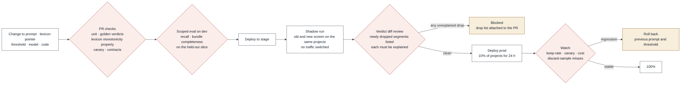

# Chunk 02 · Relevance screen — CI/CD

> **The one-line claim:**
> *In chunk 01 a bad deploy broke a document loudly. Here it wouldn't break anything: a slightly worse prompt keeps 96% of clauses instead of 98%, every project still completes, and nobody notices until a customer is asked about a rule their handbook states. So this pipeline's job is to make a silent recall loss impossible to ship — by diffing verdicts, not by watching error rates.*

| | |
|---|---|
| **Document** | CI/CD v1.0 · chunk 02 of 07 |
| **Builds on** | [LLD v1.0](lld.md) · [Infrastructure](infrastructure.md) · [Chunk 01 CI/CD](../01-ingest/ci-cd.md) for the shared skeleton |

The skeleton is chunk 01's: path-filtered CI, build once, promote by digest, OIDC, expand-only migrations, canary with alarms. This document covers **only what differs**, which is everything about quality.

---

## 1. What this pipeline must protect

| # | Risk | Why it's specific to this chunk | Mechanism |
|---|---|---|---|
| **P1** | **Silent recall loss** | A worse screen produces no errors, no alarms and no failed documents. It just quietly stops passing some clauses | Eval gate (§4) + **shadow diff** (§5) |
| **P2** | **Changes arrive from another team** | The lexicon and family definitions are chunk 06's rule packs. A vocabulary edit changes this chunk's behaviour without touching its code | Rule-pack changes trigger this chunk's eval (§3) |
| **P3** | **Prompt and threshold drift** | A prompt tweak or a threshold nudge is a one-line change with system-wide effect | Both are versioned artefacts under the same gates as code |
| **P4** | **Calibration invalidated by a model change** | A new model version reshapes the score distribution, so the 0.15 threshold silently means something else | The model id is part of the calibration key; a model change without a re-fitted calibration fails CI |

---

## 2. What triggers this pipeline

| Change | Where it lives | Triggers |
|---|---|---|
| Screen code | `services/relevance/**` | Full pipeline |
| Prompt template | `services/relevance/prompts/*.md` | Full pipeline, **eval gate mandatory** |
| Thresholds | AppConfig, sourced from `services/relevance/config/thresholds.yaml` | Full pipeline; AppConfig rollout with its own bake |
| **Lexicon / family definitions** | `services/rules/**` (chunk 06) | Chunk 06's pipeline **calls this chunk's eval** as a required check before its own merge |
| Model id | `config/model.yaml` | Full pipeline + **calibration re-fit required** |

That third row is the interesting one: **this chunk's quality gate is a required check on another chunk's pull requests.** Without it, a synonym added on Tuesday changes screening on Wednesday with nothing measuring the effect.

---

## 3. PR checks beyond the standard set

| Check | Fails when |
|---|---|
| **Golden verdicts** | Any verdict changes on the fixture corpus without the `verdicts:rebaseline` label, an owner's approval, and a listed reason. The chunk 01 analogue of golden snapshots |
| **Lexicon monotonicity** (property test) | A lexicon hit ever results in `set_aside` — invariant I2 and pattern X5, enforced rather than trusted |
| **Window boundary** | Any window crosses a document boundary (I8) |
| **Batch independence** | The canary scores below 0.8 in any position across a shuffled fixture batch |
| **Parse strictness** | A simulated truncated or reordered model response is accepted rather than retried |
| **Calibration present** | `model_id` changed without a matching `calibration_version` |
| **Threshold sanity** | Any family threshold above 0.5, which would invert the cost asymmetry, without an explicit override note |
| **Cache key completeness** | A property test constructs two windows differing only in prompt version and asserts different cache keys |

---

## 4. The eval gate

Runs on dev after deployment, on the **held-out** slice of the eval set (see the test & eval doc).

| Metric | Absolute gate | Regression tolerance vs last release |
|---|---|---|
| Segment relevance recall | ≥ 98% | 0.3 pt |
| Bundle completeness | ≥ 97% | 0.3 pt |
| Adversarial-slice recall (denials, bare tables, pointers, bilingual) | ≥ 95% | 0.5 pt |
| Routing F1 (macro) | ≥ 0.92 | 1.0 pt |
| Keep rate | 2–12% | ±3 pt, flagged not blocked |
| Cost per 1,000 segments | ≤ $0.10 [EST] | +25% blocks |

Regression is measured against bootstrap confidence intervals over documents, as in chunk 01.

---

## 5. Shadow diff: the deployment mechanism that matters here

Chunk 01's special concern was version pinning, so a document finished on the code it started on. Here the concern is different: **you cannot tell a better screen from a worse one by watching it run.** So before any traffic moves:

1. The new screen runs in **shadow** on stage against the same projects as the current one. Nothing downstream consumes its output.
2. The pipeline produces a **verdict diff**: segments the new version drops that the old one kept, and vice versa.
3. **Every newly dropped segment must be accounted for.** The diff is posted to the pull request with the clause text and both scores. The reviewer either accepts each one as correctly dropped, or the change is blocked.
4. Newly kept segments are reported too, with the cost delta, but they don't block.

**Why a diff and not just the eval score?** Because the eval set is 1,200 pages and production is thousands. A change can pass the gate and still drop a clause pattern the eval set doesn't contain. The diff shows exactly what changed in the real world before the change reaches anyone.

**Prod rollout:** 10% of projects for 24 hours, then 100%. Watched signals: keep rate, canary failures, cost per project, manual-include rate, and discard-sample misses. The manual-include rate is the human alarm — if consultants start rescuing clauses, the screen got worse regardless of what the metrics say.

---

## 6. Rollback

Rolling back the screen is cheap, which is the compensation for its silence.

| Situation | Action |
|---|---|
| Regression caught in shadow | Nothing shipped; fix the prompt or threshold |
| Regression after 10% rollout | Roll back code, prompt and thresholds together as one version set; **re-screen affected projects** (cheap: minutes and pennies) and diff the bundles that changed |
| Bad lexicon from chunk 06 | Roll back the rule pack pointer; cache invalidation is automatic because the version is in the key |
| Bad calibration | Revert `calibration_version`; verdicts re-derive on re-screen |
| A clause was wrongly dropped in production | Consultant's manual include fixes the project immediately; the case becomes a fixture and an eval document |

**Data:** nothing to migrate back. Verdicts and bundles are versioned per run, so a rollback plus re-screen produces new bundles while old ones stay for any approved extraction that referenced them.

---

## 7. How this differs from chunk 01, in one table

| | Chunk 01 · ingest | Chunk 02 · relevance |
|---|---|---|
| A bad deploy | Fails documents loudly | Keeps working, slightly worse |
| Primary guard | Invariants and golden snapshots | **Eval gate plus shadow verdict diff** |
| Deployment concern | In-flight documents must finish on one code version | New verdicts must be explainable against the old ones |
| Rollback cost | Code only; artefacts expensive to recreate | Code plus a cheap re-screen |
| External trigger | None | **Another chunk's rule-pack changes** |
| Human alarm | Consultant sees a failed document | Consultant rescues a clause manually |

---

## 8. The 90-second version

> "A bad deploy in this chunk doesn't break anything, which is exactly the problem. It keeps 96% of the clauses instead of 98%, every project still finishes, and the first sign is a customer being asked about a rule their handbook already states.
>
> So the gate isn't error rates, it's verdicts. Pull requests fail if any verdict on the fixture corpus changes without a reviewed rebaseline, if a lexicon hit can ever be discarded, or if the model changes without a re-fitted calibration.
>
> Then the new screen runs in shadow against real projects, and the pipeline posts a diff of every clause the new version would drop that the old one kept. Each one has to be explained before the change ships.
>
> And because vocabulary lives in another chunk's rule packs, this chunk's eval is a required check on their pull requests too. Otherwise a synonym added on Tuesday changes what the system sees on Wednesday with nothing measuring it."
