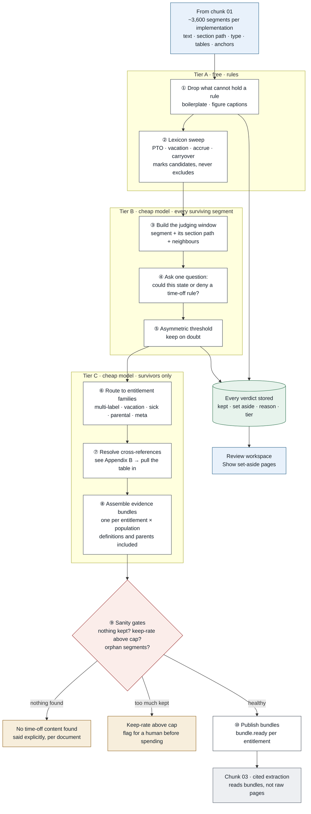

# Chunk 02 · Relevance screen & clause routing

> **The one-line claim:**
> *Of ~3,600 segments in a customer's document set, perhaps forty state a time-off rule. This chunk finds those forty without losing one, and hands the next stage a complete bundle of evidence rather than a pile of clauses. Dropping a clause here is invisible and unrecoverable: the system reports a rule as "not stated" that the customer's policy states plainly, and we ask them a question their own handbook already answered.*

| | |
|---|---|
| **Chunk** | 02 of 07 |
| **PRD requirements** | FR-SCR-01 → FR-SCR-04 · principle 4 (recall when finding) |
| **Upstream** | Chunk 01 — ingest, normalise & segment |
| **Downstream** | Chunk 03 — cited extraction & gap detection |
| **Status** | HLD ✅ v1.1 · Patterns ✅ · LLD ⬜ · Infra ⬜ · CI/CD ⬜ · Test & eval ⬜ |

Numbers marked **[EST]** are engineering estimates to confirm against the eval set in phase 0.

---

> **v1.1 amendment (after the patterns review).** Eight gaps found — see [patterns §5](patterns.md#5-gaps-this-exercise-found-in-the-hld). The substantive changes: bundles are immutable and versioned with a `supersedes` link (G1) · batch position bias is handled by shuffling plus a canary segment rather than left open (G2) · the cache key includes model id, prompt template and window policy (G3) · a per-project token budget sits in front of tier B (G4) · **orphan segments join a per-family catch-all bundle so recall survives bundling** (G5) · at most three families per segment, then `unsure` (G6) · the audit sample covers three strata including lexicon-floor keeps (G7) · bundles carry `screen_mode: full | lexicon_only` (G8).

## 1. Why this chunk exists

Chunk 01 turns a customer's pile of files into one canonical set of clauses. It makes no judgement about which ones matter. For a typical implementation that is **~600 pages ≈ 3,600 segments**, of which **perhaps 40 to 60 state or deny a time-off rule** [EST]. Everything else is the CEO's welcome letter, the code of conduct, expense rules, the dress code.

So this chunk answers one question per segment: **could this state or deny a rule about time off?** And then a second: **which entitlement does it belong to, and what else belongs with it?**

Two things make it harder than it sounds.

**The base rate is about 1.5%.** Almost everything is noise. At that imbalance, a screen that looks excellent on paper can be useless in practice: if it keeps 98% of the real clauses but also 5% of the noise, it passes ~59 true clauses and ~178 false ones. That is a fine outcome here, and §7 explains why, but it is not the outcome most people expect from "97% accurate".

**The costs of the two mistakes are not symmetric.** Keeping a clause that turns out to be irrelevant costs a fraction of a cent at the next stage. Dropping a clause that matters produces no error anywhere: chunk 03 correctly reports "not stated", the consultant asks the customer a question their handbook already answered, and the customer's confidence in us drops. **One mistake is a rounding error; the other is invisible and damaging.** Every design decision below falls out of that asymmetry.

---

## 2. Scope

| This chunk owns | This chunk does **not** own |
|---|---|
| Deciding which segments could hold a rule | Reading any value out of a clause (chunk 03) |
| Routing clauses to entitlement families | Deciding whether a rule is complete or missing (chunk 03) |
| Resolving cross-references into the evidence set | Resolving conflicts between documents (chunk 03 flags, consultant decides) |
| Assembling the evidence bundle per entitlement × population | The synonym lexicon and family definitions themselves (chunk 06 owns them as configuration) |
| Recording a verdict and reason for **every** segment | Segmentation quality (chunk 01) |
| Saying explicitly when a document holds no time-off content | Cost and scaling of the platform (chunk 07) |

---

## 3. The domain: what actually has to be caught

Run through what a real set contains, and the naive approaches fall over one by one.

| # | What appears in real documents | Why it defeats a keyword filter |
|---|---|---|
| 1 | *"Regular full-time employees become eligible for Paid Time Off after ninety (90) days…"* | The easy case. Everything else is the problem. |
| 2 | *"Employees classified as part-time are **not** eligible for vacation."* | **A denial is a rule.** Screens tuned to "grants something" throw these away, and the requirement it produces ("part-time: not eligible") is as real as any other. |
| 3 | *"Time away from work is administered per Schedule B."* | No entitlement words, no numbers. It matters only because of what it points at. |
| 4 | A table: `Years of service | Days` with no sentence around it | The words that make it relevant are in a heading two blocks up. |
| 5 | *"For purposes of this Article, 'Continuous Service' means…"* | States no rule, but chunk 03 cannot read rule 1 correctly without it. |
| 6 | *"…accrues at 1.54 hours per bi-weekly pay period."* as a bare bullet | Alone it is ambiguous: what accrues? Only the section path says "6.2 Paid Time Off". |
| 7 | *"Congé annuel: quinze (15) jours ouvrables"* | Different language, same rule. |
| 8 | *"This policy supersedes the 2022 Employee Handbook."* | Not an entitlement rule, but it changes which documents count. |
| 9 | *"Sick days may be used for vacation once the sick bank exceeds 80 hours."* | Belongs to **two** families at once. |
| 10 | The expense policy's *"employees may carry over unused allowances"* | Looks exactly like a carryover rule. It is about expense budgets. Context, not keywords, separates them. |

**The two lessons:** a clause's relevance often lives in its *context*, not its own words; and relevance is *multi-label*, not one family per clause.

---

## 4. The output contract

Chunk 02 produces two things. The second is the one people forget.

### 4.1 A verdict for every segment

```json
{ "segment_id": "r7f3:031:0006",
  "verdict": "keep",                     // keep | set_aside
  "reason": "MODEL_HIGH",                // STRUCTURAL | LEXICON_FLOOR | MODEL_HIGH | MODEL_LOW | AUDIT_SAMPLE
  "score": 0.94, "band": "high",
  "families": ["vacation_pto"],          // multi-label; ["unsure"] is allowed and keeps it in
  "tier": "B",
  "screen_version": "screen-1.0.0", "lexicon_version": "lex-2026.09" }
```

**Nothing is deleted.** A set-aside segment is stored with its reason and stays browsable in the review workspace ("Show set-aside pages"), because a consultant who suspects something is missing must be able to look.

### 4.2 An evidence bundle per entitlement × population

```json
{ "bundle_id": "b-0007",
  "run_id": "r7f3", "project_id": "p-118",
  "family": "vacation_pto",
  "population_hint": "Regular full-time",
  "segments": [
    { "segment_id": "hb25:031:0005", "role": "primary" },
    { "segment_id": "hb25:031:0006", "role": "primary" },
    { "segment_id": "add23:002:0011", "role": "primary",   "note": "carryover, different document" },
    { "segment_id": "hb25:008:0003", "role": "definition", "term": "Continuous Service" },
    { "segment_id": "hb25:031:0004", "role": "heading_context" }
  ],
  "cross_refs_resolved": [ { "from": "hb25:031:0009", "to": "hb25:074:0002", "text": "see Schedule B" } ],
  "excluded": [ { "segment_id": "hb22:029:0004", "reason": "SUPERSEDED_DOCUMENT" } ],
  "possible_conflict_with": ["b-0009"],
  "completeness": { "definitions_resolved": true, "unresolved_refs": [] } }
```

**Why bundles, not a flat list of kept segments?** Because the unit chunk 03 reasons about is *one entitlement for one group of employees*, and the evidence for it is scattered: the handbook states accrual, the addendum states carryover, a definition on page 8 fixes what "continuous service" means, and the collective agreement states something different for the warehouse. Handing chunk 03 a flat list makes it re-derive that grouping from scratch, on every prompt, with no record of what it assumed. Handing it a bundle makes the grouping **explicit, inspectable and testable** — and when a field later turns out wrong, we can ask whether the evidence was even in the bundle.

### 4.3 Worked example

Input: the running clause, plus a carryover line from a different document.

> **Handbook 2025, p31 §6.2** — "Regular full-time employees become eligible for Paid Time Off after completing ninety (90) days of continuous service. PTO accrues at 1.54 hours per bi-weekly pay period. Employees may not accrue more than 120 hours."
> **PTO Addendum 2023, p2** — "Up to 40 hours may be carried into the next calendar year."
> **Handbook 2025, p22 §4.1** — "Employees may carry over unused professional development allowances."

| Segment | Tier A | Tier B | Verdict | Family |
|---|---|---|---|---|
| Handbook §6.2 accrual clause | lexicon hit: *PTO, accrues, hours* | 0.97 | keep | vacation_pto |
| Addendum carryover line | lexicon hit: *carried into* | 0.88 | keep | vacation_pto |
| Handbook §4.1 development allowance | lexicon hit: *carry over* | **0.06** | set aside | — |
| Handbook p8 "Continuous Service" definition | no hit | 0.34 | keep (low band) | definition |

The third row is the interesting one. The lexicon fires on "carry over", and a keyword filter would have kept it and sent it to extraction as a carryover rule. The model, seeing the section path `4 Professional Development`, scores it 0.06. **The lexicon widens the net; the model narrows it. Neither is allowed to be the only voice.**

---

## 5. End to end



| # | Step | Tier | What it decides |
|---|---|---|---|
| **1** | Drop what structurally cannot hold a rule: boilerplate lines, figure captions, page furniture (chunk 01 already marked these) | A · free | Removes ~15% of segments at zero cost [EST] |
| **2** | **Lexicon sweep.** Entitlement terms, units, amounts and regional synonyms mark candidates. It can only **promote**, never exclude | A · free | Guarantees a floor under recall that no model failure can undercut |
| **3** | Build the judging window: the segment, its section path, and its immediate neighbours | B | Fixes the "what accrues?" problem (§3 row 6) |
| **4** | Ask the cheap model one question per segment: *could this state or deny a time-off rule?* Batched, each segment scored independently | B · cheap | The main decision |
| **5** | Apply an **asymmetric threshold**: keep at 0.15, not 0.5 | B | Encodes the cost asymmetry in one number |
| **6** | Route survivors to entitlement families. Multi-label; `unsure` is a valid answer that keeps the segment in | C · cheap | Vacation, sick, parental, bereavement, meta (supersedes/definitions) |
| **7** | Resolve cross-references detected by chunk 01: pull the referenced clause or table into the evidence set | C | "see Schedule B" becomes an actual segment |
| **8** | Assemble bundles: group by family × population, attach definitions and heading context, exclude superseded documents, note possible conflicts | C | The output that chunk 03 consumes |
| **9** | Sanity gates: nothing kept in a document that should have content · keep-rate above the cost cap · segments kept but in no bundle | — | Catches the failures that produce a confident empty answer |
| **10** | Publish bundles and per-segment verdicts; notify chunk 03 | — | |

---

## 6. How it evolved

### Iteration 0 — keyword filter

A list of terms; keep segments that match.

**Why it fails:** every row of §3 except the first. It keeps the professional-development carryover, misses the bare accrual bullet, misses "administered per Schedule B", and misses the French clause unless someone remembered to add the term. Worst of all, its failures are invisible: nobody knows what it dropped.

### Iteration 1 — embed everything, retrieve top-k

Embed all 3,600 segments, embed a query like "vacation entitlement accrual rules", keep the top 100.

**Four ways this broke:**
1. **k is a guess.** A simple handbook has 20 relevant segments; a unionised customer with four agreements has 200. A fixed k is wrong for both, and there is no signal in the retrieval score that tells you which case you're in.
2. **Similarity is not relevance.** The professional-development carryover clause is semantically close to the vacation carryover clause. Table rows embed poorly: `5–9 years | 15 days` has almost no semantic content on its own.
3. **Denials rank low.** "Part-time employees are not eligible for vacation" is less similar to "vacation entitlement rules" than a paragraph *about* vacation that states no rule.
4. **No explanation.** When a consultant asks why a clause was dropped, "cosine similarity 0.41, rank 143" is not an answer anyone can act on.

### Iteration 2 — the cascade above

| Failure | Fix |
|---|---|
| Keyword filter's silent misses | Lexicon promotes, never excludes; a model makes the exclusion decision |
| Keyword filter's false keeps | The model sees section context and rejects them |
| Fixed k | No k. Every segment gets an independent verdict, so the number kept follows the document |
| Ambiguous bare clauses | Judging window includes the section path and neighbours |
| Unexplainable drops | Every segment carries a verdict, a reason and a score, and stays browsable |
| Evidence scattered across documents | Bundles, with definitions and cross-references pulled in |

---

## 7. Key design decisions

### D1 · A three-tier cascade, not one classifier
- **Bought:** the free tier removes structural noise and guarantees a recall floor; the cheap tier makes the real decision; the third tier only runs on ~5% of segments, so the work that needs more care is affordable.
- **Cost:** three things to tune instead of one, and three places a bug can hide.
- **Fallback:** if the model tier is unavailable, the lexicon tier alone produces a much larger keep set and the project continues at higher cost, flagged. It never fails closed.

### D2 · The lexicon may add, never remove
This is the single most important rule in the chunk. A missing term can never cause a miss on its own, because the model still sees every non-structural segment. A **present** term can only force a segment to stay. That means chunk 06 can add synonyms safely: a bad lexicon entry costs money, never a lost clause.

### D3 · Judge the clause in its context, never alone
The window is the segment plus its section path plus one neighbour either side. It is what separates §3 row 6 (keep) from §3 row 10 (drop). **Cost:** roughly 2.5× the tokens per segment [EST]. Worth it; those two rows are the whole job.

### D4 · An asymmetric threshold, stated as a number
Keep at **0.15**, not 0.5 [EST, calibrate on the eval set]. Choosing this number *is* the design decision about which mistake we prefer, and putting it in configuration (chunk 06) rather than in code means it can be tuned per entitlement family with the eval harness watching.

### D5 · Bundles are the unit of output
See §4.2. **Cost:** bundle assembly is real logic with real failure modes (over-grouping merges two populations; under-grouping splits evidence). **Fallback:** if population cannot be determined, emit one bundle for the family marked `population: unresolved` rather than guessing a split.

### D6 · Keep the discards, and sample them
Set-aside segments are stored, browsable, and **2% are sampled into the eval set** [EST] so we continuously measure what the screen is losing. Without the sample, recall is a number we assert at release and never check again in production.

### D7 · Cache by content, not by document
Verdicts are cached on `(segment_hash, screen_version, lexicon_version)`. Re-processing a document after an unrelated change costs nothing; changing the lexicon correctly invalidates everything it could affect.

### D8 · "Nothing found" is an answer, not an empty result
If a document yields zero kept segments, that is stated per document in the UI, with its name. Silence is how a missing handbook becomes a set of unanswered questions to the customer.

### D9 · Why screen at all, when long context is cheap?
The honest version, because an interviewer will push here. Sending all 600 pages to a frontier model costs roughly **$1–2 per document set** at current prices [EST] — not obviously worth engineering around. The reasons the screen still earns its place:

1. **Accuracy, not just cost.** Extraction quality degrades when the relevant clause sits in 300,000 tokens of dress code. The failure mode is subtle: values get attached to the wrong population, or a later mention overrides an earlier one.
2. **The multiplier.** Evaluation runs the corpus dozens of times per release; there are 10–12 policy domains; documents are re-processed when a version arrives. The per-run cost is small and the annual cost is not.
3. **Attribution.** With a screen, a downstream failure can be localised: was the clause dropped, or was it present and misread? Without one, every failure is "the model got it wrong".
4. **Latency.** A 300K-token call per bundle is slow; the same work, screened, is a few short calls in parallel.

**If a future model made long-context extraction both cheap and citation-exact, this chunk shrinks to bundling and cross-reference resolution.** That is a legitimate future, and the cascade is designed so the tiers can be removed without touching the bundle contract.

---

## 8. Invariants

| # | Invariant | If violated |
|---|---|---|
| **I1** | Every segment from chunk 01 has exactly one recorded verdict with a reason | Run fails; no partial screen is publishable |
| **I2** | A lexicon hit can be down-weighted but never set aside by the model tier | Build fails in CI (property test) |
| **I3** | Every kept segment belongs to at least one bundle, or is explicitly marked `orphan` with a reason | Gate blocks publication |
| **I4** | Bundles never contain segments from a superseded document | Assembly rejects the bundle |
| **I5** | Same segment + same screen, lexicon and model versions → same verdict | Golden snapshot test |
| **I6** | Set-aside segments are retained and queryable for the project's retention period | Storage policy |
| **I7** | A bundle's `run_id` matches the chunk 01 run its segments came from | Assembly rejects mixed-run bundles |

---

## 9. Failure modes

| Failure | Behaviour |
|---|---|
| Model tier unavailable | Lexicon-only mode: keep every lexicon hit plus every segment in a section whose heading matches a family. Flagged as degraded; cost rises; nothing is lost |
| Everything kept (keep-rate > 25% [EST]) | Cost guard: stop before extraction, flag for a human. Usually means a bad lexicon change or a mis-segmented document |
| Nothing kept in a document | Explicit per-document notice, not an empty list |
| Cross-reference to something that isn't there ("see Schedule B", no Schedule B) | Bundle marked `unresolved_refs`; chunk 03 treats affected fields as gaps; consultant asked for the missing schedule |
| Two families claim the same clause | Both. Multi-label is the normal case, not an error |
| Population cannot be determined | One bundle, `population: unresolved`, flagged for the consultant |
| Segment kept but fits no bundle | `orphan`, surfaced in review rather than dropped |
| Lexicon change mid-project | Cache invalidated for affected segments; re-screen is incremental |

---

## 10. What we measure

| Metric | Definition | Target [EST] |
|---|---|---|
| **Segment relevance recall** | Gold relevant segments kept ÷ all gold relevant segments | **≥ 98%** (PRD gate) |
| **Bundle completeness** | Of gold entitlements, the share whose every gold rule span is present in one bundle | **≥ 97%** — the metric that matters most; recall on segments means little if the evidence is split across bundles |
| Keep rate | Segments kept ÷ total | 3–8% typical; > 25% trips the cost guard |
| Family routing F1 | Multi-label, per family | ≥ 0.92 |
| Cross-reference resolution recall | Gold references resolved to the right target | ≥ 0.90 |
| Definition attachment recall | Gold definitions present in the bundles that need them | ≥ 0.95 |
| Cost per 1,000 segments | Model spend | ≤ $0.10 [EST] |
| Audit-sample miss rate | Relevant segments found in the 2% sample of discards | ≤ 0.5% |

---

## 11. Back of the envelope

| Quantity | Estimate [EST] |
|---|---|
| Segments per implementation | ~3,600 (600 pages × ~6) |
| Structurally dropped at tier A | ~15% → ~3,060 reach the model |
| Judging window per segment | ~250 tokens with context |
| Tier B tokens | ~765K input |
| Tier B cost at small-model rates | **~$0.08–0.25** |
| Segments surviving to tier C | ~5% ≈ 150 |
| Tier C cost | negligible |
| Calls | ~77 batches of 40, concurrency 10 → **~1–2 minutes** |
| Cache hit rate on re-processing | > 95% |

**Conclusion:** the screen costs pennies and runs in minutes. Its value is not the money it saves at this scale; it is accuracy, attribution and the ability to re-run the corpus cheaply during evaluation.

---

## 12. PRD traceability

| PRD requirement | Covered by |
|---|---|
| FR-SCR-01 · classify segments for relevance, recall-tuned, cheap model, discards browsable | Steps 1–5, D2, D6 |
| FR-SCR-02 · route to entitlement families, resolve synonyms and regional terms | Step 6, lexicon from chunk 06 |
| FR-SCR-03 · group segments describing the same entitlement; detect cross-references | Steps 7–8, D5 |
| FR-SCR-04 · report a document with no relevant content explicitly | Step 9, D8 |

---

## 13. Questions this chunk will be asked

**"Why not just retrieve the top 100 most similar segments?"**
Because k is a guess and similarity isn't relevance. A unionised customer has ten times the relevant clauses of a simple handbook, and a denial clause ranks low against a query about entitlements. Every segment gets its own verdict instead, so the number kept follows the document.

**"What's your recall, and how do you know?"**
Target is 98% at segment level, but the number I actually watch is bundle completeness: whether every rule span for an entitlement ends up in one bundle. Both are measured on a held-out labelled set, and in production I sample 2% of what the screen discards and score it, so recall isn't a claim I made once at release.

**"What happens when the model is wrong?"**
Two protections. A lexicon hit sets a floor: the model can lower confidence but cannot discard. And the keep threshold is 0.15, not 0.5, because keeping noise costs a fraction of a cent downstream while dropping a clause is invisible and unrecoverable.

**"Isn't a 1.5% base rate a problem?"**
Yes, and it's why precision looks bad on paper. At 98% recall and 5% false-positive rate I pass about 59 real clauses and 178 false ones. That's an acceptable trade here: the false ones cost cents at extraction and are filtered by evidence, while a missed one produces a wrong "not stated" that reaches the customer.

**"How does a clause that just says 'see Schedule B' survive?"**
It has no entitlement words and no numbers, so the lexicon misses it. The model sees it in the context of a Time Off heading and keeps it, then cross-reference resolution pulls Schedule B itself into the bundle. Without that, chunk 03 would report the rule as not stated while the answer sat sixty pages away.

**"Why bundles instead of just passing the kept clauses?"**
Because the evidence for one entitlement is scattered across documents, and a definition on page 8 changes how page 31 reads. If I don't make the grouping explicit, chunk 03 re-derives it invisibly on every call, and when a value is wrong I can't tell whether the evidence was even there.

**"What if the model tier goes down?"**
Lexicon-only mode: keep every term hit and everything under a matching heading. The keep rate goes up several-fold, so it costs more at extraction, and it's flagged as degraded. It fails expensive, not silent.

**"If long context gets cheap, does this chunk disappear?"**
Partly, and I'd rather say that than defend it. The cost argument is already weak at today's prices; the accuracy, attribution and re-run arguments are the real ones. If frontier models made 300K-token extraction both citation-exact and fast, the screening tiers would go and the bundling stay.

---

## 14. Say it aloud — the 90-second version

> "Chunk 01 gives me about 3,600 clauses. Maybe forty of them state a time-off rule. This stage finds those forty.
>
> The thing to understand is that the two mistakes aren't equal. Keeping a clause I didn't need costs a fraction of a cent at extraction. Dropping one costs me the rule entirely, and nothing errors: the system says 'not stated' and we ask the customer something their handbook already answered. So everything here is tuned toward keeping.
>
> It's a three-tier cascade. First, free rules drop page furniture and boilerplate. Then a lexicon sweep marks candidates, and the important part is that the lexicon can only promote a segment, never remove one, so a missing synonym can't cost me a clause. Then a cheap model looks at each segment together with its section path and neighbours, because a bullet saying 'accrues at 1.54 hours per pay period' is meaningless on its own, and 'employees may carry over unused allowances' is about professional development, not vacation. The keep threshold is 0.15, not 0.5, and that number is the design decision.
>
> The output isn't a list of clauses. It's an evidence bundle per entitlement and population, with definitions pulled in, cross-references resolved, and superseded documents excluded. And nothing is deleted: every discard is stored with a reason, browsable by the consultant, and 2% are sampled into the eval so I keep measuring what I'm losing."

---

## 15. Open questions

| # | Question | Decide by |
|---|---|---|
| Q1 | Is the cheap tier a general small model with a prompt, or a fine-tuned classifier trained on the labelled set? Prompt first; revisit once we have 2,000 labelled segments | After phase 0 labelling |
| ~~Q2~~ | ~~Batch position bias~~ — resolved in v1.1 (G2): deterministic shuffle, no cross-referencing in the prompt, canary segment per batch with an assertion | Closed |
| Q3 | Should population resolution live here or in chunk 03? Here it's a grouping hint; there it's an extracted field. Risk of two sources of truth | Before LLD |
| Q4 | Bilingual documents: one bundle per language pair, or merged? | Before French-Canadian support |
| Q5 | Is the 2% discard sample enough to detect a recall regression within a release cycle? Needs a power calculation | Phase 0 |
