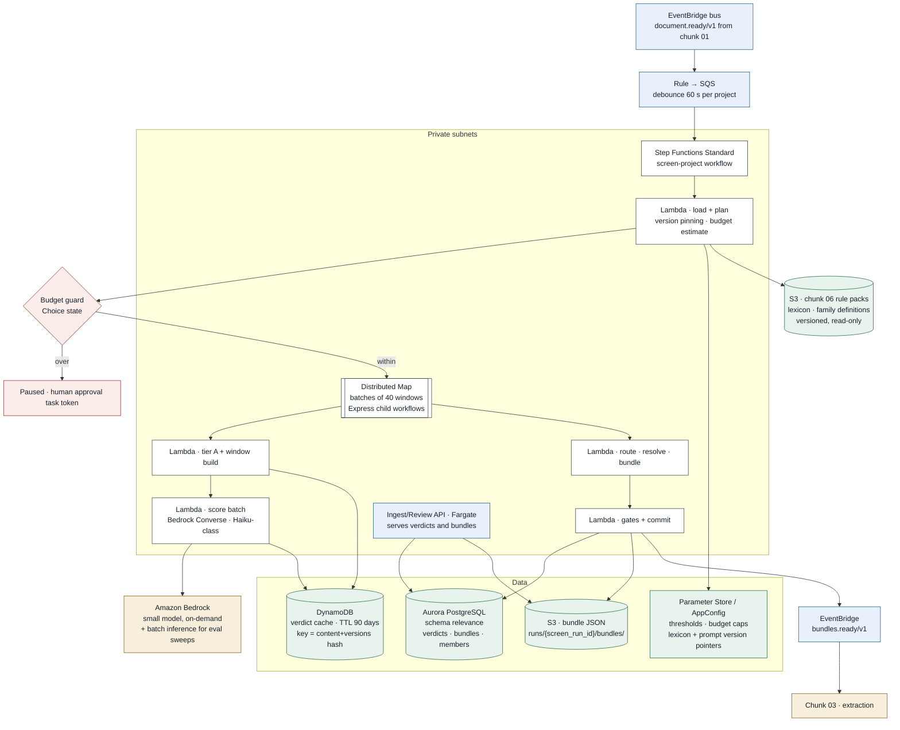

# Chunk 02 · Relevance screen — AWS Infrastructure

> **The one-line claim:**
> *This chunk is one Step Functions workflow per project, a Distributed Map over batches of clauses, a small model on Bedrock, and a DynamoDB cache that makes the second run nearly free. The only architecturally interesting parts are the model quota, the residency question that comes with managed inference, and a guard that stops the run before it spends.*

| | |
|---|---|
| **Document** | Infra v1.0 · chunk 02 of 07 |
| **Builds on** | [HLD v1.1](hld.md) · [Patterns](patterns.md) · [LLD v1.0](lld.md) |
| **Region** | `ca-central-1` primary · `ca-west-1` DR |

---

## 1. The picture


```
   [EventBridge]  document.ready/v1 from chunk 01
        │
        ▼
   [SQS · 60 s debounce per project]
        │
        ▼
 ┌──────────────────────────────────────────────┐
 │  Step Functions · screen-project             │ ── [PAUSED_BUDGET]
 │  pin versions → budget guard → map → bundle  │     task token, waits for a human
 └──────────────────────────────────────────────┘
        │
        ├── Lambda: tier A + window build ──► [DynamoDB · verdict cache, TTL 90d]
        │                                         ▲ hash of content + versions
        ▼                                         │
 ┌──────────────────────────────────────┐         │
 │ Distributed Map · 40 windows/batch    │────────┘
 │ Express children · 20 concurrent      │
 │   Lambda → [Amazon Bedrock · small model]
 └──────────────────────────────────────┘
        │
        ▼
   Lambda: route · resolve refs · bundle
        │
        ▼
   Lambda: gates + commit ──► [Aurora · schema relevance]  ──► [S3 · bundle JSON]
        │
        ▼
   [EventBridge]  bundles.ready/v1 ──► Chunk 03
        │
        └──► [Review API · Fargate] ──► consultant sees kept, set aside, and bundles
```



---

## 2. Component mapping

| LLD component | AWS | Configuration |
|---|---|---|
| Trigger | EventBridge rule → SQS | 60 s delivery delay implements the debounce; one message per project collapses a 14-document upload |
| Orchestrator | Step Functions **Standard** | One execution per screen run; name `{project_id}:{screen_run_id}` |
| Budget guard | Choice state + `waitForTaskToken` | Pausing is a state, not a crash; a human resumes it |
| Tier A + windows | Lambda, 1,024 MB | Pure CPU |
| Tier B scoring | Lambda + **Bedrock Converse API**, small model | 20 s timeout, retries on throttling |
| Verdict cache | **DynamoDB** on-demand, TTL 90 days | Hash key only; no clause text stored |
| Tier C + bundling | Lambda, 3,008 MB | Needs all kept segments for the project |
| Bundles | **S3** `runs/{screen_run_id}/bundles/*.json` | Chunk 03 reads whole bundles |
| Index, verdicts | **Aurora PostgreSQL**, schema `relevance` | Shared cluster, separate schema (chunk boundary rule) |
| Rule packs | **S3**, versioned, read-only, owned by chunk 06 | Version pinned per run |
| Thresholds, budgets | **AppConfig** | Changeable without a deploy, with its own rollout and rollback |
| Events out | EventBridge `bundles.ready/v1` | Chunk 03's rule subscribes |

---

## 3. Decisions (ADRs)

| # | Decision | Why |
|---|---|---|
| **ADR-07** | **Bedrock for the small model**, behind the `ScreenPort` adapter | In-region managed inference, no GPU fleet to operate, same IAM and VPC-endpoint story as Textract in chunk 01. The adapter keeps a self-hosted classifier open once labelled data exists |
| **ADR-08** | **Distributed Map with Express children** over segment batches | ~77 batches per project is small, but eval runs screen 40 projects at once. Express children keep per-transition cost negligible and avoid the parent's history limit — same reasoning as chunk 01 ADR-02 |
| **ADR-09** | **DynamoDB for the verdict cache, Aurora for everything else** | This is the one genuine key-value pattern in the system: 3,600 point lookups per run, TTL expiry, no joins. Putting it in Aurora would add thousands of round-trips per run to the shared relational store. Splitting stores is justified by access pattern, not fashion |
| **ADR-10** | **Bedrock batch inference for eval sweeps only** | Batch inference is roughly half price but asynchronous [VERIFY current pricing and limits]. Fine for a nightly eval over the whole corpus; wrong for an interactive project screen where the consultant is waiting |
| **ADR-11** | **Cross-region inference disabled for residency-bound tenants** | Managed inference can route requests to other regions for capacity unless restricted [VERIFY the exact control in your account]. For a tenant that requires Canadian processing, the profile must be region-pinned, and the run records which was used |
| **ADR-12** | **Thresholds and budgets in AppConfig, lexicon in S3 rule packs** | Two different change cadences and two different owners. Thresholds move with eval evidence (this chunk); vocabulary moves with domain knowledge (chunk 06) |

---

## 4. Workflow settings

| Setting | Value |
|---|---|
| Execution name | `{project_id}:{screen_run_id}` — idempotent start |
| Map `MaxConcurrency` | 20 batches [EST]; tenant semaphore above it |
| `ToleratedFailurePercentage` | 0 — a failed batch fails the run after its own retries, because a silently missing batch is a silently missing clause |
| Bedrock retries | `ThrottlingException`, `ModelTimeout`: interval 2 s, backoff 2.0, max 6, jitter FULL |
| Breaker | Parameter Store flag; 20 failures in 60 s opens for 10 min; while open, the run switches to `lexicon_only` rather than waiting, because screening is on the consultant's critical path |
| Pause states | `waitForTaskToken`, 7-day timeout, then the run fails with a clear reason |

---

## 5. Storage, network, security

**S3.** `coo-{env}-relevance-bundles` (bundle JSON, SSE-KMS tenant key, versioning on, 30-day lifecycle to IA); rule packs read from chunk 06's bucket with a read-only cross-stack policy.

**DynamoDB.** On-demand, TTL attribute, point-in-time recovery off (it's a cache), KMS with the tenant key. Item = hash, score, families, timestamps. **No clause text.**

**Aurora.** Schema `relevance`, owned solely by this chunk. Chunk 03 reads bundles from S3 and the index through this chunk's API, never by querying its tables.

**Network.** Same VPC, no NAT. New interface endpoint: **Bedrock runtime**. DynamoDB via gateway endpoint. Endpoint policies scoped to our tables and model ids.

**IAM, per role:**

| Role | Can | Cannot |
|---|---|---|
| `relevance-plan` | Read rule packs, AppConfig, segments; start Map | Call Bedrock |
| `relevance-score` | `bedrock:InvokeModel` on the pinned model id; read/write cache items | Write Aurora; read bundles |
| `relevance-bundle` | Read verdicts, write bundles to S3 and Aurora, `events:PutEvents` | Call Bedrock |
| `relevance-api` | Read verdicts and bundles for authorised projects; write manual overrides | Call Bedrock; write bundles directly |

**Privacy.** Clause text reaches Bedrock only. Zero-retention terms; region-pinned inference; no text in logs, traces, queue messages or the cache.

---

## 6. Quotas, cost, resilience

| Limit | Exposure | Mitigation |
|---|---|---|
| Bedrock tokens/minute per model per region [VERIFY] | 3,060 windows × 250 tokens ≈ 765K tokens per project, bursty | Map concurrency cap, jittered retries, quota increase before beta, batch inference for eval sweeps |
| Bedrock requests/minute [VERIFY] | ~77 requests per project | Comfortable; eval sweeps are the risk, and they use batch inference |
| Lambda concurrency | 20 per run × concurrent projects | Reserved concurrency for the scorer |
| DynamoDB on-demand | 3,600 reads + ~3,000 writes per run | Well within defaults |

**Cost per implementation [EST]:** model ~$0.08–0.25 · DynamoDB ~$0.01 · Lambda ~$0.02 · Step Functions ~$0.01. **Under $0.30**, and a re-run after a small change is mostly cache hits.

**At 2M pages/month [EST]:** ~$500–900/month of model spend for screening, plus tens of dollars of everything else. The interesting number is the one it protects: without screening, extraction would read every page.

**Resilience.** AZ loss: Lambda, Aurora and DynamoDB are multi-AZ. Bedrock degraded: breaker → `lexicon_only`, marked. Region loss: pilot light in `ca-west-1`; screen runs are cheap to redo, so RPO is effectively "re-screen", unlike chunk 01 where OCR output is expensive to recreate.

---

## 7. Deploying independently

Chunk 02 is its own CDK app: `RelevanceData` (S3 bucket, DynamoDB table, `relevance` schema migrations), `RelevanceCompute` (Step Functions, Lambdas, AppConfig), `RelevanceApi` (routes added to the shared review API's listener).

Contracts: **in** `document.ready/v1`; **out** `bundles.ready/v1` and the read API. Chunk 06's rule packs are an input with its own version pin. Nothing else is shared.

---

## 8. Open questions

| # | Question | Decide by |
|---|---|---|
| Q1 | Which small model, and is it available in `ca-central-1` with the throughput we need? [VERIFY] | Before alpha |
| Q2 | Does any tenant's contract forbid managed inference entirely, requiring a self-hosted classifier? | Before alpha |
| Q3 | Provisioned throughput vs on-demand once volume is real | After beta |
| Q4 | Is the 60 s debounce enough for slow trickle uploads, or should the consultant press "start screening"? | Alpha |

---

## 9. The 90-second version

> "One Step Functions execution per project, named so it can't start twice. It pins the lexicon, prompt, model and threshold versions first, because a verdict is only meaningful with those recorded.
>
> Then a budget guard: estimated tokens against the project cap. Over it, the run pauses and waits for a human on a task token rather than spending.
>
> Clauses go through a Distributed Map, forty windows per batch, Express children. Each batch checks DynamoDB first, so a re-run after a small change is mostly cache hits, and the cache key includes the prompt and lexicon versions so a rule change invalidates exactly what it should. Scoring is a small model on Bedrock behind an adapter, in-region, with cross-region inference switched off for residency-bound tenants.
>
> Bundles land as JSON in S3 with an index in Postgres, and the event goes out on EventBridge. The whole thing costs well under a dollar per implementation. The screen exists to protect the stage that isn't cheap."
