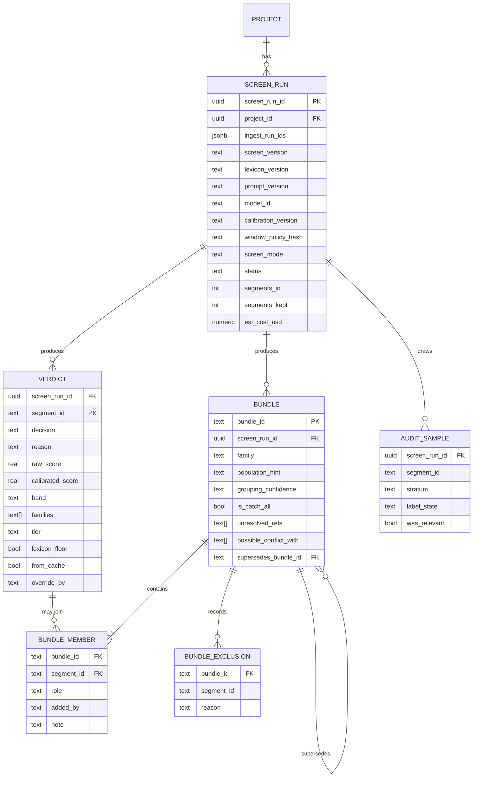

# Chunk 02 · Relevance screen — Low-Level Design

> **The one-line claim:**
> *This stage decides what the rest of the system is even allowed to see. So its build spec is mostly about three things the HLD could gloss over: making the model's scores comparable across versions, making a batch of forty clauses judge each one on its own merits, and making sure that everything the screen keeps actually reaches an evidence bundle.*

| | |
|---|---|
| **Document** | LLD v1.0 · chunk 02 of 07 |
| **Builds on** | [HLD v1.1](hld.md) · [Patterns](patterns.md) |
| **Upstream** | Chunk 01 `document.ready/v1` |
| **Downstream** | Chunk 03 `bundles.ready/v1` |
| **Status** | LLD ✅ · Infra ⬜ · CI/CD ⬜ · Test & eval ⬜ |

**[EST]** = estimate to calibrate in phase 0. **[VERIFY]** = external fact to re-check.

---

## 1. Re-evaluation of the HLD and patterns

The patterns review already closed eight gaps (G1–G8, now folded into HLD v1.1). Reading both documents as an implementer, ten more appear. Six are serious.

| # | Finding | Severity | Resolution |
|---|---|---|---|
| **F1** | **Scores aren't comparable across model versions.** The HLD states a keep threshold of 0.15. A different model, or the same model at a new version, produces a differently shaped score distribution, so 0.15 silently becomes a different policy. | 🔴 Critical | **Calibration step** (§5, S3d): a stored mapping from raw score to calibrated probability, fitted on the labelled set per model version. The threshold applies to the *calibrated* value, and `calibration_version` is recorded on every run. |
| **F2** | **Windows can cross document boundaries.** "One neighbour either side" is undefined at the first and last segment of a document; naively it pulls in the next document's cover page. | 🔴 Critical | Windows never cross a `doc_id`. Missing neighbours are absent, not substituted. Invariant I8. |
| **F3** | **Lexicon matching was hand-waved.** Naive substring matching finds "PTO" inside "OPTION" and misses "congé" when the document writes "conge" without the accent. | 🟠 High | Token-boundary matching on a normalised form (casefold, strip accents, collapse elisions), with multi-word phrases matched as token sequences. Lexicon entries declare `match: exact | stem | phrase`. |
| **F4** | **A 40-row table doesn't fit in a judging window.** Tier B would either blow the token budget or truncate the table mid-way. | 🟠 High | Tables are **summarised for judging** (caption + header row + first 3 rows + row count) while the **whole table stays the kept unit**. The summary never leaves tier B, so citations are unaffected. |
| **F5** | **Batched output alignment was assumed.** If the model returns 39 scores for 40 inputs, or reorders them, a naive zip misassigns every verdict after the gap. | 🟠 High | Every window carries a short opaque id; the response must echo it. Mismatch → strict parse failure → retry the batch at size 10, then size 1. Never align by position. |
| **F6** | **Population inference had no owner.** The HLD emits `population_hint`, chunk 03 extracts `eligibility.population`. Two sources of truth. | 🟠 High | The hint is **grouping metadata only**, never surfaced to a consultant and never written to an entitlement record. Chunk 03 is authoritative. The hint's only job is deciding which bundle a clause joins. (Closes HLD Q3.) |
| **F7** | **Bundle explosion.** Families × populations × documents can produce 40+ bundles for a unionised customer, multiplying extraction cost and confusing review. | 🟡 Medium | Cap at 25 bundles per project [EST]; above that, merge by family and mark `grouping_confidence: low`, leaving population to chunk 03. |
| **F8** | **Definition attachment was unspecified.** Which segments are definitions, and which bundles should get them? | 🟡 Medium | A definition is a segment matching a definitional pattern (`"X" means…`, `For purposes of this Article, "X"…`). It attaches only to bundles containing a member that uses the term. Cap: 5 definitions per bundle. |
| **F9** | **Incremental re-screen wasn't designed.** A customer sends one more document on day 12; existing bundles already feed approved extractions. | 🟡 Medium | A new screen run creates **new bundle versions** with `supersedes` links; unchanged bundles are copied by reference. Chunk 03 re-extracts only changed bundles. |
| **F10** | **Determinism.** Temperature 0 does not guarantee identical scores across provider-side changes. | 🟢 Low | The verdict cache is the determinism mechanism: within a project, a segment is scored once. Eval runs pin the model snapshot and record it. |

---

## 2. Real-world scenarios

Continuing chunk 01's numbering. Each becomes a fixture.

| # | Scenario | Expected behaviour |
|---|---|---|
| **R21** | Bare bullet: *"1.54 hours per bi-weekly pay period"* under heading `6.2 Paid Time Off` | Kept; the window's section path carries the meaning |
| **R22** | *"Employees may carry over unused allowances"* under `4 Professional Development` | Set aside; lexicon fires, model rejects at 0.06 |
| **R23** | *"Part-time employees are not eligible for vacation."* | Kept, family `vacation_pto`. A denial is a rule |
| **R24** | *"Time away from work is administered per Schedule B."* | Kept; cross-reference resolved; Schedule B pulled into the bundle |
| **R25** | Schedule B exists in a different document | Cross-document resolution succeeds; both bundled |
| **R26** | Schedule B does not exist anywhere | Bundle marked `unresolved_refs`; chunk 03 treats affected fields as gaps |
| **R27** | 40-row tenure table with no surrounding prose | Kept whole; judged on a summarised view (F4) |
| **R28** | Definition of "Continuous Service" on page 8 | Kept as `definition`; attached to bundles whose members use the term |
| **R29** | *"Sick days may be used for vacation once the bank exceeds 80 hours"* | Two families; appears in both bundles |
| **R30** | Bilingual page, French column | Kept; lexicon matches `congé annuel` after accent-stripping; routed with `lang: fr` |
| **R31** | *"This policy supersedes the 2022 Employee Handbook"* | Family `meta`; informs supersede handling; excluded from entitlement bundles |
| **R32** | The 2022 handbook itself, marked superseded by chunk 01 | Its segments are screened but excluded from bundles, with a reason |
| **R33** | Lexicon change mid-project adds "leave" | Cache invalidated for affected segments; keep-rate jumps to 41%; budget guard pauses the run |
| **R34** | A document with no time-off content (code of conduct) | Explicit per-document notice; not an empty result |
| **R35** | A project where **no** document yields a keep | Project-level alert. Usually a missing handbook or a broken upstream run |
| **R36** | Model provider throttles for 10 minutes | Batches retry with backoff; run stays `SCREENING`; nothing fails |
| **R37** | Model provider down for hours | Degrades to `lexicon_only`; bundles marked; consultant told screening was degraded |
| **R38** | Consultant spots a missed clause in "set-aside pages" and clicks **Include** | Manual override verdict recorded with actor; segment joins a bundle; the miss is logged as a labelled example for eval |
| **R39** | Same project re-screened after a new document arrives | New bundle versions with `supersedes`; unchanged bundles reused; approved extractions unaffected |
| **R40** | Canary segment scores 0.4 in batch position 38 | Batch fails `BATCH_BIAS`, re-runs at size 10; if it recurs, the run fails and alerts |

---

## 3. Components and technology

| Component | Choice | Why, and what was rejected |
|---|---|---|
| Orchestration | **Step Functions Standard**, one execution per project screen run | Same as chunk 01. Batches run as a Distributed Map with Express children |
| Tier A + window build | **Lambda** (container) | Pure CPU, short, highly parallel |
| Tier B scoring | **Lambda** calling a small model through `ScreenPort` | Rejected: a fine-tuned classifier now — no labelled data yet. The port makes that a later swap |
| Tier C + bundling | **Lambda**, one invocation per project | Needs to see all kept segments at once |
| Verdict cache | **DynamoDB**, key = decision hash, 90-day TTL | High-volume key-value lookups with expiry and no joins. Rejected Aurora: this is the one place in the system with a genuine key-value access pattern, and it would add 3,600 round-trips per run to the relational store |
| Verdicts, bundles, members | **Aurora PostgreSQL**, schema `relevance` | Relational: joins to segments, per-project queries for the UI, transactional commit with the outbox |
| Bundle payloads | **S3** `runs/{screen_run_id}/bundles/*.json` | Chunk 03 reads whole bundles; Postgres holds the index |
| Lexicon, family definitions, thresholds | **Chunk 06 rule packs**, read-only, version-pinned per run | This chunk never edits them |
| Model | Small, cheap, instruction-following, behind `ScreenPort` | Concrete choice in the infra doc |

---

## 4. State machine

`PENDING → SCREENING → (PAUSED_BUDGET | PAUSED_KEEP_RATE) → BUNDLING → READY`
with `FAILED` reachable from any working state, and `SUPERSEDED` when a later screen run replaces this one.

Paused states are resumable by a human decision (approve the spend, or fix the lexicon and re-run). Nothing auto-resumes.

---

## 5. Stage specifications

```mermaid
flowchart TB
  classDef step fill:#FFFFFF,stroke:#39434F,color:#17202A
  classDef gate fill:#FBEDEA,stroke:#9B2C2C,color:#17202A
  classDef store fill:#E7F3EC,stroke:#236A45,color:#17202A
  classDef warn fill:#F7EEDC,stroke:#8A5A12,color:#17202A
  classDef stop fill:#EDEFF2,stroke:#4B5563,color:#17202A

  IN["document.ready from chunk 01<br/>run_id · doc_id · segment count"]
  IN --> LOAD["S1 · Load segments for the run<br/>plus every other ready document in the project"]
  LOAD --> CFG["S1b · Pin versions<br/>lexicon · prompt · model · thresholds · calibration"]
  CFG --> BUDGET{"S1c · Budget guard<br/>estimated tokens vs project cap"}
  BUDGET -->|"over"| HOLD["PAUSED_BUDGET<br/>needs a human before spending"]
  BUDGET -->|"within"| STRUCT

  subgraph TA["S2 · Tier A, free"]
    STRUCT{"Boilerplate · figure caption ·<br/>page furniture?"}
    LEXN["Normalise for matching<br/>lowercase · strip accents · token boundaries"]
    LEX{"Lexicon hit?<br/>term · unit · amount · heading"}
    STRUCT -->|"no"| LEXN --> LEX
  end
  STRUCT -->|"yes"| ASIDE1["verdict set_aside · STRUCTURAL"]

  subgraph TB2["S3 · Tier B, cheap model"]
    WIN["Build judging window<br/>segment + section path + 1 neighbour each side<br/>never crosses a document · tables summarised to header + 3 rows"]
    CACHE{"Verdict cached?<br/>content + lexicon + prompt + model + window policy"}
    BATCH["Shuffle into batches of 40 by run seed<br/>append canary segment"]
    SCORE["Score each window independently<br/>ids echoed back and checked"]
    CAL["Apply calibration map<br/>raw score → calibrated probability"]
    CANARY{"Canary ≥ 0.8?"}
    THRESH{"Calibrated score ≥ 0.15<br/>or lexicon floor?"}
    WIN --> CACHE
    CACHE -->|"miss"| BATCH --> SCORE --> CAL --> CANARY
    CANARY -->|"no"| DRIFT["FAILED · BATCH_BIAS<br/>batch re-run smaller, then alert"]
    CANARY -->|"yes"| THRESH
    CACHE -->|"hit"| THRESH
  end
  LEX --> WIN

  THRESH -->|"no"| SAMP{"Audit sample<br/>2% of three strata"}
  SAMP -->|"picked"| SHADOW["set_aside · AUDIT_SAMPLE<br/>scored in the eval"]
  SAMP -->|"not picked"| ASIDE2["set_aside · MODEL_LOW"]
  THRESH -->|"yes"| KEEP["keep · band from calibrated score"]

  subgraph TC["S4 · Tier C, survivors only"]
    ROUTE["Route to families, multi-label<br/>max 3, else unsure"]
    POP["Infer population hint<br/>rules first, model second · hint only"]
    XREF["Resolve cross-references<br/>see Schedule B → target segment"]
    DEF["Attach definitions<br/>term defined and named in a kept segment"]
    ROUTE --> POP --> XREF --> DEF
  end
  KEEP --> ROUTE

  DEF --> BUILD["S5 · Bundle builder<br/>group by family × population<br/>exclude superseded · note conflicts<br/>orphans to catch_all bundle"]
  BUILD --> GATES{"S6 · Gates<br/>I1 every segment has a verdict<br/>I3 no unbundled keeps<br/>keep-rate ≤ 25%"}
  GATES -->|"keep-rate high"| HOLD2["PAUSED_KEEP_RATE"]
  GATES -->|"invariant broken"| FAIL["FAILED · reason code"]
  GATES -->|"pass"| COMMIT["S7 · Commit in one transaction<br/>verdicts · bundles · members · exclusions"]
  COMMIT --> PUB["S8 · Publish bundles.ready<br/>per project, with counts and screen_mode"]

  ASIDE1 --> VSTORE[("verdict table<br/>every segment, with reason")]
  ASIDE2 --> VSTORE
  SHADOW --> VSTORE
  KEEP --> VSTORE
  COMMIT --> DB[("bundles + members")]
  PUB --> NEXT["Chunk 03"]

  class LOAD,CFG,LEXN,WIN,BATCH,SCORE,CAL,ROUTE,POP,XREF,DEF,BUILD,COMMIT,PUB,KEEP step
  class BUDGET,STRUCT,LEX,CACHE,CANARY,THRESH,SAMP,GATES gate
  class VSTORE,DB store
  class SHADOW,HOLD,HOLD2 warn
  class ASIDE1,ASIDE2,FAIL,DRIFT,NEXT stop
```



### S1 · Load and pin
Triggered by `document.ready/v1`, debounced 60 s per project so a 14-document upload produces one screen run, not fourteen. Loads **all ready documents in the project**, because bundles span documents. Pins and records: `lexicon_version`, `prompt_version`, `model_id`, `calibration_version`, `thresholds`, `window_policy_hash`.

### S1c · Budget guard
Estimated tokens = surviving segments × mean window size [EST 250 tokens]. Compared with the per-project cap (default 3M tokens [EST]). Over → `PAUSED_BUDGET` with the numbers and the versions in the message.

### S2 · Tier A
- Structural drop: `is_boilerplate`, figure captions, page furniture (chunk 01 flags).
- Normalisation for matching: casefold, NFKD accent strip, collapse `l'`/`d'` elisions, normalise hyphens.
- Lexicon match: token-boundary exact, stem, or multi-token phrase, per entry. A hit sets `lexicon_floor = true` (patterns X5).

### S3 · Tier B
| Step | Spec |
|---|---|
| **Window** | segment text + `section_path` + previous and next segment, **same document only** (F2). Tables summarised (F4). Cap 600 tokens; truncate neighbours first, never the segment |
| **Cache** | DynamoDB `GetItem` on the decision hash; on hit, skip scoring |
| **Batch** | 40 windows, shuffled deterministically by `screen_run_id`, plus one canary |
| **Prompt** | One question per window; forbids cross-referencing between windows; requires the echoed id; returns `{id, score, families?}` |
| **Parse** | Strict: all ids present, scores in range. Failure → retry at 10, then 1, then fail the batch |
| **Calibrate** | Apply the stored isotonic/Platt map for this `model_id` + `calibration_version` (F1) |
| **Canary** | Must score ≥ 0.8; otherwise `BATCH_BIAS` |
| **Threshold** | Keep if calibrated ≥ 0.15 **or** `lexicon_floor` |
| **Timeouts** | 20 s per batch call, 3 retries with jitter |

### S4 · Tier C
Routing (multi-label, max 3, else `unsure`), population hint (rules first: "full-time", "part-time", named bargaining unit; model only if rules find nothing — and it remains a hint, F6), cross-reference resolution (match chunk 01's detected refs to heading or schedule titles; cross-document allowed within the project), definition attachment (F8).

### S5 · Bundle builder
Group by `family × population_hint`; attach definitions and heading context; exclude superseded documents with a reason; detect possible conflicts (same family and population, different documents, both stating a value-bearing clause) and record `possible_conflict_with` without resolving; route orphans to `catch_all` (G5); enforce the 25-bundle cap (F7).

### S6 · Gates
I1, I3, I4, I7, I8 plus keep-rate ≤ 25%.

### S7–S8 · Commit and publish
One transaction: verdicts, bundles, members, exclusions, audit samples, outbox row. Then `bundles.ready/v1 {project_id, screen_run_id, bundle_count, kept, screen_mode}`.

---

## 6. Data model



```sql
CREATE TABLE relevance.screen_run (
  screen_run_id     uuid PRIMARY KEY,
  project_id        uuid NOT NULL,
  ingest_run_ids    jsonb NOT NULL,
  screen_version    text NOT NULL,
  lexicon_version   text NOT NULL,
  prompt_version    text NOT NULL,
  model_id          text NOT NULL,
  calibration_version text NOT NULL,
  window_policy_hash char(64) NOT NULL,
  thresholds        jsonb NOT NULL,
  screen_mode       text NOT NULL DEFAULT 'full',   -- full | lexicon_only
  status            text NOT NULL,
  segments_in       int, segments_kept int,
  est_cost_usd      numeric(10,4),
  started_at        timestamptz NOT NULL,
  finished_at       timestamptz
);

CREATE TABLE relevance.verdict (
  screen_run_id     uuid NOT NULL REFERENCES relevance.screen_run,
  segment_id        text NOT NULL,
  decision          text NOT NULL,            -- keep | set_aside
  reason            text NOT NULL,            -- STRUCTURAL | LEXICON_FLOOR | MODEL_HIGH | MODEL_LOW | AUDIT_SAMPLE | MANUAL_INCLUDE | MANUAL_EXCLUDE
  raw_score         real, calibrated_score real, band text,
  families          text[] NOT NULL DEFAULT '{}',
  tier              text NOT NULL,
  lexicon_floor     boolean NOT NULL DEFAULT false,
  from_cache        boolean NOT NULL DEFAULT false,
  override_by       text, override_reason text, override_at timestamptz,
  PRIMARY KEY (screen_run_id, segment_id)
);

CREATE TABLE relevance.bundle (
  bundle_id             text PRIMARY KEY,
  screen_run_id         uuid NOT NULL REFERENCES relevance.screen_run,
  family                text NOT NULL,
  population_hint       text,
  grouping_confidence   text NOT NULL DEFAULT 'normal',  -- normal | low
  is_catch_all          boolean NOT NULL DEFAULT false,
  unresolved_refs       text[] NOT NULL DEFAULT '{}',
  possible_conflict_with text[] NOT NULL DEFAULT '{}',
  supersedes_bundle_id  text REFERENCES relevance.bundle,
  payload_key           text NOT NULL
);

CREATE TABLE relevance.bundle_member (
  bundle_id  text NOT NULL REFERENCES relevance.bundle,
  segment_id text NOT NULL,
  role       text NOT NULL,        -- primary | definition | heading_context | cross_ref | uncertain
  added_by   text NOT NULL DEFAULT 'system',
  note       text,
  PRIMARY KEY (bundle_id, segment_id, role)
);

CREATE TABLE relevance.bundle_exclusion (
  bundle_id text NOT NULL REFERENCES relevance.bundle,
  segment_id text NOT NULL, reason text NOT NULL,
  PRIMARY KEY (bundle_id, segment_id)
);

CREATE TABLE relevance.audit_sample (
  screen_run_id uuid NOT NULL REFERENCES relevance.screen_run,
  segment_id    text NOT NULL,
  stratum       text NOT NULL,      -- model_low | structural | lexicon_floor_keep
  label_state   text NOT NULL DEFAULT 'pending',
  was_relevant  boolean,
  PRIMARY KEY (screen_run_id, segment_id)
);
```

**Cache item (DynamoDB):** `pk = sha256(segment_text + section_path + neighbour_ids + lexicon_version + prompt_version + model_id + window_policy_hash)`, attributes `raw_score`, `families`, `scored_at`, `ttl`. **No clause text is stored in the cache** — only the hash and the score.

---

## 7. Invariants

| # | Invariant | Enforcement |
|---|---|---|
| I1 | Every segment in the run has exactly one verdict | Count check at S6; run fails otherwise |
| I2 | A `lexicon_floor` segment is never `set_aside` by the model | Property test + runtime assertion |
| I3 | Every kept segment is in ≥ 1 bundle (possibly `catch_all`) | S6 gate |
| I4 | No bundle member comes from a superseded document | Builder rejects |
| I5 | Same inputs + same pinned versions → same verdicts | Golden snapshot in CI |
| I6 | Set-aside segments are retained for the project retention period | Storage policy |
| I7 | A bundle's members all come from the same ingest run set | Builder rejects |
| **I8** | A judging window never crosses a document boundary | Unit test + runtime assertion (F2) |
| **I9** | Every run records lexicon, prompt, model, calibration and threshold versions | NOT NULL constraints |

---

## 8. Reliability

| Concern | Design |
|---|---|
| Batch failure | One batch failing doesn't fail the run: retry at 10, then 1. Segments that still fail are marked `keep` with reason `SCORING_FAILED` — **fail toward keeping** |
| Provider throttling | Retry with jitter; circuit breaker; run waits rather than fails (R36) |
| Provider outage | `lexicon_only` mode after the breaker stays open 10 min; bundles marked (G8) |
| Idempotency | Key `{screen_run_id}:{batch_index}`; artefact keys deterministic; DB writes `ON CONFLICT DO NOTHING` |
| Cancellation | Project deletion marks the run cancelled; late writes rejected |
| Concurrency | Distributed Map, 20 batches concurrent per run [EST]; per-tenant cap above that |
| Poison window | A window that fails parsing three times at size 1 is kept with `SCORING_FAILED` and logged |

---

## 9. API for the review workspace

| Method | Path | Purpose |
|---|---|---|
| `GET` | `/projects/{pid}/screen` | Current run: status, counts, keep rate, mode, versions |
| `GET` | `/projects/{pid}/bundles` | Bundles with family, population hint, member counts, flags |
| `GET` | `/bundles/{bundle_id}` | Full bundle with members and roles |
| `GET` | `/documents/{doc_id}/verdicts?page=31` | Per-segment verdicts for the page viewer, so set-aside clauses render greyed |
| `POST` | `/segments/{segment_id}/include` | **Manual include** (R38): reason required; creates a `MANUAL_INCLUDE` verdict, adds the segment to a chosen or new bundle, and records the actor |
| `POST` | `/segments/{segment_id}/exclude` | Manual exclude; same audit trail |
| `POST` | `/projects/{pid}/screen/resume` | Approve a paused run (budget or keep-rate), with a reason |
| `POST` | `/projects/{pid}/screen/rerun` | Force a re-screen, e.g. after a lexicon fix |

**Plain-language states for consultants:**

| Internal | Consultant sees |
|---|---|
| `SCREENING` | Finding the time-off rules · 2,100 of 3,600 clauses reviewed |
| `PAUSED_BUDGET` / `PAUSED_KEEP_RATE` | Paused — this set looks unusual. Review before we continue |
| `READY`, `screen_mode=full` | 46 clauses found across 6 entitlements |
| `READY`, `screen_mode=lexicon_only` | Found with reduced accuracy — the AI service was unavailable. Consider re-running |
| Document with no keeps | No time-off rules found in *Code of Conduct.pdf* |

**The manual-include loop matters more than it looks.** It's the only channel where a real miss becomes data: every override is exported as a labelled example into the eval set (see the test & eval doc), so consultant corrections improve the screen instead of evaporating.

---

## 10. Error and warning catalogue

| Code | Kind | Consultant message |
|---|---|---|
| `PAUSED_BUDGET` | Pause | "This document set is larger than expected. Approve to continue." |
| `PAUSED_KEEP_RATE` | Pause | "We're flagging an unusual amount of this set as relevant. Someone should check before we continue." |
| `NO_CONTENT_IN_DOC` | Notice | "No time-off rules found in {file}." |
| `NO_CONTENT_IN_PROJECT` | Warning | "We didn't find time-off rules in any document. Is the handbook included?" |
| `UNRESOLVED_REF` | Warning | "This policy points to {ref}, which we don't have. Ask the customer for it." |
| `DEGRADED_SCREEN` | Warning | "Screening ran in reduced mode; accuracy may be lower." |
| `GROUPING_LOW_CONFIDENCE` | Warning | "We couldn't tell which employee group this applies to." |
| `BATCH_BIAS` | Fail | Internal; engineering alerted |
| `SCORING_FAILED` | Info | Segment kept unscored; appears in review as low confidence |

---

## 11. Security, observability, cost

**Security.** Clause text goes to a model provider: zero-retention terms, in-region inference, no document text in logs or in the cache (hash only). Same tenant isolation as chunk 01: prefix, key, row-level security.

**Metrics.** `screen_segments_total{decision,reason}` · `screen_keep_rate` · `screen_calibrated_score` histogram · `screen_canary_failures_total` · `screen_cache_hit_ratio` · `screen_cost_usd` · `screen_bundles_total{grouping_confidence}` · `screen_manual_overrides_total{direction}` · `screen_unresolved_refs_total`.

**Alerts.** Any canary failure · keep rate outside 2–25% · cache hit ratio < 50% on a re-run (suggests a key bug) · manual-include rate > 2 per project (suggests real recall loss).

**SLO.** 95% of projects screened within **5 minutes** of the last document becoming ready [EST].

**Cost per implementation [EST]:** ~$0.08–0.25 of model spend, ~$0.01 of DynamoDB, negligible compute. Cache hits on re-runs make the second pass nearly free.

---

## 12. Configuration

```yaml
relevance:
  debounce_seconds: 60
  window:
    neighbours: 1
    max_tokens: 600
    table_summary: { header_rows: 1, sample_rows: 3 }
  batch: { size: 40, concurrency: 20, canary: true }
  thresholds:
    default_keep: 0.15
    per_family: { sick: 0.12, parental: 0.12 }     # recall matters even more where clauses are rarer
  guards:
    project_token_budget: 3_000_000
    max_keep_rate: 0.25
    max_bundles: 25
    max_families_per_segment: 3
    max_definitions_per_bundle: 5
  sampling:
    discard_sample_rate: 0.02
    strata: [model_low, structural, lexicon_floor_keep]
  degraded:
    enable_lexicon_only: true
    breaker: { failures: 20, window_s: 60, open_s: 600 }
```

---

## 13. Runbook

| Symptom | Likely cause | Action |
|---|---|---|
| Keep rate jumps across all projects | Lexicon or prompt change | Compare `lexicon_version`; roll back the rule pack; re-screen affected projects |
| Canary failures in one batch position | Prompt or batching regression | Reduce batch size via config; block the release; add the case to fixtures |
| Cache hit ratio collapses | Key includes something that changes per run | Inspect the key builder; likely a timestamp or neighbour id churn |
| Many `UNRESOLVED_REF` for one customer | Their documents reference schedules they didn't send | Consultant requests them; not an engineering issue |
| Manual includes rising | Real recall loss, probably new vocabulary | Sample the overrides, add to eval, consider a lexicon addition and a threshold review |

---

## 14. Downstream contract

Chunk 03 receives `bundles.ready/v1` and may rely on: bundles contain no superseded segments · every member has a role · definitions are attached where the term is used · `unresolved_refs` lists what's missing · `population_hint` is a hint, never a value · `screen_mode` says whether screening was degraded · bundles are immutable; a re-screen produces new ids with `supersedes`.

---

## 15. Open questions

| # | Question | Decide by |
|---|---|---|
| Q1 | Isotonic vs Platt calibration, and how many labelled points are needed for a stable map? | Phase 0 |
| Q2 | Is 60 s the right debounce, or should screening wait for an explicit "documents complete" signal from the consultant? | Alpha |
| Q3 | Should `catch_all` bundles go to chunk 03 by default, or only on consultant request? Cost vs recall | Before beta |
| Q4 | When the manual-include rate is high for a customer, should the threshold adapt per project? (Tempting; risks unmeasurable drift) | After beta data |
