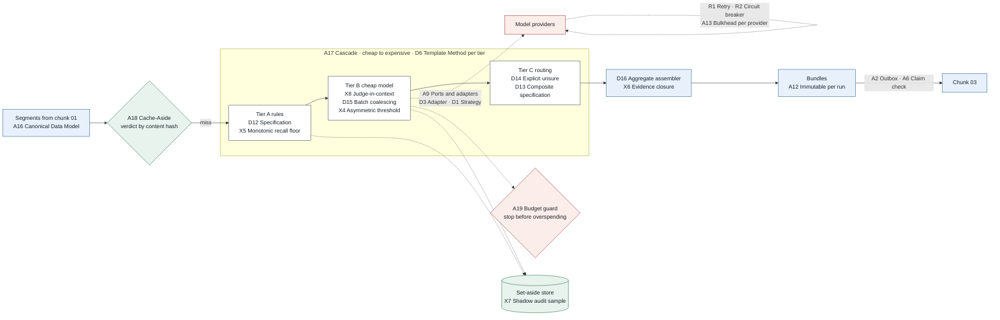
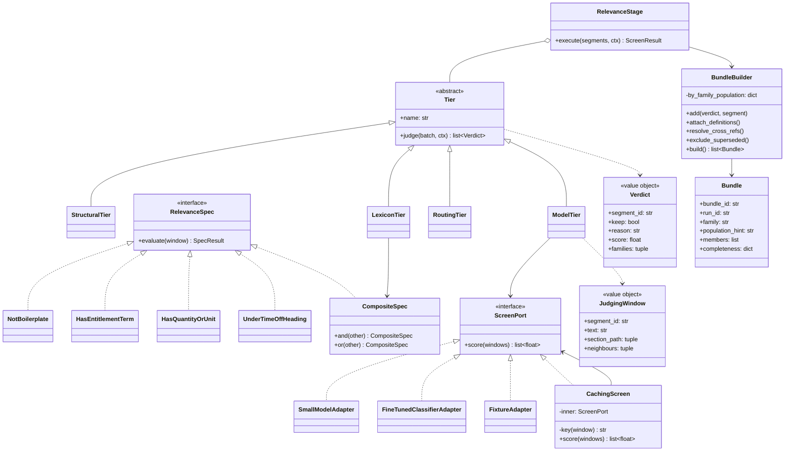

# Chunk 02 · Relevance screen — Architecture & Design Patterns

> **The one-line claim:**
> *Every pattern here exists to make one asymmetry safe: keeping a clause I didn't need costs a fraction of a cent, and dropping one I did need is silent and unrecoverable. A pattern that doesn't push in that direction, or make the cost of pushing that way affordable, doesn't belong in this chunk.*

| | |
|---|---|
| **Chunk** | 02 of 07 · Relevance screen & clause routing |
| **Companion to** | [HLD](hld.md) |
| **Pattern ids** | Continue chunk 01's numbering. Reused patterns keep their original id; new ones start at **A17**, **D13**, **X4** |
| **Status** | ✅ v1.0 |

---

## 1. The pattern map



### 1.1 Reused from chunk 01

These carry over unchanged; see [Chunk 01 patterns](../01-ingest/patterns.md) for the full cards.

| Id | Pattern | How chunk 02 uses it |
|---|---|---|
| A1 | Pipes and filters | Three tiers plus bundling, each independently testable |
| A2 | Transactional outbox | `bundles.ready` published in the same transaction as the verdicts |
| A3 | Process manager | The screen is one step in the document workflow |
| A5 | Fan-out / scatter-gather | Segments batched and scored in parallel, gathered per document |
| A6 | Claim check | Task messages carry segment ids, never clause text |
| A9 | Ports and adapters | `ScreenPort`: prompt-based model today, fine-tuned classifier later |
| A12 | Immutable versioned runs | A screen run is pinned to a chunk 01 run; verdicts are never rewritten |
| A13 | Bulkhead | One model provider's failure can't exhaust the other's capacity |
| A16 | Canonical data model | Input is chunk 01's segment; output is a bundle, and nothing downstream sees raw pages |
| D6 | Template method | Every tier subclasses `Tier`; idempotency, tracing and verdict recording are in the base |
| D12 | Specification | Lexicon rules as composable, explainable objects |
| R1–R4 | Retry · circuit breaker · DLQ · idempotent consumer | Same as chunk 01 |

### 1.2 New in chunk 02

| Id | Pattern | Where | The failure it prevents |
|---|---|---|---|
| **A17** | **Cascade (progressive filtering)** | Tiers A → B → C | Paying frontier prices to read a dress code; and a single classifier that must be cheap *and* careful at once |
| **A18** | **Cache-aside, content-addressed** | Verdict cache | Re-screening 3,600 unchanged segments because one document was re-uploaded |
| **A19** | **Budget guard (backpressure on spend)** | Before tier B and before publishing | A bad lexicon change quietly multiplying the extraction bill |
| **D13** | **Composite specification** | Lexicon tier | Rules that can't be combined, explained, or tested individually |
| **D14** | **Explicit "unsure" label (null object)** | Routing tier | A segment silently assigned to one family because the code needed a default |
| **D15** | **Batch coalescing with independent scoring** | Tier B | 3,060 separate model calls; or a batch where segment 37 is judged by what segment 5 said |
| **D16** | **Aggregate assembler** | Bundle builder | Half-built bundles escaping, and grouping logic scattered across the codebase |
| **X4** | **Asymmetric decision threshold** | Tier B | A default 0.5 cut-off silently encoding "both mistakes are equal" |
| **X5** | **Monotonic recall floor** | Lexicon tier | A missing synonym costing a clause; or a bad synonym being unfixable without risk |
| **X6** | **Evidence closure** | Bundle builder | A rule read without the definition that changes its meaning |
| **X7** | **Shadow audit sampling** | Discards | Recall being a number asserted once at release and never checked in production |
| **X8** | **Judge-in-context** | Tier B window | "Accrues at 1.54 hours per pay period" judged with no idea what accrues |

---

## 2. New architecture patterns

### A17 · Cascade (progressive filtering)

**Problem here.** One classifier would have to be cheap enough to run on 3,600 segments and careful enough to tell a vacation carryover clause from a professional-development one. Those pull in opposite directions.

**Pattern.** A funnel of stages ordered cheapest-first, each removing what it can decide confidently and passing the rest on. Cost per stage rises; volume falls.

**Where.** Tier A (free rules) → Tier B (cheap model on ~3,060 segments) → Tier C (routing and bundling on ~150).

**Domain example.** The dress-code section is removed at tier A for free. The professional-development carryover clause survives to tier B and is rejected there at a cost of a fraction of a cent. The accrual clause reaches tier C, where routing and bundling can afford to be careful.

**Why this, not one good model over everything?** Because the expensive judgement only has to be made 150 times instead of 3,600, so it can be a better judgement. It's the same shape as shortlist-then-rerank in search, and the same reason: **narrow cheaply, then go deep.**

**When not.** With a few hundred segments and no repeat runs, the cascade is overhead. Volume and re-runs are what justify it.

**Say it.** *"A cascade, because one model can't be both cheap enough for 3,600 segments and careful enough for the hard ten. Narrow cheaply, then go deep."*

---

### A18 · Cache-aside, content-addressed

**Problem here.** A customer re-sends one corrected document. Chunk 01 re-processes it, which produces a new run, which would re-screen all 3,600 segments, most of them byte-identical to last time.

**Pattern.** Before scoring, look up a cache keyed by the **content** of the decision, not the document: `sha256(segment_text + section_path + neighbour_ids) + screen_version + lexicon_version + model_id + window_policy_hash`. On a miss, score and store.

**Domain example.** A revised handbook changes three clauses in section 6. Everything else hits the cache. The re-screen costs three model calls instead of seventy-seven.

**The part that's easy to get wrong.** The key must include **everything that can change a verdict**: the model, the prompt, the window policy, the lexicon. Miss one and you serve stale verdicts after a change that should have invalidated them — a bug that looks like the model randomly disagreeing with itself. (This is gap **G3** in §5.)

**Say it.** *"Verdicts are cached by what the decision depends on, not by document. The key includes the lexicon and prompt versions, so a rule change invalidates exactly what it should."*

---

### A19 · Budget guard (backpressure on spend)

**Problem here.** The keep rate decides the extraction bill. A lexicon change that over-fires, or a badly segmented document, could quietly triple it — and extraction is where the money is.

**Pattern.** A budget checked at two points: before tier B (estimated tokens for this document set against a per-project cap) and before publishing (keep rate against a ceiling, default 25% [EST]). Exceed either and the run pauses for a human instead of spending.

**Domain example.** Someone adds "leave" to the lexicon. It fires on "leave the building", "leave of absence", "annual leave" and hundreds of unrelated sentences. Keep rate jumps to 40%. The guard stops the project before extraction and names the lexicon version that changed.

**Why a guard and not just an alert?** An alert tells you after the money is spent. In a system where the expensive stage is downstream, the cheap stage is the right place to stop.

**Say it.** *"The screen decides the extraction bill, so it carries a budget guard: if the keep rate goes past the ceiling, the run stops and asks a human before spending."*

---

## 3. New code-level patterns



### D13 · Composite specification

**Problem.** "Relevant by rule" is several conditions that must combine, change often, and be explainable to a consultant asking why a clause was kept.

**Pattern.** Each condition is an object with `evaluate(window) -> SpecResult(passed, reason)`. They compose with `and` / `or`.

```python
LEXICON_CANDIDATE = (
    NotBoilerplate()
    & (HasEntitlementTerm(lexicon)          # "PTO", "vacation", "congé annuel"
       | HasQuantityOrUnit()                # "1.54 hours", "10 days", "120 hrs"
       | UnderTimeOffHeading(lexicon))      # section path says Time Off
)
result = LEXICON_CANDIDATE.evaluate(window)
# result.reasons -> ["HasEntitlementTerm: 'Paid Time Off'", "HasQuantityOrUnit: '1.54 hours'"]
```

**Domain example.** The consultant asks why a bare table row was kept. The answer is a sentence, not a score: *"UnderTimeOffHeading: Article 18 — Vacation."*

**Why not a regex list?** Because reasons matter as much as verdicts here, and because chunk 06 owns these rules as configuration. Objects can be tested one at a time; a 400-character regex can't.

---

### D14 · Explicit "unsure" (null object)

**Problem.** Routing must return a family. The tempting default is "if unsure, pick the closest". That produces a confident wrong grouping, which is worse than an admitted uncertain one.

**Pattern.** `unsure` is a first-class family with its own behaviour: the segment stays in, is bundled into every plausible family's bundle as `role: uncertain`, and is surfaced in review.

**Domain example.** *"Sick days may be used for vacation once the sick bank exceeds 80 hours."* Routing returns `["sick", "vacation_pto"]`, not a coin flip. A genuinely opaque clause returns `["unsure"]` and still reaches extraction.

**Say it.** *"Unsure is a label, not a fallback. The system never quietly picks a family because the code needed one."*

---

### D15 · Batch coalescing with independent scoring

**Problem.** 3,060 separate model calls is slow and expensive; one call with 3,060 segments is impossible. Batching is obvious. The non-obvious part is that a naive batch makes segments judge each other: the model sees forty clauses, notices that most are irrelevant, and drifts toward rejecting the rest.

**Pattern.** Batch for transport, isolate for judgement. Each segment is scored on its own terms within the batch, the prompt forbids cross-referencing, batch composition is **shuffled** so a document's clauses don't arrive in a block, and **one known-relevant canary segment** rides in every batch.

```python
batches = shuffle_into_batches(windows, size=40, seed=run_id)   # deterministic per run
for b in batches:
    b.append(CANARY)                       # a known-relevant fixture clause
    scores = screen.score(b)
    assert scores[CANARY] >= 0.8, "batch position bias or prompt drift"
```

**Why the canary?** It turns an invisible quality drift into a failing assertion. If the canary starts scoring low in certain batch positions, the batching is biasing results — the open question the HLD listed, answered in code rather than in a study.

---

### D16 · Aggregate assembler (bundle builder)

**Problem.** A bundle has rules: group by family × population, attach definitions, resolve references, exclude superseded documents, note conflicts. Spread that logic across the pipeline and half-built bundles leak.

**Pattern.** The bundle is an **aggregate**: a builder consumes verdicts and segments, applies the rules in order, and only `build()` returns bundles that satisfy the invariants (I3, I4, I7 in the HLD).

**Domain example.** The 2022 handbook's vacation clause is offered to the builder. `exclude_superseded()` drops it into the bundle's `excluded` list with a reason, rather than silently ignoring it, so a consultant can see *why* the old handbook isn't in evidence.

---

## 4. New domain patterns

### X4 · Asymmetric decision threshold

**Problem.** A classifier's default cut-off is 0.5, which quietly asserts that a false keep and a false drop cost the same. Here they differ by orders of magnitude.

**Pattern.** Set the threshold from the **cost ratio**, not from accuracy. Keep at **0.15** [EST]. Tune it per family with the eval harness, store it in configuration (chunk 06), and record it on every run so a verdict can be re-explained later.

**Domain example.** A clause scoring 0.22 — *"Employees in the Ontario bargaining unit follow the schedule in Appendix C"* — is kept. At 0.5 it would have been dropped, and with it the entire Ontario union entitlement.

**Say it.** *"The keep threshold is 0.15, not 0.5, and that number is the design decision: it's where I encode that a false keep costs a fraction of a cent and a false drop costs the rule."*

### X5 · Monotonic recall floor

**Problem.** Two opposite fears about the lexicon: that a missing term loses a clause, and that a careless term addition breaks something.

**Pattern.** Make the lexicon **monotonic**: it can only promote a segment, never remove one. A hit sets a floor (`keep`), and the model may reduce confidence but cannot override to `set_aside`.

**Consequences, both good.** A missing term can't cause a miss on its own, because the model still sees every non-structural segment. A wrong term can only cost money, never a clause. **So the lexicon becomes safe to edit**, which is exactly what chunk 06 needs it to be.

**Cost.** Precision drops when the lexicon over-fires, which is why A19 exists. Monotonic safety is paid for in cents.

**Say it.** *"The lexicon can only add, never remove. That makes a missing synonym survivable and a bad synonym merely expensive."*

### X6 · Evidence closure

**Problem.** A rule can't be read correctly in isolation. "After ninety days of continuous service" depends on a definition on page 8. "Per Schedule B" depends on a table sixty pages later.

**Pattern.** A bundle is **closed** under the things its members depend on: definitions they name, cross-references they make, and the heading context they sit under. Closure is computed and recorded, and anything unresolved is stated.

**Domain example.** Bundle A carries the accrual clause, the carryover line from the addendum, the "Continuous Service" definition and the §6.2 heading. Chunk 03 gets everything needed to read the rule, and if Schedule B is missing, `unresolved_refs` says so and the affected fields become gaps rather than guesses.

**Say it.** *"Bundles are closed over their dependencies: definitions and cross-references come along. A rule read without its definition is a wrong rule read confidently."*

### X7 · Shadow audit sampling

**Problem.** Recall is measured on an eval set at release. In production, the screen's misses are by definition invisible: nobody sees the clause that wasn't kept.

**Pattern.** Sample **2%** of discards [EST], label them (by SME, in batches), and score them like an eval slice. Sample from both discard reasons **and** from segments kept only because of the lexicon floor, so an over-firing lexicon can't hide a weak model.

**Domain example.** Two weeks after a model upgrade, the sample shows three missed clauses, all bilingual French-English pages. That's a signal no dashboard would otherwise have produced.

**Say it.** *"Two percent of what the screen throws away is sampled and scored, because otherwise recall is a claim I made once at release."*

### X8 · Judge-in-context

**Problem.** Segments are the unit of citation, but not the unit of meaning.

**Pattern.** The unit of judgement is a **window**: the segment, its section path, and one neighbour either side. The verdict attaches to the segment; the context only informs it.

**Domain example.** Two clauses, nearly identical wording: *"Employees may carry over unused allowances."* One sits under `6 Time Off → 6.2 Paid Time Off`, one under `4 Professional Development`. Same words, opposite verdicts. No amount of lexicon work separates them; the section path does it immediately.

**The discipline that goes with it.** Context informs, never contaminates: the window's neighbours are never cited, and the verdict is recorded against the segment alone.

---

## 5. Gaps this exercise found in the HLD

Mapping patterns onto the HLD exposed eight places where it was underspecified. These become amendments (HLD → v1.1) and inputs to the LLD.

| # | Gap | Pattern that exposed it | Resolution |
|---|---|---|---|
| **G1** | **Bundle identity across re-runs.** The HLD pins a bundle to a chunk 01 run, but says nothing about what happens to an approved extraction when the document is re-screened. | A12 Immutable runs | Bundles are immutable and versioned like runs. A re-screen creates new bundle ids; chunk 03's approved fields keep pointing at the old bundle, which is retained. A `supersedes` link joins them. |
| **G2** | **Batch position bias was left as an open question.** | D15 Batch coalescing | Answered in the design, not deferred: shuffle deterministically by run id, forbid cross-referencing in the prompt, and put a canary segment in every batch with an assertion. |
| **G3** | **Cache key was incomplete.** The HLD listed screen and lexicon versions; the model id, prompt template and window policy also change verdicts. | A18 Cache-aside | Key = segment content hash + section path + neighbour ids + screen version + lexicon version + model id + window policy hash. |
| **G4** | **No hard spend ceiling.** The HLD had a keep-rate guard but no token budget, so a pathological document set could still run away. | A19 Budget guard | Per-project token budget checked before tier B; exceeding it pauses the run. Keep-rate ceiling stays as the second check. |
| **G5** | **Orphans were named but not handled.** "Kept but in no bundle" was marked and surfaced — which quietly loses the clause for extraction after all that work to keep it. | D16 Aggregate assembler | Orphans join a per-family `catch_all` bundle marked `low_confidence_grouping`, so chunk 03 still sees them. Surfacing is not enough; recall must survive bundling. |
| **G6** | **No cap on multi-label routing.** A segment routed to six families multiplies extraction cost and confuses attribution. | D14 Explicit unsure | Maximum three families per segment; beyond that it routes to `unsure` and is flagged. |
| **G7** | **The audit sample couldn't see the lexicon's blind spot.** Sampling only discards means an over-firing lexicon masks a weak model tier. | X7 Shadow sampling | Sample three strata: model discards, structural discards, and keeps that exist **only** because of the lexicon floor. |
| **G8** | **Degraded mode wasn't marked.** Lexicon-only mode produces bundles indistinguishable from normal ones, so eval and chunk 03 can't account for it. | A9 Ports and adapters | Bundles carry `screen_mode: full | lexicon_only`. Eval excludes degraded runs from quality baselines; the UI shows the consultant that screening was degraded. |

---

## 6. Anti-patterns deliberately avoided

| Anti-pattern | What it looks like here | Why it's tempting | Why it's wrong |
|---|---|---|---|
| **Top-k retrieval** | Embed everything, keep the 100 most similar | Standard RAG, one line of code | k is a guess; unionised customers have ten times the clauses of a simple handbook, and denials rank low |
| **Hard keyword filter** | Drop anything without a lexicon term | Fast, free, explainable | "Administered per Schedule B" has no term. One missing synonym costs a rule, invisibly |
| **Similarity as relevance** | Cosine score above a threshold | Cheap and tunable | The professional-development carryover clause is semantically adjacent to the vacation one |
| **One mega-prompt with every family definition** | "Here are 14 entitlement families; classify this clause" | Fewer moving parts | Accuracy degrades as definitions accumulate — the same attention problem that breaks large-catalogue classification; and adding a family changes behaviour on all the others |
| **Silent drop** | Discarded segments not stored | Saves storage | The consultant can't check, the eval can't measure, and the failure is invisible by construction |
| **Per-customer manual threshold tuning** | "This customer needs 0.3" | Fixes today's complaint | Unmeasurable drift, no baseline, no way to tell improvement from noise. Thresholds move by family, with eval evidence, never by customer |
| **Letting the lexicon exclude** | "No entitlement term → drop" | Saves model calls | Breaks X5, and the saving is pennies against a lost clause |
| **Bundling inside the extraction prompt** | Hand chunk 03 all kept clauses and let the model group them | One less component | Grouping becomes invisible, unrepeatable and untestable, and re-derived on every call |

---

## 7. Pattern selection guide for chunk 03

Chunk 03 (cited extraction & gap detection) will need:

| Its problem | The pattern |
|---|---|
| Model output must conform to the schema | Constrained structured output + **D12 Specification** for field validation |
| Every value must cite a real span | **X2 Design by contract** (chunk 01) — deterministic verification, not model self-report |
| The same clause set re-extracted after a prompt change | **A18 Cache-aside** keyed by bundle + prompt + model |
| Cost per bundle varies wildly | **A17 Cascade** again: cheap pass for simple bundles, frontier model only where arithmetic or conflict is involved |
| Conflicting values across documents | **D14 Explicit unsure** as `conflicting`, never a silent pick |
| Approved values must survive re-extraction | **A12 Immutable runs** and **G1** above |

---

## 8. The 90-second version

> "Every pattern in this chunk serves one asymmetry: a false keep costs a fraction of a cent, a false drop costs the rule.
>
> The shape is a cascade. Free rules first, then a cheap model on everything that survives, then routing and bundling on the few percent left. The lexicon is monotonic: it can only promote a segment, never remove one, which makes a missing synonym survivable and a bad synonym merely expensive. The keep threshold is 0.15 rather than 0.5, because that number is where the cost asymmetry lives.
>
> Judgement happens in context: the segment plus its section path, because 'employees may carry over unused allowances' is a vacation rule under one heading and a training-budget rule under another.
>
> Batching is for transport, not for judgement, so batches are shuffled and carry a canary segment that asserts the model hasn't drifted. Verdicts are cached on everything that can change them, including the prompt and lexicon versions.
>
> And the output is a closed evidence bundle rather than a list of clauses: definitions and cross-references travel with the rule, superseded documents are excluded with a reason, and two percent of everything discarded is sampled and scored, so recall stays a measurement instead of a claim."
