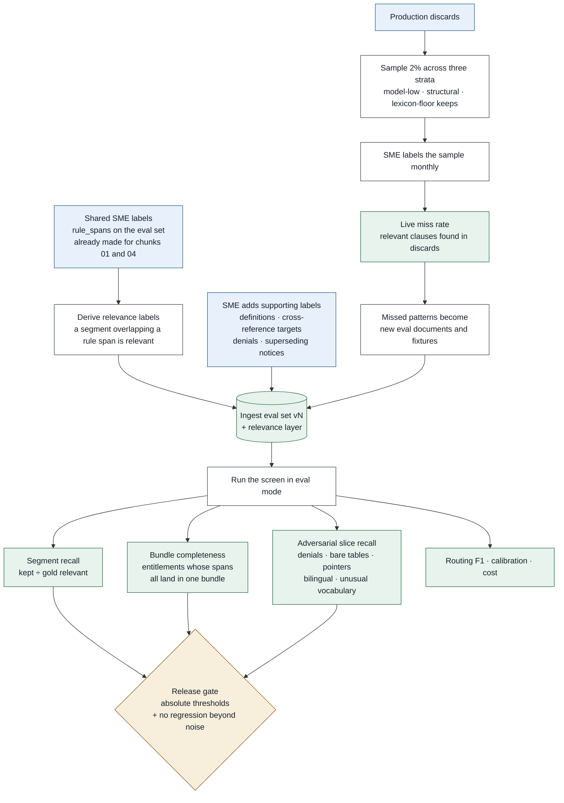

# Chunk 02 · Relevance screen — Test & Evaluation Plan

> **The one-line claim:**
> *This chunk's quality is a single number that cannot be observed in production: the clauses it threw away. Everything here exists to measure that number honestly — before release on a labelled set, and after release by sampling the discards and by counting how often a consultant has to rescue a clause by hand.*

| | |
|---|---|
| **Document** | Test & Eval v1.0 · chunk 02 of 07 |
| **Builds on** | [LLD v1.0](lld.md) · [CI/CD](ci-cd.md) · [Chunk 01 test & evaluation](../01-ingest/test-and-evaluation.md) for the shared method |

---

## 1. What's different from chunk 01

Chunk 01's failures are mostly deterministic and checkable: a lost page, a wrong highlight. Chunk 02's central failure is **statistical and invisible**. Three consequences:

1. **The test suite can't carry this chunk.** Fixtures prove the mechanics; only the eval says whether the screen is good.
2. **Production must be measured, not just monitored.** Hence discard sampling and the manual-include signal.
3. **Ground truth is cheaper here** than in chunk 01, because it can largely be *derived* from labels the project already has (§3.1).

---

## 2. Test suites

| Layer | Suite | Proves | Runs |
|---|---|---|---|
| Unit | Specifications | Each lexicon rule fires on its cases and not on neighbours ("PTO" not inside "OPTION"; "congé" with and without accent) | PR |
| Unit | Window builder | Never crosses a document (I8); tables summarised; token cap truncates neighbours first | PR |
| Unit | **Lexicon monotonicity** (property) | A floored segment can never be set aside, for any model score | PR |
| Unit | Parse strictness | Truncated, reordered and duplicated model responses all trigger retry, never misalignment | PR |
| Unit | Bundle builder | Grouping, definition attachment, superseded exclusion, orphan catch-all, 25-bundle cap | PR |
| Unit | Cache key | Two windows differing only in prompt version get different keys | PR |
| Component | **Golden verdicts** | Every verdict on the fixture corpus, unchanged without a reviewed rebaseline | PR |
| Component | Canary batch | Canary scores ≥ 0.8 in every position of a shuffled batch | PR |
| Component | Contract | `bundles.ready/v1` schema; chunk 03's consumer expectations | PR |
| Integration | End to end on dev | 40 fixtures through the real workflow, Bedrock and DynamoDB; budget pause and resume; degraded mode | Dev deploy |
| **Eval** | **Screen quality** | §4 metrics on the held-out slice | Stage gate, nightly |
| Environment | Load | 40 projects screened concurrently within SLO; Bedrock throttling handled | Stage |
| Environment | Chaos | Provider throttled, then down: run waits, then degrades, and is marked | Stage |
| Production | **Discard sampling** | Live recall (§5) | Monthly |
| Production | Manual-include rate | The human alarm | Continuous |

---

## 3. Ground truth

### 3.1 Derive first, label second

Most relevance labels come free from work already done:

- **A segment overlapping a gold `rule_span` is relevant.** Those spans were labelled by SMEs for chunks 01 and 04. No extra work.
- **Supporting segments need explicit labelling**, because no rule span covers them: definitions, cross-reference targets, denials, superseding notices, population-scoping clauses. An SME adds these on the same documents, roughly 1 minute per page [EST].
- **Family labels** come from the entitlement each rule span belongs to, again already known.



This is the payoff for keeping one shared eval set across chunks: chunk 02's ground truth is mostly a projection of chunk 04's.

### 3.2 The adversarial slice

The general eval set under-represents exactly the cases this chunk exists to get right. So a deliberate slice of ~120 segments [EST], each hand-picked or synthesised:

| Pattern | Example | Why it's here |
|---|---|---|
| Denial | "Part-time employees are not eligible for vacation" | Screens tuned to "grants something" drop these |
| Bare pointer | "Administered per Schedule B" | No terms, no numbers |
| Bare table row | `5–9 years | 15 days` | Meaning lives in the heading |
| Near-miss distractor | "Carry over unused professional development allowances" | Must be dropped |
| Bilingual | "Congé annuel: quinze (15) jours" | Accent and language handling |
| Unusual vocabulary | "Absence bank", "flex days", "personal float" | Lexicon blind spots |
| Definition | "'Continuous Service' means…" | Must be kept and attached |
| Superseding notice | "This policy supersedes…" | Routes to `meta` |

**The adversarial slice is scored separately and gated separately.** Averaged into 1,200 pages, these cases disappear.

---

## 4. Metrics

### The three that matter most

| Metric | Definition | Target [EST] |
|---|---|---|
| **Segment relevance recall** | Gold relevant segments kept ÷ all gold relevant | **≥ 98%** |
| **Bundle completeness** | Gold entitlements whose every rule span lands in **one** bundle ÷ all gold entitlements | **≥ 97%** — recall means nothing if the evidence is split |
| **Adversarial-slice recall** | Same as recall, on §3.2 | **≥ 95%** |

### Everything else

| Metric | Definition | Target [EST] |
|---|---|---|
| Keep rate | Kept ÷ total | 2–12%; > 25% trips the guard |
| Precision | Gold relevant ÷ kept | Reported, **not gated** — precision costs money, recall costs correctness |
| Routing F1 | Multi-label, macro and per family | ≥ 0.92 |
| Definition attachment recall | Gold definitions present in bundles that use the term | ≥ 0.95 |
| Cross-reference resolution recall | Gold references resolved to the right target | ≥ 0.90 |
| Grouping purity | Share of bundles containing exactly one gold entitlement × population | ≥ 0.90 |
| Calibration error | ECE over calibrated scores | ≤ 0.05 |
| Canary pass rate | Batches whose canary scored ≥ 0.8 | 100% |
| Cost per 1,000 segments | Model spend | ≤ $0.10 |
| Cache hit ratio on re-run | | ≥ 95% |

**Why precision is reported and not gated:** a false keep costs a fraction of a cent at extraction and is filtered by the evidence check there. Gating precision would create pressure to raise the threshold, which is the one thing this chunk must never do quietly.

---

## 5. Measuring recall in production

Three independent signals, because the eval set can't see what production documents contain.

| Signal | How | Cadence | What it catches |
|---|---|---|---|
| **Stratified discard sample** | 2% of discards across three strata: model-low, structural, and **keeps that exist only because of the lexicon floor**. An SME labels them | Monthly | A weakening model; an over-firing lexicon hiding it |
| **Manual-include rate** | Every consultant "Include this clause" action is a labelled miss with the clause text | Continuous | Real misses on real customers, immediately |
| **Downstream attribution** | `SCREEN_DROPPED` from chunk 04's attribution tree | Per eval run | Misses that reached a wrong extraction |

Each confirmed miss becomes three things: a fixture, a candidate eval document, and a lexicon or threshold review item.

**The power question (HLD Q5):** at 2% sampling of ~3,000 discards per project, a miss rate of 1% yields ~0.6 detected misses per project [EST]. Across 30 projects a month that's ~18 — enough to notice a systematic pattern, not enough to detect a small regression quickly. **So the sample is a slow, honest signal; the fast one is the manual-include rate.** Both are needed, and the document says so rather than implying the sample is sufficient.

---

## 6. Gates and regression

| Check | PR | Dev | Stage | Prod |
|---|:-:|:-:|:-:|:-:|
| Unit, property, golden verdicts, canary | ✅ | | | |
| Integration (40 fixtures, budget pause, degraded mode) | | ✅ | | |
| Eval: absolute thresholds and regression | | | ✅ | |
| **Shadow verdict diff, every new drop explained** | | | ✅ | |
| Load, chaos | | | ✅ | |
| Keep rate, canary, manual-include, cost | | | | ✅ alarm |

Regression rule as chunk 01: blocked if a blocking metric drops more than `max(0.5 pt, bootstrap CI half-width)`, tightened to 0.3 pt for the three that matter.

---

## 7. Eval harness

Same shape as chunk 01's: pinned config, runner in eval mode with real Bedrock, aligner, scorer, `results.parquet`, markdown and HTML report, run manifest.

Two additions specific to this chunk:

- **Sweep mode.** Re-score once, then evaluate many thresholds offline from stored scores. Threshold tuning costs no model calls, so a per-family threshold review takes minutes.
- **Drop explainer.** For every gold relevant segment that was missed, the report prints the clause, its calibrated score, whether the lexicon fired, and the section path. A recall number tells you there's a problem; this tells you which kind.

```
SCREEN EVAL · eval-set-v1 (test) · screen-1.1.0 vs screen-1.0.0
──────────────────────────────────────────────────────────────────
metric                    value   95% CI          baseline   Δ     gate
segment_recall            0.984   [0.976,0.990]   0.981     +0.3   PASS
bundle_completeness       0.972   [0.961,0.981]   0.974     −0.2   PASS
adversarial_recall        0.938   [0.902,0.966]   0.951     −1.3   FAIL
routing_f1_macro          0.931   [0.918,0.943]   0.925     +0.6   PASS
keep_rate                 0.061                    0.058
cost_per_1k_segments      $0.071                   $0.083
──────────────────────────────────────────────────────────────────
RESULT: BLOCKED · adversarial_recall
  missed: 4 denial clauses, 2 bare pointers
  e.g. "Casual employees shall not accrue vacation credits."  score 0.11, lexicon: no hit
```
*(Illustrative numbers.)*

---

## 8. Test data

| Data | Where | Notes |
|---|---|---|
| Fixture corpus (R21–R40) | `services/relevance/tests/fixtures/` | Synthetic or public text only |
| Golden verdicts | `tests/golden/verdicts/*.json` | Rebaseline needs owner approval |
| Adversarial slice | `eval/relevance/adversarial/` | Grows from production misses |
| Eval set | Shared with chunks 01 and 04, plus the relevance layer | One labelled corpus, three consumers |
| Manual-include exports | `s3://coo-stage-eval/relevance/overrides/` | Sanitised, SME-reviewed before entering the eval set |

---

## 9. What to build first

| # | Build | Proves |
|---|---|---|
| 1 | `JudgingWindow` builder + its unit tests | The boundary and table rules (I8, F4) |
| 2 | Lexicon specifications + the monotonicity property test | X5 in code |
| 3 | Scorer for segment recall and bundle completeness | The two numbers that decide releases |
| 4 | The adversarial slice, hand-written: 20 cases | Real evaluation before any model call |
| 5 | `ScreenPort` with a fixture adapter, then a real one | End-to-end scoring, testable offline |

By item 4 you can measure a screen you haven't built yet — which is the right order, because the metric defines the target.

---

## 10. The 90-second version

> "The failure I care about is invisible: a clause the screen threw away. Nothing errors, so I have to go looking.
>
> Before release, I measure three things on a labelled, held-out set: how many relevant clauses I keep, whether all the evidence for one entitlement lands in one bundle, and recall on an adversarial slice of the cases most likely to be missed — denials, bare pointers, bare table rows, bilingual clauses. That slice is gated separately, because averaged into 1,200 pages those cases disappear.
>
> Ground truth is mostly free: a segment overlapping a gold rule span is relevant by definition, and those spans were already labelled for extraction. SMEs only add the supporting cases.
>
> After release, two signals. A stratified sample of two percent of discards, labelled monthly — honest but slow. And the manual-include rate: every time a consultant rescues a clause by hand, that's a labelled miss, and it's the fastest alarm I have.
>
> And precision is reported, never gated, because gating it would create pressure to raise the keep threshold, which is the one thing this chunk must never do quietly."
