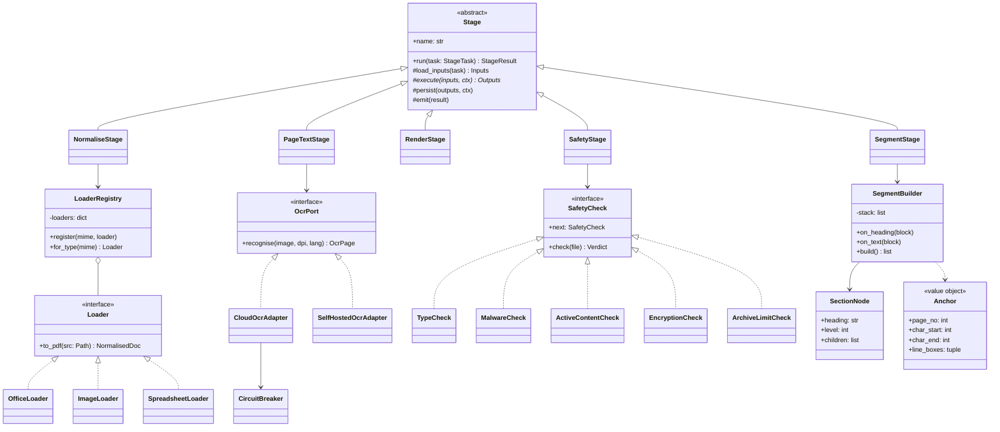

# Chunk 01 · Ingest — Architecture & Design Patterns

> **The one-line claim:**
> *Every pattern in ingest earns its place by solving a specific way that customer documents, distributed workers, or citations break. No pattern here is decoration. If you can't name the failure it prevents, it doesn't belong.*

| | |
|---|---|
| **Chunk** | 01 of 07 · Ingest, normalise & segment |
| **Companion to** | [HLD](Chunk%2001%20%C2%B7%20Ingest,%20normalise%20%26%20segment.md) · [LLD](../lld/Chunk%2001%20%C2%B7%20Ingest,%20normalise%20%26%20segment%20%E2%80%94%20Low-Level%20Design.md) |
| **Diagrams** | `diagrams/mermaid/01-ingest/01h-pattern-map.mmd` · `01i-stage-class-diagram.mmd` |
| **Status** | ✅ v1.0 |

**How to read this.** §1 is the map: every pattern, where it lives, one line on why. §2–§5 go pattern by pattern, grouped by level. Each card follows the same shape: **the problem in our domain → the pattern → where it's applied → a concrete example → why this, not the alternative → when not to use it → the line to say in an interview.** §6 lists the gaps this exercise found in the LLD. §7 is the anti-patterns we deliberately avoided. §8 is a selection guide you can reuse on chunks 02–07.

Pattern ids: **A** architecture · **D** design (code-level) · **R** reliability · **X** domain-specific.

---

## 1. The pattern map

```mermaid
flowchart LR
  classDef arch fill:#E8F1FB,stroke:#1E5A86,color:#17202A
  classDef code fill:#FFFFFF,stroke:#39434F,color:#17202A
  classDef rel fill:#FBEDEA,stroke:#9B2C2C,color:#17202A
  classDef data fill:#E7F3EC,stroke:#236A45,color:#17202A

  UI["React"] -->|"A10 Backend for Frontend<br/>A11 SSE replay"| API["Ingest API"]
  API -->|"A7 Valet Key<br/>presigned upload"| Q0[("quarantine/")]
  API -->|"A2 Transactional Outbox"| ORC["Orchestrator<br/>A3 Process Manager<br/>D5 State"]
  ORC -->|"A6 Claim Check<br/>keys not bytes"| QUEUE[["Queue<br/>A4 Competing Consumers<br/>A4 Load levelling"]]

  subgraph PIPE["A1 Pipes and Filters · D6 Template Method per stage"]
    S1["S1 Safety<br/>A8 Gatekeeper<br/>D4 Chain of Responsibility"]
    S2["S2 Unpack<br/>A5 Fan-out children"]
    S4["S4 Normalise<br/>D1 Strategy · D2 Registry"]
    S5["S5 Render<br/>A5 Scatter-Gather pages"]
    S6["S6 Text<br/>D3 Adapter · A9 Ports and Adapters<br/>X1 Source map"]
    S10["S10 Segment<br/>D8 Composite section tree<br/>D7 Builder"]
    S14["S14 Validate<br/>X2 Design by Contract"]
  end

  QUEUE --> S1 --> S2 --> S4 --> S5 --> S6 --> S10 --> S14
  S1 -.->|"A13 Bulkhead sandbox"| SBX["Sandbox pool"]
  S6 -.->|"R1 Retry · R2 Circuit Breaker"| OCR["OCR engine"]
  QUEUE -.->|"R3 Dead Letter"| DLQ[["DLQ"]]
  S14 --> DB[("Postgres<br/>A12 Immutable runs<br/>D10 Repository")]
  S14 --> OBJ[("Object store<br/>A14 Content-addressed<br/>A15 WORM originals")]
  S14 -->|"A2 Outbox · A16 Canonical Data Model"| NEXT["Chunk 02"]

  class API,ORC,QUEUE,UI arch
  class S1,S2,S4,S5,S6,S10,S14 code
  class SBX,OCR,DLQ rel
  class Q0,DB,OBJ,NEXT data
```



| Id | Pattern | Where in ingest | The failure it prevents |
|---|---|---|---|
| **A1** | Pipes and Filters | S1 → S14 | One giant function nobody can test, scale or change safely |
| **A2** | Transactional Outbox | API, S14 | "DB says READY but chunk 02 never heard" (or the reverse) |
| **A3** | Process Manager (orchestration) | Orchestrator | Nobody knowing where a document is or why it stopped |
| **A4** | Competing Consumers + Queue-Based Load Levelling | Job queue | Peak-season spikes overwhelming workers |
| **A5** | Fan-out / Scatter-Gather | S2 children, S5–S8 pages | A 420-page scan processed one page at a time |
| **A6** | Claim Check | Every queue message | 300 MB files pushed through a message queue |
| **A7** | Valet Key | Upload | Large files streamed through our API servers |
| **A8** | Gatekeeper / Quarantine | S0 → S1 | Hostile files reaching parsers that trust them |
| **A9** | Ports and Adapters (Hexagonal) | OCR, layout, converter, storage | Vendor lock-in; tests needing a live OCR service |
| **A10** | Backend for Frontend | Ingest API | React stitching together five internal services |
| **A11** | Event stream with replay | SSE + `Last-Event-ID` | Consultant's progress bar freezing after Wi-Fi blips |
| **A12** | Immutable, versioned runs | `processing_run` | Pipeline upgrade silently breaking approved citations |
| **A13** | Bulkhead | Sandbox pool, per-tenant caps | One converter exploit or one big customer taking everyone down |
| **A14** | Content-addressable storage | `originals/{hash}` | Same handbook stored and processed five times |
| **A15** | WORM (write once, read many) | Originals | "Is this the file the customer actually sent?" disputes |
| **A16** | Canonical Data Model | Document → Page → Segment → Anchor | Every downstream stage branching on file format |
| **D1** | Strategy | Loaders per format | `if pdf… elif docx… elif tiff…` sprawl |
| **D2** | Registry / Plugin | Type-keyed loader dispatch | Adding a format means editing working code |
| **D3** | Adapter | `OcrPort` implementations | Each OCR vendor's response shape leaking into our code |
| **D4** | Chain of Responsibility | S1 safety checks | One unreadable function doing six security checks |
| **D5** | State | Document state machine | Illegal transitions (READY → SCANNING) |
| **D6** | Template Method | `Stage` base class | Every stage re-implementing idempotency, tracing, persistence |
| **D7** | Builder | `SegmentBuilder` | Segments assembled half-valid across page breaks |
| **D8** | Composite | Section tree | Losing that `6.2 (b)(ii)` is an exception inside `6.2 (b)` |
| **D9** | Decorator | Retry / timeout / tracing wrappers | Cross-cutting code copied into every stage |
| **D10** | Repository | DB access | SQL scattered through business logic |
| **D11** | Value Object | `Anchor`, `BBox`, `ContentHash` | Coordinates mutated after validation |
| **D12** | Specification | Text-health rules, invariants | Thresholds hard-coded and untestable |
| **R1** | Retry with exponential backoff + jitter | All stages | Transient blips failing documents |
| **R2** | Circuit Breaker | OCR, converter | Hammering a dead OCR service; retry storms |
| **R3** | Dead Letter Queue | Queue | Poison messages blocking or looping forever |
| **R4** | Idempotent Consumer | Every stage | At-least-once delivery creating duplicate pages/segments |
| **X1** | Source map (offset map) | Canonical text ↔ raw chars ↔ boxes | Correct citations failing verification; highlights on wrong words |
| **X2** | Design by Contract (invariants) | I1–I7 | Silent page loss; wrong highlights |
| **X3** | Golden snapshot testing | CI | Refactors quietly changing segment ids |

---

## 2. Architecture patterns

### A1 · Pipes and Filters

**Problem here.** Ingest does fourteen different things: scan, unpack, convert, render, OCR, layout, segment… Each has different failure modes, runtimes and scaling needs. OCR is slow and external. Rendering is CPU-bound. Segmentation is pure logic.

**Pattern.** A pipeline of independent **filters** (stages), each doing one transformation, connected by **pipes** (queue + stored artefacts). Each filter reads its inputs and writes its outputs, and knows nothing about the others.

**Where.** S1 → S14. Every stage is a filter; the queue plus object store are the pipes.

**Domain example.** When the 112-page collective agreement arrives, S5 renders pages while S6 OCRs pages already rendered. If the layout model (S8) is upgraded, only S8 changes and only S8 needs re-testing.

**Why this, not a monolith.** Each stage scales, retries and times out on its own terms. A failure is pinned to a stage (`FAILED at S4/CONVERSION_TIMEOUT`), not "ingest failed".

**When not.** For a 3-page PDF, the per-stage overhead (queue hop, artefact write) dominates. Acceptable here because the unit of value is the 600-page implementation, not the single small file. For a latency-critical synchronous API this would be the wrong shape.

**Say it.** *"Ingest is pipes and filters. Each stage has one job, its own timeout and retry budget, and writes its output to storage — so a failure has an address, and I can upgrade the layout model without touching OCR."*

---

### A2 · Transactional Outbox

**Problem here.** At S14 we must do two things: commit pages and segments to Postgres, and tell chunk 02 the document is ready. If we commit and then crash before publishing, the document is READY forever and nothing downstream knows. If we publish first and the commit fails, chunk 02 reads segments that don't exist.

**Pattern.** Write the event into an **outbox table in the same DB transaction** as the state change. A relay process publishes outbox rows and marks them sent.

**Where.** S0 (`document.received`), every state transition, S14 (`document.ready`). Also the source for SSE replay (A11).

**Domain example.** Worker crashes one millisecond after committing the 112-page agreement. On restart, the relay finds the unpublished `document.ready` row and sends it. Chunk 02 still gets it.

**Why not just publish to the queue after commit?** That's the "dual write" problem: two systems, no shared transaction, guaranteed eventual inconsistency at scale.

**Cost.** Delivery is **at-least-once**, so every consumer must be idempotent (R4). There's also a small publish delay (relay polling, ~1 s).

**Say it.** *"State and event are written in one transaction through an outbox, so 'ready in the database' and 'announced downstream' can never disagree."*

---

### A3 · Process Manager (orchestration, not choreography)

**Problem here.** A document's path branches: office files go through conversion, ZIPs spawn children, encrypted files pause for the consultant, quarantined files stop. Someone must know "where is document X and what happens next".

**Pattern.** A **central orchestrator** holds each document's state and decides the next step. Workers are dumb: they do one stage and report back.

**Choreography (rejected).** Each stage emits an event and the next stage subscribes. Fine for 3 linear steps. For 14 steps with branches, pauses and cancellations, the flow exists only as an emergent property of subscriptions, and nobody can answer "why is this document stuck?" without reading every service.

**Where.** Orchestrator + `document.state` + D5 State pattern.

**Domain example.** Consultant deletes the Ontario addendum mid-OCR. The orchestrator marks the run cancelled; in-flight workers see it and discard their writes (LLD §7.4). With choreography, there's no single place to cancel.

**Cost.** The orchestrator is a critical component. See gap **G1** (§6): it must not be a single leader holding state in memory.

**Say it.** *"Fourteen stages with branching and cancellation is a process, not a chain reaction. I orchestrate it, so there's one place that knows where every document is and why."*

---

### A4 · Competing Consumers + Queue-Based Load Levelling

**Problem here.** Load is spiky. Implementations cluster at quarter starts; a big customer drops 2,000 pages at once. Workers sized for the peak sit idle 90% of the time.

**Pattern.** Many identical workers pull from one queue (**competing consumers**). The queue absorbs bursts (**load levelling**) and workers scale on queue depth.

**Where.** Job queue for all stages; autoscaling on `queue_age` and depth.

**Domain example.** Monday 9 a.m., three consultants each upload a 600-page set. The queue grows; workers scale from 4 to 20; the oldest-task age stays under the 10-minute SLO.

**Why not synchronous calls?** Upload would block for minutes and one slow OCR page would hold an HTTP connection hostage.

**Watch out.** A shared queue lets one tenant starve others. That's why A13 adds **per-tenant caps**.

**Say it.** *"The queue turns our peak into a backlog instead of an outage. Workers compete for tasks and scale on queue age, not CPU."*

---

### A5 · Fan-out / Scatter-Gather

**Problem here.** Pages are independent for rendering, OCR and layout. Processing 420 pages serially at ~1.5 s each is over 10 minutes; in parallel it's under a minute.

**Pattern.** **Scatter** one task per page; **gather** when all pages report done, then continue at document level.

**Where.** S5/S6/S8 per page, gathered before S9 (boilerplate needs all pages). Also S2: a ZIP scatters into child documents.

**Domain example.** 112 OCR tasks run in parallel. The gather step counts `stage_attempt` rows with outcome `ok` for `S6` and fires S8 when the count equals `page_count_declared`.

**The hard part is the gather.** It must be idempotent (a retried page must not count twice) and tolerant (one poison page must fail the document explicitly, not hang it). We count distinct `(run_id, stage, page_no)` successes, not messages.

**Say it.** *"Pages scatter, the document gathers. The gather counts distinct page successes, so retries can't double-count and a lost page can't hang the document."*

---

### A6 · Claim Check

**Problem here.** Queue messages have size limits (often 256 KB) and should never carry customer content.

**Pattern.** Put the payload in storage; send a **reference** (the claim check) in the message.

**Where.** Every task: `{doc_id, run_id, stage, page_no, input_keys[]}`. Never bytes, never text.

**Domain example.** The S6 task for page 44 carries `runs/r7f3/pages/0044.webp`, not the image.

**Bonus.** Messages contain no document text, which keeps customer data out of queue logs and dead-letter inspection tools. That's a privacy property as well as a size one.

**Say it.** *"Messages carry keys, not content. Queues stay small, and customer text never lands in queue logs."*

---

### A7 · Valet Key

**Problem here.** A 300 MB scanned PDF streamed through our API servers ties up memory and connections, and fails on a weak connection.

**Pattern.** The API issues a **short-lived, narrowly scoped credential** (presigned multipart URLs) so the browser uploads **directly to object storage**.

**Where.** `POST /projects/{pid}/uploads` returns presigned part URLs to `quarantine/{doc_id}` only.

**Domain example.** Consultant in a hotel uploads the union agreement in 8 MB parts; the connection drops at part 23; React resumes from part 24. The API never touches the bytes.

**Guard-rails.** URLs expire in 15 minutes; they allow PUT to one key only; the server re-hashes after completion (the client's hash is a hint, not proof).

**Say it.** *"The browser uploads straight to storage with a scoped, expiring key. My API handles the handshake, not the gigabytes."*

---

### A8 · Gatekeeper / Quarantine

**Problem here.** Customer files are untrusted. Parsers (PDF, XML, Office) have a long history of vulnerabilities.

**Pattern.** Everything lands in a **quarantine zone**. A **gatekeeper** stage validates it. Only files that pass are copied to the trusted zone. Nothing downstream can read quarantine.

**Where.** `quarantine/` → S1 → `originals/`. IAM denies worker roles read access to `quarantine/` except the S1 role.

**Domain example.** An HR portal export with embedded JavaScript is stopped at S1 with `ACTIVE_CONTENT`. The layout model never opens it.

**Why a separate zone, not just a check?** A check can be skipped by a bug. A zone the rest of the system *cannot read* can't.

**Say it.** *"Untrusted files land in a zone nothing else can read. They earn their way into the trusted zone by passing the gatekeeper."*

---

### A9 · Ports and Adapters (Hexagonal)

**Problem here.** OCR engine choice depends on the tenant (Canadian residency may require self-hosted). The layout model will be replaced. Tests shouldn't need a live cloud service.

**Pattern.** The core defines **ports** (interfaces in our language). **Adapters** implement them for each vendor. The core never imports a vendor SDK.

**Where.** `OcrPort`, `LayoutPort`, `ConverterPort`, `BlobStorePort`, `MalwareScanPort`.

**Domain example.** Tenant A uses cloud OCR; Tenant B requires in-country processing and uses the self-hosted adapter. The pipeline code is identical. In CI, a `FixtureOcrAdapter` returns recorded responses.

**Cost.** One more layer, and the port must be designed around what *we* need (words, boxes, confidence), not the richest vendor's feature set.

**Say it.** *"The core speaks in ports. OCR, layout and conversion are adapters, so swapping a vendor for data residency is config, not a rewrite."*

---

### A10 · Backend for Frontend (BFF)

**Problem here.** The React workspace needs document status, page images, segments and warnings, composed and phrased for a consultant. Internal services use internal state names and ids.

**Pattern.** A backend **shaped for one frontend**, which composes internal data and translates it (e.g. `READY_WITH_WARNINGS` → "Ready · 2 things to check").

**Where.** Ingest API (for now it's both the public ingest API and the BFF; they split if a second client appears).

**Domain example.** `GET /projects/{pid}/documents` returns one list with progress, plain-language state and warning badges. React doesn't call the orchestrator, the DB and the object store separately.

**Say it.** *"React talks to one backend shaped for it. Internal state names never reach the consultant."*

---

### A11 · Event stream with replay

**Problem here.** The consultant watches 14 documents progress. Polling every second is wasteful; a WebSocket is more than we need; any push channel drops events on reconnect.

**Pattern.** **Server-sent events** with an **event id**. On reconnect the browser sends `Last-Event-ID`, and the server replays everything after it from the outbox.

**Where.** `GET /projects/{pid}/events`, fed from the outbox (A2).

**Domain example.** Laptop sleeps for 5 minutes during OCR. On wake, React reconnects with `Last-Event-ID: 88121`, receives the 37 events it missed, and the list is correct without a page reload.

**Why SSE not WebSocket?** Traffic is one-way (server → browser), SSE reconnects automatically, and it works through corporate proxies that break WebSockets.

**Say it.** *"Progress is pushed over SSE with event ids, so a sleeping laptop catches up by replay instead of showing stale state."*

---

### A12 · Immutable, versioned runs

**Problem here.** A consultant approved "cap = 120 hrs, cited from segment `r7f3:031:0006`". Next month we ship a better table detector. Re-processing would renumber segments, and the approved citation would point at nothing.

**Pattern.** Treat each processing run as an **immutable version**. Re-processing creates a new run; the pointer (`current_run_id`) moves only on success; old runs are never edited.

**Where.** `processing_run`, `runs/{run_id}/` prefix, invariant **I7**.

**Domain example.** Project on run v1.2 has 40 approved fields. v1.3 is released. The project stays on v1.2 until the consultant opts in; the UI lists which approved fields would need re-confirming.

**Relationship to event sourcing.** This is event-sourcing-lite: we don't rebuild state from events, but we never destroy history, and every approved fact points to the exact version it was derived from.

**Cost.** Storage for old runs. Cheap compared with an audit finding that says "we can't show what the system saw when this was approved".

**Say it.** *"Runs are immutable. Approved citations pin to a run, so improving the pipeline can never silently rewrite what a consultant already signed off."*

---

### A13 · Bulkhead

**Problem here.** Two blast-radius risks: a malicious file exploiting the office converter, and one big customer consuming all workers.

**Pattern.** **Partition resources** so a failure or overload in one compartment can't sink the others.

**Where.**
- **Security bulkhead:** malware scan and conversion run in a separate container class: no network, read-only filesystem, one document per process.
- **Capacity bulkhead:** per-tenant concurrency caps (default 200 page tasks); separate queues for interactive (small, fast) vs bulk work if needed.

**Domain example.** A crafted DOCX crashes LibreOffice. The sandbox process dies, the task retries, then goes to DLQ. The render and OCR workers never notice.

**Say it.** *"The converter is the riskiest code I run, so it lives in its own compartment with no network. And tenants get caps, so one big customer can't starve the rest."*

---

### A14 · Content-addressable storage

**Problem here.** Customers resend the same file under new names; the same handbook appears in the ZIP and as an email attachment.

**Pattern.** **Store by hash of content**, not by name. Same bytes → same key → stored once.

**Where.** `originals/{sha256}`; `document.content_hash`; dedup at S0.

**Domain example.** `Handbook_FINAL.pdf` and `Handbook_FINAL_v2.pdf` hash identically. The second upload returns `duplicate_of` in milliseconds, with no processing and no duplicate citations.

**Limit.** It catches identical bytes only. A re-saved PDF with a new timestamp is a different hash. That's what near-duplicate detection (S13, MinHash) is for.

**Say it.** *"Originals are stored by content hash, so a re-sent file costs nothing, and the hash is also the audit anchor."*

---

### A15 · WORM storage (write once, read many)

**Problem here.** Six months later a customer disputes a configured rule: "Our policy never said 120 hours." We must prove what they sent.

**Pattern.** Originals are **immutable at the storage layer** (object lock in compliance mode): not even an admin can alter them during retention.

**Where.** `originals/` (invariant **I5**).

**Say it.** *"Originals are write-once. When a customer disputes a rule, I can show the exact bytes they sent and the exact sentence we cited."*

---

### A16 · Canonical Data Model

**Problem here.** Inputs arrive as PDF, DOCX, TIFF, XLSX, email. If each downstream stage handled each format, the system would be 7 chunks × 8 formats of special cases.

**Pattern.** Translate everything at the edge into **one canonical model**: Document → Page → Segment → Anchor.

**Where.** Output of chunk 01; the only thing chunks 02–05 ever see.

**Domain example.** The accrual table from `PTO_Accrual_Rates.xlsx` and the one from a scanned agreement both become `type: table` segments. They differ only in anchor kind (`cell` vs `page_bbox`), and the React viewer switches on anchor kind, not file type.

**Say it.** *"Format variety dies at ingest. Everything downstream sees one canonical shape and never asks what the customer sent."*

---

## 3. Design patterns (code level)

Class view of how these fit together:



### D6 · Template Method — the `Stage` base class

**Problem.** Every stage must: check idempotency, load inputs, run under a timeout, trace, persist outputs, record the attempt, emit an outbox event. Fourteen copies of that is fourteen chances to forget one step.

**Pattern.** The base class fixes the **skeleton**; subclasses fill in only `execute`.

```python
class Stage(ABC):
    name: ClassVar[str]

    def run(self, task: StageTask) -> StageResult:
        key = task.idempotency_key()                      # R4
        if self.attempts.succeeded(key):
            return StageResult.already_done(key)
        with tracer.span(f"ingest.{self.name}", **task.ids()), \
             deadline(self.timeout_s):                    # D9-style cross-cutting
            if self.runs.is_cancelled(task.run_id):
                return StageResult.cancelled(key)
            inputs = self.load_inputs(task)               # A6 claim check → blobs
            outputs = self.execute(inputs, task.ctx)      # the only stage-specific step
            self.persist(outputs, task)                   # deterministic keys, ON CONFLICT DO NOTHING
        self.attempts.record_ok(key)
        return StageResult.ok(key, outputs.summary())

    @abstractmethod
    def execute(self, inputs: Inputs, ctx: RunContext) -> Outputs: ...
```

**Why not composition everywhere?** Here the steps and their order *are* the rule, and must not vary. Template Method encodes an order that subclasses can't break.

**Say it.** *"The base stage owns the non-negotiables: idempotency, cancellation, tracing, persistence. A new stage writes one method."*

---

### D1 · Strategy + D2 · Registry (plugin dispatch)

**Problem.** Each format needs a different conversion. A growing `if/elif` chain means every new format edits code that already works.

**Pattern.** Each format is a **strategy** implementing `Loader`. A **registry** maps detected type → strategy. Adding a format is a registration.

```python
LOADERS = LoaderRegistry()

@LOADERS.register("application/vnd.openxmlformats-officedocument.wordprocessingml.document")
class DocxLoader(Loader):
    def to_pdf(self, src: Path) -> NormalisedDoc:
        clean = accept_tracked_changes(src)               # S4 step 1
        inventory = paragraph_inventory(clean)            # for invariant I1b
        pdf = self.converter.convert(clean, timeout_s=120)  # A9 port, A13 sandbox
        return NormalisedDoc(pdf=pdf, inventory=inventory)

loader = LOADERS.for_type(detected_mime)  # raises UnsupportedType → REJECTED, never a "nearest" guess
```

**Domain example.** Customers start sending `.pages` files. We add `PagesLoader` and one registration. PDF, DOCX and TIFF paths are untouched, and their golden snapshots (X3) prove it.

**Say it.** *"Formats are strategies in a registry. Supporting a new one is a registration, so it can't break the ones that already work."*

---

### D3 · Adapter

**Problem.** Every OCR vendor returns a different shape: blocks/lines/words, polygons vs boxes, confidence 0–100 vs 0–1, rotated coordinates.

**Pattern.** An **adapter** per vendor converts its response into our `OcrPage` (upright page coordinates, 0–1 confidence, words with line ids).

**Where.** `CloudOcrAdapter`, `SelfHostedOcrAdapter`, `FixtureOcrAdapter`.

**The rule that matters.** All normalisation happens **inside** the adapter. Code outside it never sees a vendor type. This is the concrete mechanism behind A9.

**Say it.** *"Each OCR vendor gets an adapter that speaks our coordinate system. Nothing outside the adapter knows which vendor ran."*

---

### D4 · Chain of Responsibility

**Problem.** Safety has six checks with an order that matters: type before malware (don't AV-scan a 2 GB non-document), active content before encryption (can't inspect encrypted content), archive limits before unpacking.

**Pattern.** Each check is a **handler**. It either stops the chain with a verdict or passes to the next.

```python
SAFETY_CHAIN = chain(
    TypeCheck(allow=ALLOWED_TYPES),        # → REJECTED
    MalwareCheck(scanner),                 # → QUARANTINED
    ActiveContentCheck(),                  # → QUARANTINED
    EncryptionCheck(),                     # → NEEDS_INPUT
    ArchiveLimitCheck(limits),             # → QUARANTINED
)
verdict = SAFETY_CHAIN.check(file)         # first failure wins; PASS if all pass
```

**Domain example.** A new rule, "block Office files with external template links" (a known attack), is one new handler inserted after `ActiveContentCheck`.

**Say it.** *"Safety is a chain. Order is explicit, the first failure wins, and a new threat is one new link."*

---

### D5 · State

**Problem.** A document has 17 states. Code like `if doc.state in (...)` scattered across services lets illegal transitions happen: a retry resurrecting a quarantined file, for example.

**Pattern.** Encode states and **allowed transitions** in one place; every change goes through it.

```python
TRANSITIONS: dict[State, set[State]] = {
    State.SCANNING: {State.QUARANTINED, State.NEEDS_INPUT, State.UNPACKING,
                     State.CONVERTING, State.RENDERING, State.REJECTED},
    State.FAILED:   {State.RECEIVED, State.MANUAL},
    State.QUARANTINED: set(),               # terminal. Retry is impossible by construction
    ...
}

def transition(doc: Document, to: State, *, actor: str, reason: str) -> None:
    if to not in TRANSITIONS[doc.state]:
        raise IllegalTransition(doc.state, to)
    repo.update_state(doc.doc_id, expected=doc.state, new=to,     # optimistic check, see G1
                      actor=actor, reason=reason)
```

**Say it.** *"States and legal transitions live in one table. A quarantined file can't be retried, because that transition doesn't exist."*

---

### D7 · Builder + D8 · Composite

**Problem.** Segments are assembled incrementally while walking layout blocks: a clause may start on page 31 and finish on page 32; headings change the section context mid-stream. A half-built segment must never escape.

**Patterns.**
- **Composite:** the section tree. `SectionNode` has children; `6 Time Off` → `6.2 Paid Time Off` → `(b)` → `(ii)`. Every segment's `section_path` is its path in this tree.
- **Builder:** `SegmentBuilder` consumes blocks (`on_heading`, `on_text`, `on_table`), keeps the open segment and the section stack, and only `build()` returns finished, validated segments.

**Domain example.** Article 18(c)(ii) of the collective agreement says "except for employees hired after 2024". Because the tree preserves that `(ii)` sits under `(c)`, chunk 03 knows the exception's scope is 18(c), not all of Article 18.

**Say it.** *"Sections are a composite tree, and segments come out of a builder, so a clause split across pages is one segment and an exception knows exactly what it's an exception to."*

---

### D9 · Decorator

**Problem.** Retry, timeout, metrics and tracing apply to every external call (OCR, converter, storage). Writing them inline buries the actual logic.

**Pattern.** Wrap the call in **decorators** that add behaviour without changing it.

```python
@traced("ocr.recognise")
@with_timeout(seconds=45)
@retry(backoff=expo(base=2, cap=300), jitter=True, retry_on=(Transient,), max_attempts=5)  # R1
@circuit(breaker=ocr_breaker)                                                            # R2
def recognise(image: bytes, dpi: int, lang: list[str]) -> OcrPage:
    return adapter.recognise(image, dpi=dpi, lang_hint=lang)
```

**Order matters.** The circuit breaker is innermost, so an open circuit fails fast *without* spending retry attempts. See gap **G5**.

---

### D10 · Repository

**Problem.** Stage code shouldn't contain SQL, and tests shouldn't need Postgres for logic.

**Pattern.** `DocumentRepo`, `RunRepo`, `SegmentRepo` expose domain operations (`update_state(expected, new)`, `insert_segments(run_id, segs)`). An in-memory implementation serves unit tests.

---

### D11 · Value Object

**Problem.** An anchor that's validated in S11 and then mutated later is a wrong highlight waiting to happen.

**Pattern.** `Anchor`, `BBox`, `ContentHash` and `SegmentId` are **immutable, validated at construction, compared by value**.

```python
@dataclass(frozen=True, slots=True)
class BBox:
    x0: float; y0: float; x1: float; y1: float
    def __post_init__(self):
        if not (0 <= self.x0 < self.x1 and 0 <= self.y0 < self.y1):
            raise ValueError(f"degenerate bbox {self}")
```

**Say it.** *"Coordinates are value objects. Once validated, they can't change, and an invalid one can't be constructed."*

---

### D12 · Specification

**Problem.** The native-text health check combines four rules with thresholds that will be tuned. Hard-coded booleans are untestable and unexplainable.

**Pattern.** Each rule is a **specification** object with `is_satisfied_by(page)` and a reason. Specifications combine with `and`/`or`.

```python
HEALTHY_NATIVE = (MinChars(50) & MaxGarbageRatio(0.05)
                  & NoPrivateUseGlyphs() & MaxInvisibleRatio(0.20))
ok, failed = HEALTHY_NATIVE.evaluate(page)   # failed = ["MaxGarbageRatio(0.05): got 0.31"]
```

**Domain example.** When a consultant asks "why was page 12 OCR'd when it has text?", the stored reason says `MaxGarbageRatio: 0.31`, which means broken font encoding (scenario R13).

---

## 4. Reliability patterns

### R1 · Retry with exponential backoff and jitter

**Where.** Every stage, with budgets per stage (LLD §7.1).
**Rule.** Retry only **transient** errors (timeouts, 5xx, throttling). Never retry deterministic failures (malware, invariant broken): a retry can't fix them and hides them.
**Jitter** stops 112 page tasks that failed together from retrying together.

### R2 · Circuit Breaker

**Where.** OCR adapter, converter pool.
**States.** Closed → (20 failures in 60 s) → Open → (after 120 s) Half-open → one probe → Closed or Open.
**Domain example (R16 in LLD).** OCR vendor outage: the breaker opens, tasks are **delayed, not failed**, documents show "Waiting on text recognition service", and nothing is marked FAILED for somebody else's outage.

### R3 · Dead Letter Queue

**Where.** Every queue. After the last retry, the message moves to the DLQ and the document goes to `FAILED` with a code.
**Why.** A poison message (a page that always crashes the layout model) must neither block the queue nor loop forever. The DLQ is alarmed and replayable after a fix.

### R4 · Idempotent Consumer

**Where.** Every stage (in the D6 template).
**Mechanism.** Idempotency key `{run_id}:{stage}[:{page}]`; deterministic artefact keys; `INSERT … ON CONFLICT DO NOTHING`.
**Why it's mandatory, not optional.** The outbox (A2) and queue both deliver **at least once**. Without idempotency, at-least-once becomes "duplicate pages and double-counted gathers".

**Say it (all four).** *"Transient errors retry with jittered backoff. A dead dependency trips a breaker so we wait instead of failing. Poison messages go to a dead-letter queue. And because delivery is at-least-once, every stage is idempotent by key."*

---

## 5. Domain-specific patterns

### X1 · Source map (the offset map)

**Problem.** The text we give models (clean, de-hyphenated, ligatures expanded) is not the text on the page. But the highlight must land on the page.

**Pattern.** Borrowed from JavaScript source maps: keep a **mapping from every position in the transformed text back to the original**. Transform freely, map back exactly.

**Where.** S6 canonicalisation → `offsets.bin` per page → used by S11 anchors and chunk 03 citation verification.

**Domain example.** Canonical "accrues" (7 chars) maps to raw `a c c r u - ⏎ e s` across two lines. The highlight draws two boxes: the end of line 3 and the start of line 4.

**Say it.** *"It's a source map for documents. I clean the text for the model, and every clean character maps back to a box on the page."*

### X2 · Design by Contract (invariants)

**Problem.** Silent failures: a lost page, a shifted highlight.

**Pattern.** State **preconditions, postconditions and invariants** explicitly and check them at runtime, failing loudly.

**Where.** I1a/I1b, I2, I3 at runtime; I4 in CI; I5 and I7 in storage/DB constraints.

**Say it.** *"The failures that hurt in document pipelines are the ones nothing reports. So the assumptions are contracts, checked in code, and a broken contract stops the document."*

### X3 · Golden snapshot testing

**Problem.** A refactor changes segmentation subtly: ids shift, a table splits differently. Unit tests pass; citations downstream break.

**Pattern.** Commit expected outputs for a fixture corpus; CI diffs every build against them; intentional changes are reviewed and re-baselined.

**Where.** `samples/fixtures/ingest/*` → `expected/*.json`. Enforces I4.

---

## 6. Gaps this exercise found in the LLD

Mapping every pattern onto the LLD exposed seven places where it said *what* but not *how*. These are amendments to LLD v1.0 (→ v1.1).

| # | Gap | Pattern that exposed it | Resolution |
|---|---|---|---|
| **G1** | The orchestrator was described as "leader-elected", which makes it a single point of failure holding in-memory state. | A3 Process Manager, D5 State | **Stateless orchestrator.** State lives only in Postgres. Transitions use optimistic concurrency: `UPDATE document SET state=:new, version=version+1 WHERE doc_id=:id AND state=:expected AND version=:v`. Any number of orchestrator replicas; a lost update simply retries. No leader. |
| **G2** | ZIP and email containers: when is the **batch** done? The LLD defined document completion, not batch or container completion. | A5 Scatter-Gather | **Aggregator** on `upload_batch`: the batch is complete when every document (including children) is terminal. Batch summary event `batch.completed {ready, warnings, failed, quarantined}` drives the "14 of 14 processed" banner in React. |
| **G3** | Events had no schema version, so a change to `document.ready` would break chunk 02. | A2 Outbox, A16 Canonical Model | Every event carries `schema: "document.ready/v1"`. Consumers follow the **tolerant reader** rule (ignore unknown fields). Breaking changes publish v2 alongside v1 until consumers move. |
| **G4** | Outbox delivery is at-least-once, but the LLD didn't require chunk 02 to dedupe. | A2, R4 | Contract for all consumers: dedupe on `(doc_id, run_id, event_type)`. Added to chunk 02's inbound contract. |
| **G5** | Retry and circuit breaker interplay was unspecified: an open circuit could burn all retry attempts in seconds and fail documents during an outage. | R1, R2, D9 | Breaker is **innermost**. `CircuitOpen` is not a retryable failure; it **re-schedules** the task (delay = breaker's remaining open time) **without incrementing** `attempt_no`. |
| **G6** | Scatter-gather had no rule for a page stuck forever (e.g. a worker dies without failing the task, visibility timeout loops). | A5, R3 | Gather has a **deadline**: if not all pages have reported within `max(10 min, 3 s × pages)`, the orchestrator inspects missing pages; any at max attempts → DLQ → document `FAILED/PAGE_TIMEOUT` listing page numbers. |
| **G7** | The `Stage` contract was described, but not the component that enforces it. | D6 Template Method | The `Stage` base class (§3, D6) is now the **only** way to implement a stage. A lint rule forbids stages that don't subclass it. |

---

## 7. Anti-patterns we deliberately avoided

| Anti-pattern | What it would look like here | Why it's tempting | Why it's wrong for us |
|---|---|---|---|
| **Fixed-size chunking** | 500-token chunks with overlap | It's the RAG default and trivial to implement | Cuts "1.54 hours" from "per bi-weekly pay period"; chunks have no page coordinates |
| **Dual write** | Commit to DB, then publish to queue | Simple | Eventually DB and downstream disagree (fixed by A2) |
| **Choreography for a branching flow** | Every stage subscribes to the previous stage's event | "Loosely coupled" | Nobody can answer "why is this document stuck?"; no single place to cancel (A3) |
| **Mutable pipeline output** | Re-processing overwrites segments in place | Less storage | Silently breaks approved citations (A12) |
| **Nearest-loader fallback** | Unknown type → "try the PDF loader" | Fewer rejections | A confident wrong answer; a Word file read as an image |
| **Smart pipes** | Business logic in the queue or relay (filtering, transforming) | Seems efficient | Logic hidden in infrastructure; untestable |
| **Vendor SDK in the core** | `boto3.textract` imported in segmentation code | Fast to start | Data-residency tenants impossible without a rewrite (A9) |
| **LLM in ingest** | "Ask the model to parse the PDF" | Handles messy docs | Non-deterministic, costly, no coordinates. Ingest is deterministic and cheap by design |
| **Distributed monolith** | 14 microservices that must deploy together | "Microservices" | Stages share one codebase and one deployable worker image; they scale by queue, not by service |

---

## 8. Pattern selection guide (reuse for chunks 02–07)

Ask these questions in order. Each "yes" points to a pattern.

| Question | If yes → |
|---|---|
| Does the work have several steps with different scaling/failure needs? | **A1** Pipes and Filters |
| Does a DB change also need to notify another component? | **A2** Outbox (+ **R4** everywhere) |
| Does the flow branch, pause for humans, or need cancelling? | **A3** Orchestration + **D5** State |
| Is load spiky? | **A4** Queue + competing consumers |
| Are sub-units independent? | **A5** Scatter-gather (design the gather first) |
| Is the payload large or sensitive? | **A6** Claim check; **A7** valet key for uploads |
| Is the input untrusted? | **A8** Gatekeeper + **A13** bulkhead |
| Is a vendor choice likely to change or vary by tenant? | **A9** Ports & adapters + **D3** adapter |
| Will a human approve something derived from this output? | **A12** Immutable versions |
| Do many variants share one skeleton? | **D6** Template method; variants as **D1** strategies in a **D2** registry |
| Is a transformation lossy but must be traceable? | **X1** Source map |
| Could it fail silently? | **X2** Contracts, checked in code |

**Preview for chunk 02 (relevance screen):** A1 continues; add **Specification** (D12) for relevance rules, **Strategy** for cheap-vs-expensive classifiers, a **Cache-Aside** keyed by segment hash + model version, and **Bulkhead** between model providers.

---

## 9. The 90-second version

> "Ingest is pipes and filters: fourteen stages, each with one job, its own timeout and retry budget, connected by a queue and object storage. Messages carry keys, not content.
>
> An orchestrator owns the document state machine, because the flow branches: containers fan out, encrypted files pause for the consultant, quarantined files stop. State lives in Postgres with optimistic concurrency, so there's no leader to lose.
>
> Every state change and its event are written in one transaction through an outbox. Delivery is at-least-once, so every stage is idempotent by key.
>
> Untrusted files land in a quarantine zone nothing else can read, pass a chain of safety checks, and the office converter runs in a sandbox bulkhead with no network.
>
> Vendors sit behind ports and adapters, so OCR can be cloud for one tenant and in-country for another.
>
> And two domain patterns carry the product promise: a source map from clean text back to page boxes, so highlights are exact; and immutable, versioned runs, so a pipeline upgrade can never rewrite a citation a consultant already approved."
